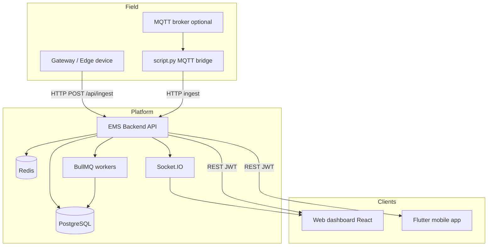
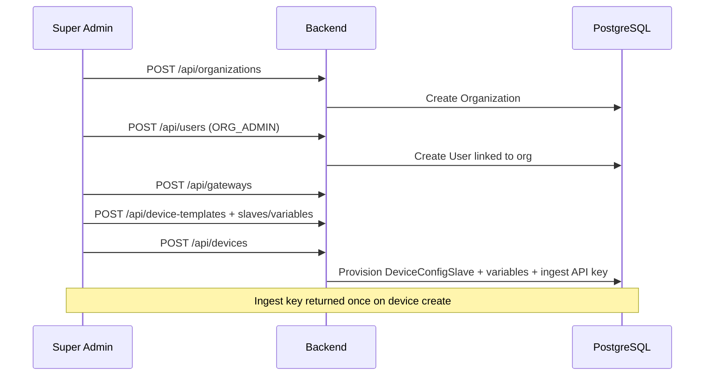
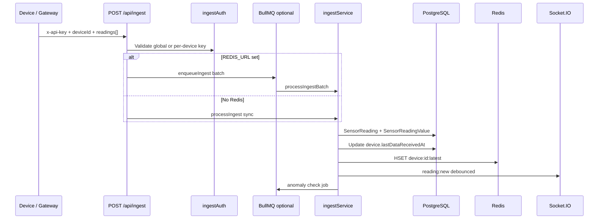
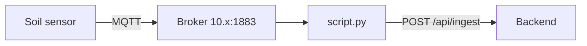
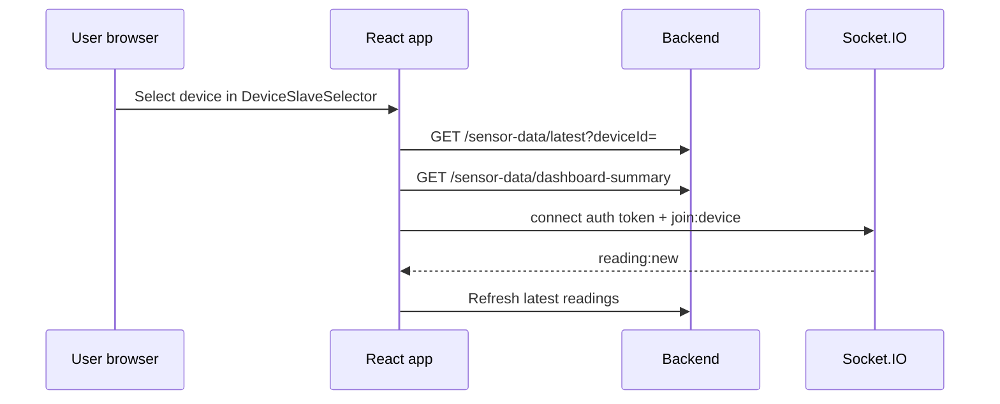
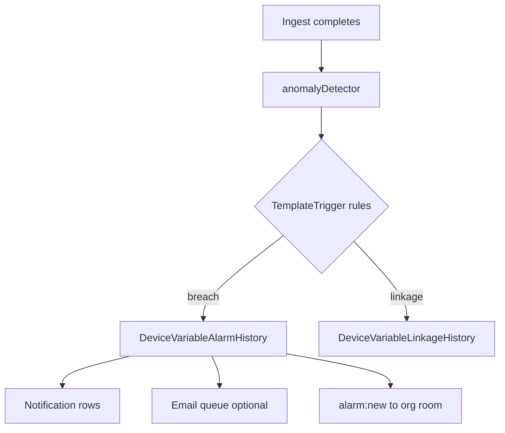
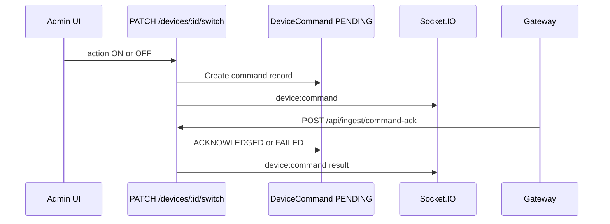
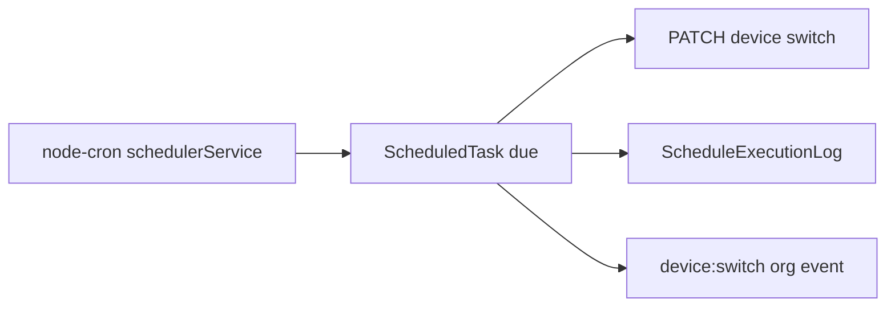
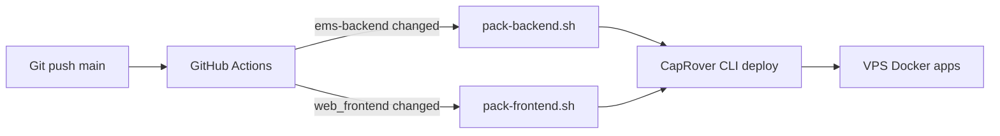

# System overview & flows

This document describes how users, devices, and data move through the Smart AgriTech EMS platform.

## High-level system map



## User roles & access

| Role | Backend enum | Web route prefix | Primary responsibilities |
|------|--------------|------------------|---------------------------|
| Super Admin | `SUPER_ADMIN` | `/admin` | All orgs, platform settings, themes, products, global users |
| Org Admin | `ORG_ADMIN` | `/org` | Own org: users, gateways, devices, templates, alarms |
| End User | `USER` | `/user` | Assigned devices only: dashboards, analytics, notifications |

```mermaid
flowchart LR
    LOGIN[Login /api/auth/login] --> JWT[JWT access + refresh]
    JWT --> ROUTE{Role?}
    ROUTE -->|SUPER_ADMIN| ADMIN[/admin/*]
    ROUTE -->|ORG_ADMIN| ORG[/org/*]
    ROUTE -->|USER| USER[/user/*]
```

## Core feature domains

1. **Multi-tenant organizations** — isolated data per org; super admin manages all.
2. **Gateway & device inventory** — physical gateways, logical devices, templates.
3. **Telemetry ingest** — HTTP API (primary); optional MQTT bridge for legacy sensors.
4. **Live dashboards** — latest readings, charts, AI-style analytics pages.
5. **History & export** — raw readings, aggregates, CSV download.
6. **Alarms & linkage** — template triggers, contacts, variable alarm history.
7. **Scheduling** — cron-based device switch tasks.
8. **Notifications** — in-app + email for alarms.
9. **Billing helpers** — slab rates, interval history (energy cost estimation).
10. **Platform config** — themes, icons, products, subscriptions, system settings.

---

## Flow 1: Organization onboarding



**Steps in UI (admin/org):**

1. Create organization (admin only).
2. Create org admin user.
3. Create gateway (serial, org).
4. Create device template with slaves and variables (e.g. `SoilMoisture`, `BatteryLevel`).
5. Create device → select gateway + template → receive **per-device ingest API key**.
6. Assign end users to device (`DeviceUser`).

---

## Flow 2: Device telemetry ingest



**Ingest payload example:**

```json
{
  "deviceId": "uuid",
  "slaveId": "optional-config-slave-uuid",
  "readings": [
    { "variableName": "SoilMoisture", "value": 42.5, "unit": "%" },
    { "variableName": "BatteryLevel", "value": 88, "unit": "%" }
  ]
}
```

**Modes:**

| Mode | Condition | Behavior |
|------|-----------|----------|
| Queued (production) | `REDIS_URL` set | BullMQ micro-batches (`INGEST_BATCH_MAX` / `INGEST_BATCH_MS`) |
| Sync (dev) | No Redis | Immediate DB write per request |

---

## Flow 3: MQTT field sensors (optional)

For hardware that publishes to MQTT (e.g. SMM soil topic):



`script.py` maps `M` → `SoilMoisture`, `B` → `BatteryLevel`, `TX` → `TxCounter`.

Environment: `EMS_BASE_URL`, `EMS_INGEST_API_KEY`, `EMS_DEVICE_ID`, `MQTT_BROKER_IP`.

---

## Flow 4: Live dashboard viewing



Device context (`DeviceContext`) keeps selected device/slave across dashboard, detail, and history pages.

---

## Flow 5: Alarm detection & notification



**Admin/org configures:**

- Template triggers (variable, operator, threshold).
- Alarm settings & contacts (email, phone, WhatsApp fields).
- Alarm history UI for process/resolve.

---

## Flow 6: Remote device switch (command)



30s timeout if no acknowledgment.

---

## Flow 7: Scheduled tasks



---

## Flow 8: CI/CD deploy (CapRover)



Separate workflows — backend and frontend deploy independently.

---

## Data retention & performance notes

- **Hot path:** Redis caches latest variable values per device; optional skip of Postgres `currentValue` on ingest (`SKIP_PG_CURRENT_VALUE`).
- **Flush:** `valueFlushService` periodically writes Redis → `DeviceConfigVariable.currentValue`.
- **TimescaleDB:** Optional hypertable scripts in `ems-backend/timescaledb-install/` for time-series at scale.
- **Health:** `GET /health` reports `redis` connectivity and `ingestMode` (`queued` vs `sync`).

---

## Related documents

- [Architecture](./02-architecture.md) — component diagram and security model
- [Application functionality](./04-application-functionality.md) — page-by-page features
- [Backend](./05-backend.md) — API reference summary
- [Deployment](./07-deployment-guide.md) — production hosting
