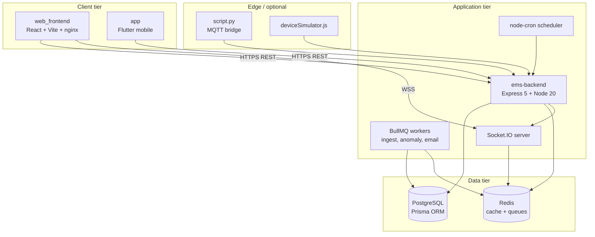
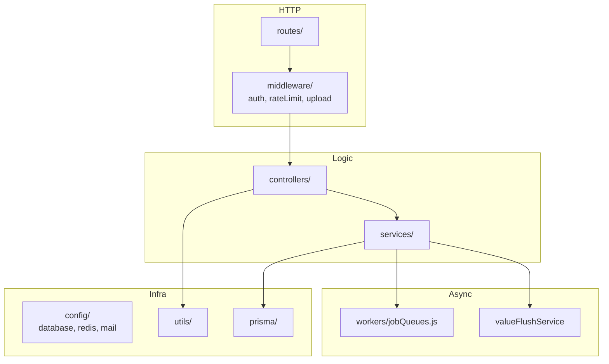
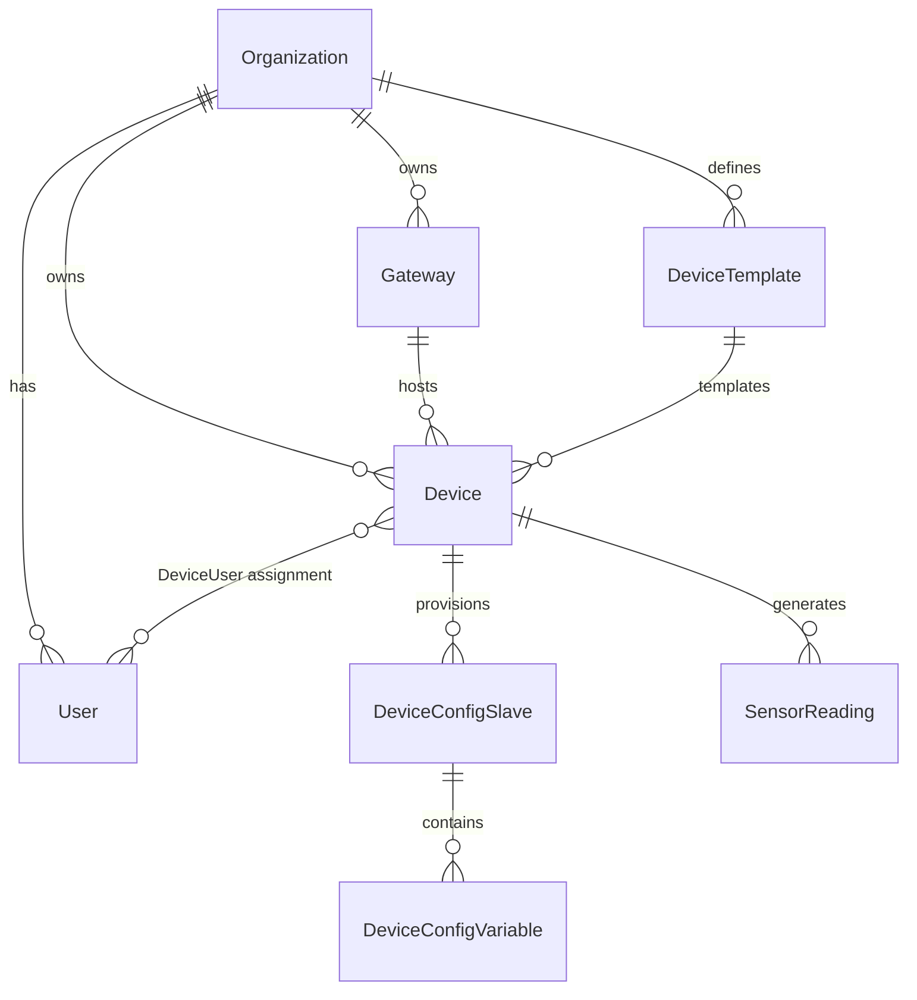
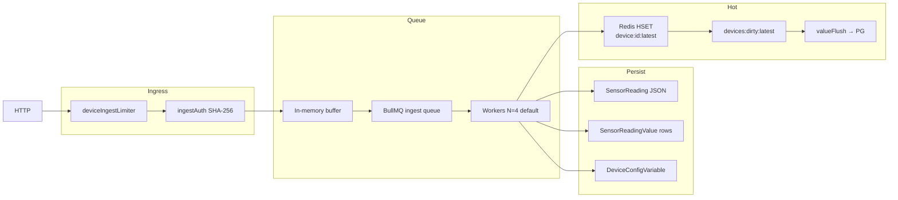
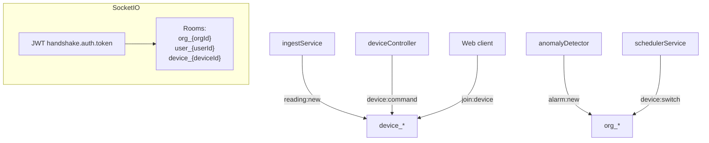
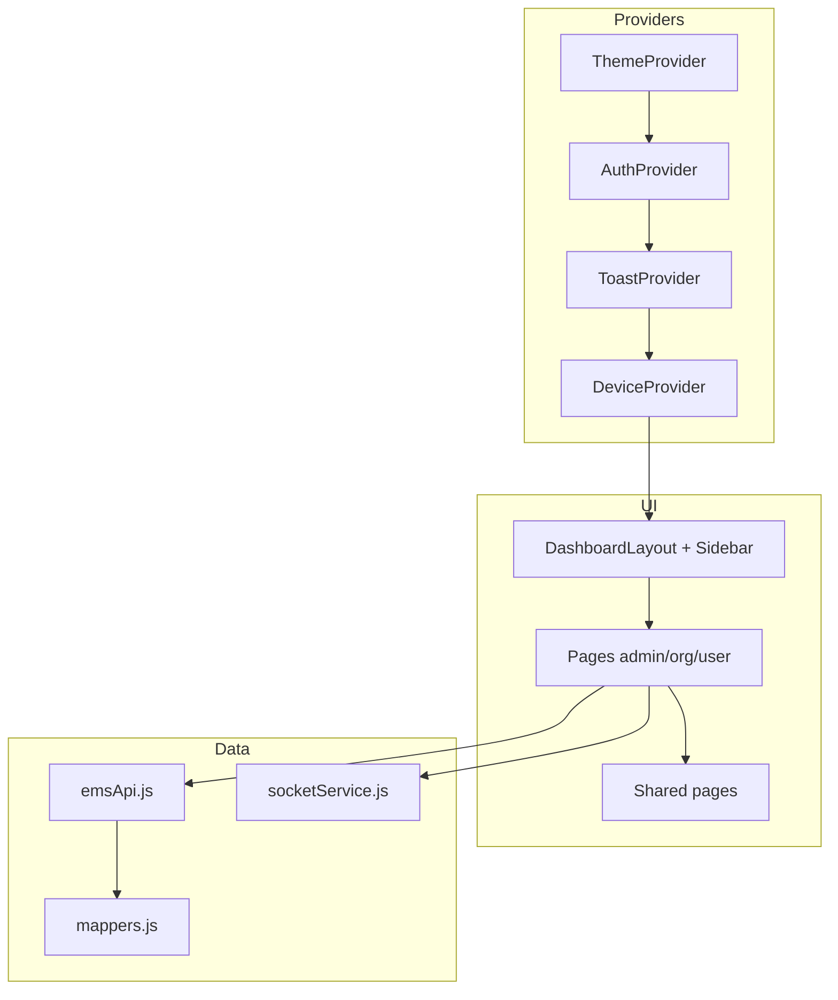
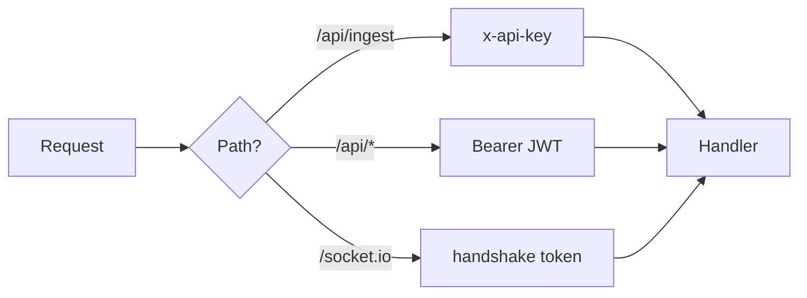
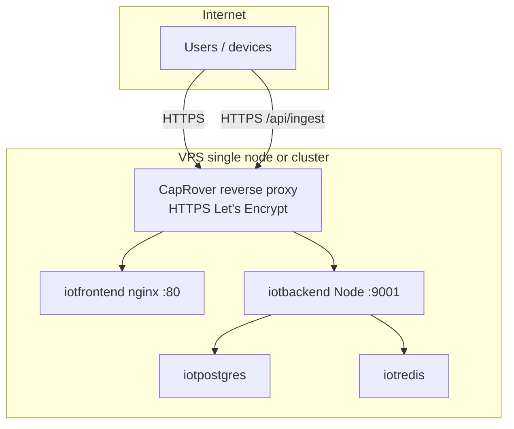

# Architecture

Technical architecture of the Smart AgriTech EMS platform: components, data flow, security, and deployment topology.

## Logical architecture

```mermaid
C4Context
    title EMS Platform Context

    Person(admin, "Super Admin", "Manages platform")
    Person(orgadmin, "Org Admin", "Manages org devices")
    Person(user, "Field User", "Views assigned devices")
    Person(device, "IoT Device", "Sends telemetry")

    System(ems, "EMS Platform", "Web + API + real-time")
    System_Ext(mqtt, "MQTT Broker", "Optional field protocol")
    System_Ext(email, "SMTP", "Alarm emails")

    admin --> ems
    orgadmin --> ems
    user --> ems
    device --> ems
    mqtt --> ems
    ems --> email
```

## Container diagram



## Backend internal layers



| Layer | Responsibility |
|-------|----------------|
| **Routes** | URL mapping, mount order (`/api/ingest` before `/api`) |
| **Middleware** | JWT `protect`, role `authorize`, rate limits, multer uploads |
| **Controllers** | Request validation, org scoping, HTTP responses |
| **Services** | Business logic: ingest, anomalies, notifications, scheduler |
| **Workers** | BullMQ: batched ingest, anomaly checks, email, device delete |
| **Prisma** | 40+ models, migrations, type-safe queries |

## Multi-tenancy model



**Isolation rules:**

- `ORG_ADMIN` and `USER` queries scoped to `user.organizationId`.
- `USER` device list filtered through `DeviceUser` join.
- `SUPER_ADMIN` can query any org (optional `organizationId` filter).

## Ingest architecture (production path)



## Real-time architecture



Optional **Redis adapter** (`@socket.io/redis-adapter`) enables horizontal scaling of API instances.

## Web frontend architecture



Build output: static SPA served by **nginx** (Docker) with API URL baked at build time (`VITE_API_URL`, `VITE_SOCKET_URL`).

## Mobile app (Flutter)

Located in `app/` — companion client for the same REST API:

- Auth, device list, dashboards (role-aligned with backend).
- Shares backend JWT auth model.
- Deployed separately (Android/iOS builds), not part of CapRover web stack.

## Security architecture

| Concern | Implementation |
|---------|----------------|
| Authentication | JWT access (15m default) + refresh tokens (hashed in DB) |
| Authorization | Role middleware + per-controller org/device checks |
| Ingest auth | `x-api-key` header — global `INGEST_API_KEY` or per-device hashed key |
| Rate limiting | `express-rate-limit` + Redis store when available |
| CORS | `CLIENT_URL` comma-separated origins |
| Cookies | Optional httpOnly token cookies in auth flow |
| Helmet | Security headers on API |
| Uploads | Cloudinary for icons/products (optional) |



## Production deployment topology (CapRover)



Internal DNS (CapRover): `srv-captain--{appName}` for service-to-service URLs.

## Observability

| Endpoint | Purpose |
|----------|---------|
| `GET /health` | Liveness: DB, Redis, ingest mode |
| `GET /metrics` | Prometheus text format counters |
| App logs | Docker/CapRover container logs |
| Prisma logs | Opt-in `PRISMA_LOG_QUERIES=true` |

## Scalability considerations

| Bottleneck | Mitigation |
|------------|------------|
| High ingest rate | Redis + BullMQ batching; increase `INGEST_WORKER_CONCURRENCY` |
| Dashboard reads | Redis latest cache; `SKIP_PG_CURRENT_VALUE`; response cache on dashboard summary |
| Socket fan-out | Redis Socket.IO adapter; multiple backend replicas behind CapRover |
| Time-series growth | TimescaleDB hypertables; archive scripts in `scripts/archive-cold-data` |
| DB connections | PgBouncer (documented in `.env.example`); pool tuning `DB_POOL_*` |

## Related documents

- [System flows](./01-system-overview-and-flows.md)
- [Tech stack](./03-tech-stack.md)
- [Backend details](./05-backend.md)
- [Deployment](./07-deployment-guide.md)
