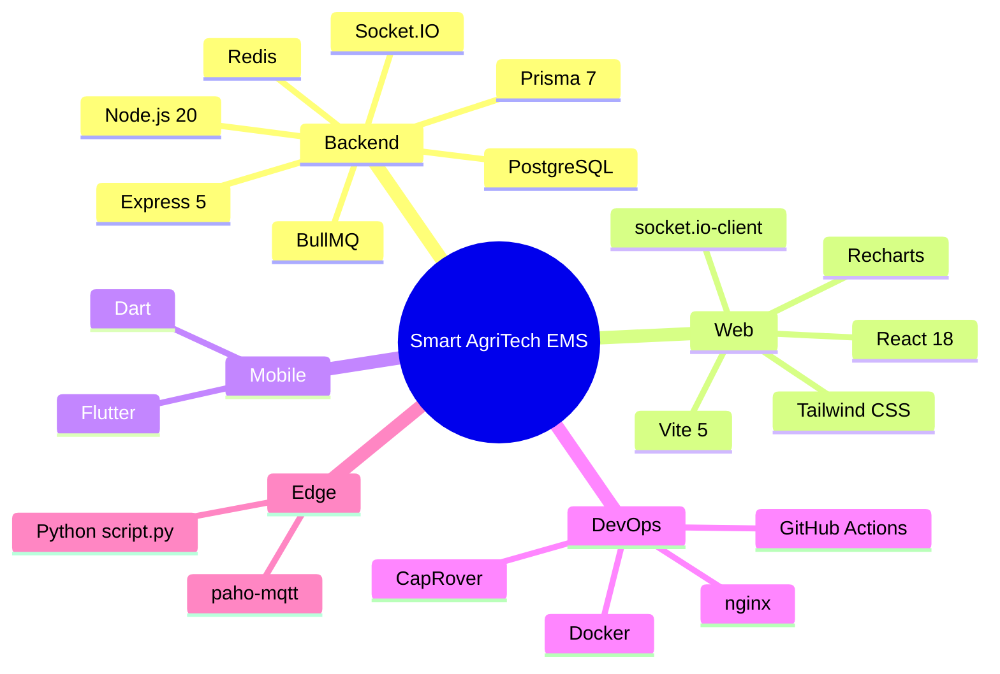
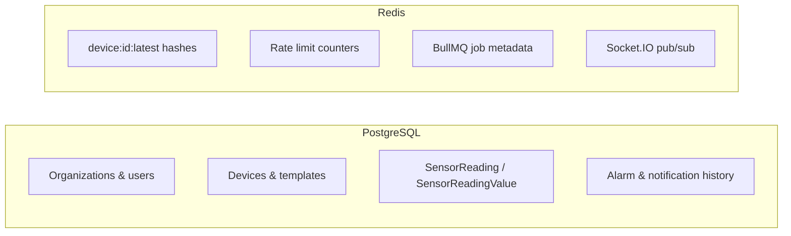

# Tech stack

Technologies used across the Smart AgriTech EMS monorepo.

## Stack at a glance

---

## Backend (`ems/ems-backend`)

| Layer | Technology | Version / notes |
|-------|------------|-----------------|
| Runtime | Node.js | 20 LTS (Alpine in Docker) |
| Framework | Express | 5.x |
| ORM | Prisma | 7.x with `@prisma/adapter-pg` |
| Database | PostgreSQL | 16 recommended; TimescaleDB optional |
| Cache / queue | Redis | 7.x; required for production ingest batching |
| Job queue | BullMQ | Ingest, anomaly, email, device-delete workers |
| Real-time | Socket.IO | + optional `@socket.io/redis-adapter` |
| Auth | jsonwebtoken | Access + refresh token rotation |
| Validation | express + custom | Controllers + `AppError` |
| Email | Nodemailer | Gmail or custom SMTP / SES |
| Media | Cloudinary | Icons, product images (optional) |
| Scheduling | node-cron | In-process scheduled device tasks |
| Metrics | Custom Prometheus text | `/metrics` endpoint |
| Security | helmet, cors, compression | Production hardening |
| Dev tools | deviceSimulator, seedFleet | Load testing & demo data |

**Key files:**

- `server.js` — application entry
- `prisma/schema.prisma` — data model (~40 models)
- `workers/jobQueues.js` — async processing
- `services/ingestService.js` — telemetry hot path

---

## Web frontend (`web_frontend`)

| Layer | Technology | Notes |
|-------|------------|-------|
| UI library | React | 18.x |
| Build | Vite | 5.x; dev proxy to API :5000 |
| Styling | Tailwind CSS | Custom design tokens in `index.css` |
| Routing | React Router | 6.x; role-based route trees |
| Charts | Recharts | Dashboards, historical data, AI pages |
| HTTP | fetch API | `api/client.js` with JWT refresh |
| Real-time | socket.io-client | Live readings & alarms |
| UI snapshots | boneyard-js | Skeleton loading states |
| Icons | lucide-react | Sidebar and actions |
| Production serve | nginx:alpine | SPA + gzip; Docker multi-stage build |

**Build-time env:**

| Variable | Purpose |
|----------|---------|
| `VITE_API_URL` | REST base (e.g. `https://api.example.com/api`) |
| `VITE_SOCKET_URL` | Socket.IO origin (e.g. `https://api.example.com`) |
| `VITE_ENABLE_SOCKET` | Set `false` to disable WebSocket client |

---

## Mobile app (`app/`)

| Layer | Technology |
|-------|------------|
| Framework | Flutter |
| Language | Dart |
| API | Same REST backend as web |
| Platforms | Android / iOS (standard Flutter targets) |

The mobile app mirrors core EMS capabilities for field users; web dashboard is the primary admin surface.

---

## Edge / integration

| Component | Stack | Purpose |
|-----------|-------|---------|
| `script.py` | Python 3, paho-mqtt | Subscribe MQTT soil topic → HTTP ingest |
| `deviceSimulator.js` | Node.js | Synthetic fleet telemetry for testing |
| `seedFleet.js` | Node.js + Prisma | 100 devices / 10 gateways demo fleet |

---

## Data stores

| Store | What lives there |
|-------|------------------|
| **PostgreSQL** | All durable entities, audit history, commands |
| **Redis** | Latest readings cache, ingest queue, optional rate limits & socket cluster |

---

## DevOps & deployment

| Tool | Role |
|------|------|
| **Docker** | Backend & frontend container images |
| **CapRover** | PaaS on VPS — HTTPS, app deploy, one-click Postgres/Redis |
| **GitHub Actions** | `caprover-deploy-backend.yml`, `caprover-deploy-frontend.yml` |
| **CapRover CLI** | `caprover deploy -t tarball` from CI |
| **nginx** | Static frontend + gzip |
| **Let's Encrypt** | Via CapRover HTTP settings |

**Pack scripts:**

- `scripts/caprover/pack-backend.sh`
- `scripts/caprover/pack-frontend.sh`
- `scripts/caprover/pack-all.ps1` (Windows manual)

---

## Development tooling

| Tool | Usage |
|------|-------|
| npm | Backend & frontend package management |
| Prisma CLI | `migrate deploy`, `generate`, `db seed` |
| Git | Monorepo; path-filtered CI |
| Vite dev server | HMR on port 5173 |
| ESLint / IDE | Per-project conventions |

---

## Recommended minimum specs

### Local development (single machine)

| Resource | Minimum |
|----------|---------|
| CPU | 4 cores |
| RAM | 8 GB |
| Disk | 10 GB free |
| Services | Node 20, PostgreSQL 16, Redis 7 |

### Production (small deployment, &lt;100 devices, 1 msg/sec)

| Resource | Recommended |
|----------|-------------|
| VPS | 2 vCPU, 4 GB RAM, 40 GB SSD |
| Stack | CapRover + 4 apps (frontend, backend, postgres, redis) |
| OS | Ubuntu 22.04 LTS |

### Production (medium, 100–1000 devices)

| Resource | Recommended |
|----------|-------------|
| VPS | 4 vCPU, 8–16 GB RAM, 80+ GB SSD |
| Redis | Dedicated or managed; required |
| DB | Consider managed PostgreSQL or read replica (`DATABASE_READ_URL`) |

---

## Version matrix (pin in production)

| Component | Pin strategy |
|-----------|--------------|
| Node | `20-alpine` in Dockerfiles |
| PostgreSQL | `16-alpine` (CapRover one-click) |
| Redis | `7-alpine` |
| CapRover | `caprover/caprover:1.14.1+` (Docker API 1.44+) |

---

## Related documents

- [Architecture](./02-architecture.md)
- [Backend](./05-backend.md)
- [Web frontend](./06-web-frontend.md)
- [Deployment guide](./07-deployment-guide.md)
