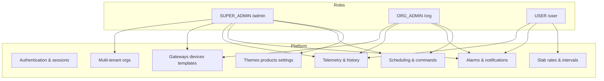
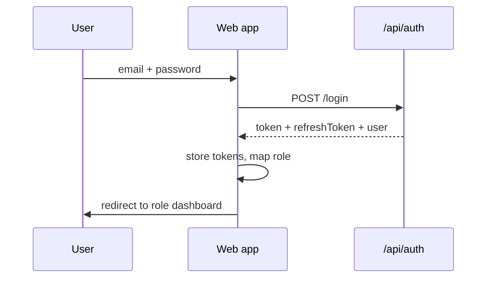
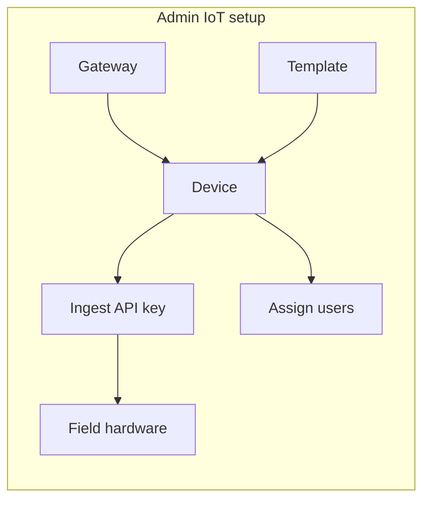
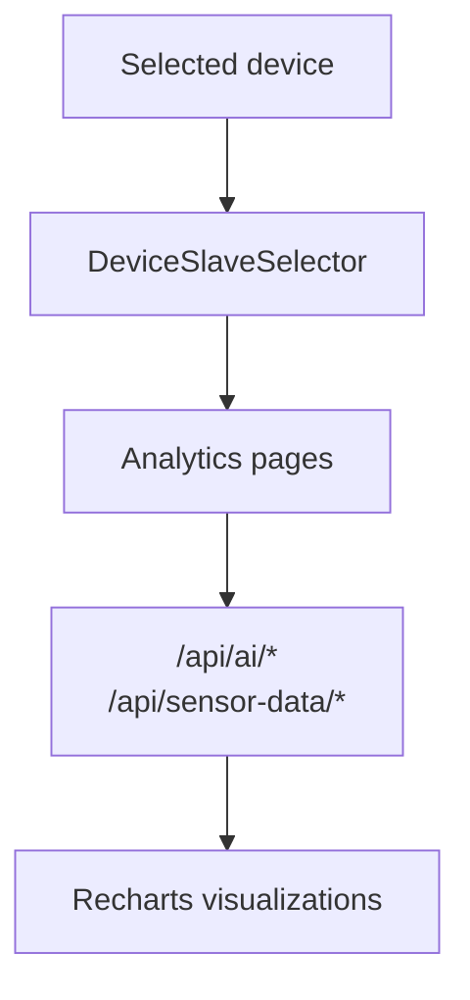
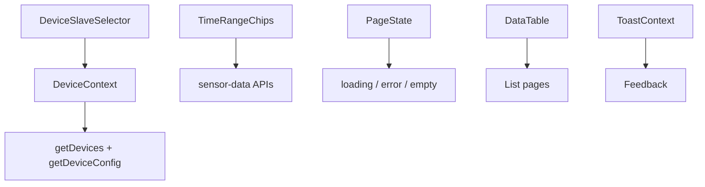
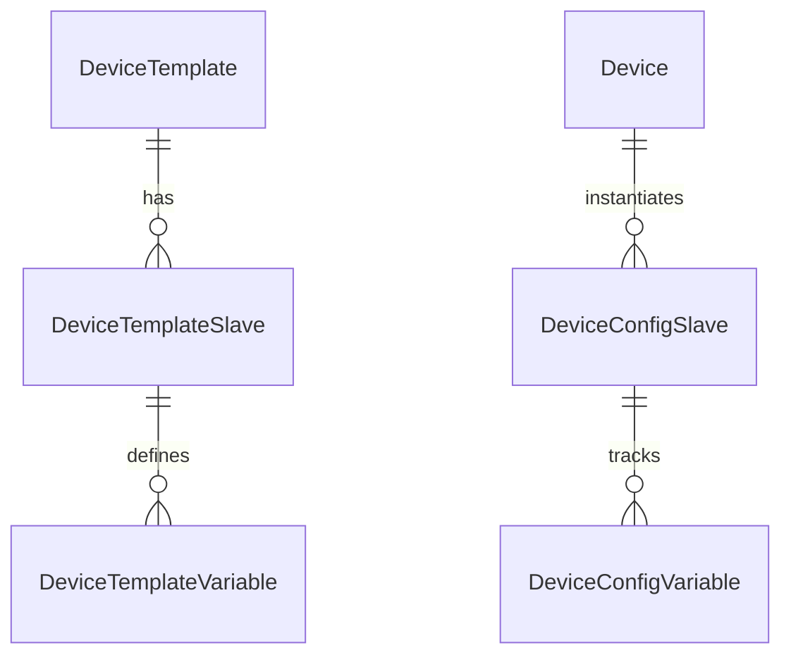
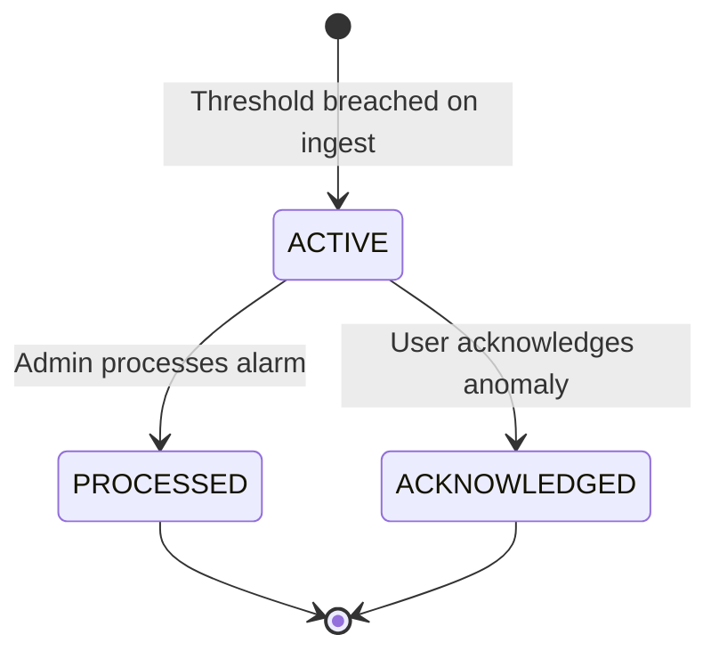

# Application functionality

Detailed feature catalog for Smart AgriTech EMS, organized by role and module.

## Feature map

---

## Authentication & account

| Feature | Who | Description |
|---------|-----|-------------|
| Login / logout | All | Email + password; JWT access + refresh |
| Session refresh | All | Silent token refresh on 401 |
| Forgot / reset password | All | Email reset flow |
| Change password | All | `/user/account` and API |
| Role-based redirect | All | `/` → `/admin`, `/org`, or `/user` |

---

## Super Admin (`/admin`) — 22 nav items

### Dashboard & monitoring

| Page | Route | Features |
|------|-------|----------|
| Dashboard | `/admin` | Org/user/device/gateway counts; online/offline; power & variable charts for selected device; recent alarms; device switch toggles |
| Dashboard detail | `/admin/dashboard-detail` | Live variable cards from selected device; summary KPIs; time range |
| Data center | `/admin/data-center` | Cross-org device overview, latest readings |
| Sensor history | `/admin/sensor-history` | Paginated raw ingest log; CSV export |
| Historical data | `/admin/historical-data` | Per-device variable chart + table; date range |

### Organization & access

| Page | Route | Features |
|------|-------|----------|
| Organizations | `/admin/organizations` | CRUD tenants |
| Users | `/admin/users` | CRUD all roles; org assignment; status; password reset |

### IoT inventory

| Page | Route | Features |
|------|-------|----------|
| Gateways | `/admin/gateways` | CRUD; serial; org binding |
| Devices | `/admin/devices` | CRUD; template; gateway; MQTT config modal; ingest key on create |
| Device detail | `/admin/devices/:id` | Overview, metrics, schedule, user assignment, remote switch |
| Device templates | `/admin/device-templates` | CRUD; clone |
| Template detail | `/admin/device-templates/:id` | Slaves & variables CRUD |
| Device timestamps | `/admin/device-timestamps` | Last-seen / connectivity log |

### Alarms

| Page | Route | Features |
|------|-------|----------|
| Variable alarms | `/admin/variable-alarms` | Active alarm list; process |
| Alarm history | `/admin/alarm-history` | Variable + linkage tabs; device filter |
| Linkage records | `/admin/linkage-records` | Automation linkage history |
| Template triggers | `/admin/template-triggers` | Threshold rules on template variables |
| Alarm settings | `/admin/alarm-settings` | Org alarm configuration |
| Alarm contacts | `/admin/alarm-contacts` | Notification contacts |

### Platform

| Page | Route | Features |
|------|-------|----------|
| Icons | `/admin/icons` | Upload/manage UI icons (Cloudinary) |
| Products | `/admin/products` | Subscription product catalog |
| Schedule tasks | `/admin/schedule-tasks` | CRUD cron jobs; toggle; execution logs |
| Theme settings | `/admin/theme-settings` | Themes; assign to orgs |
| Settings | `/admin/settings` | System key/value settings |

---

## Org Admin (`/org`) — 17 nav items

Same core IoT and alarm features as admin, **scoped to own organization**:

| Module | Pages | Notes |
|--------|-------|-------|
| Dashboard | `/org`, `/org/dashboard-detail` | Org device stats; monthly energy |
| Team | `/org/users` | Create `USER` role only |
| Widgets | `/org/widget-templates` | Dashboard widget definitions |
| Inventory | devices, gateways, templates | No cross-org access |
| History | sensor-history, historical-data, device-timestamps | Device-scoped charts |
| Alarms | template-triggers, settings, contacts, alarm-history | Org-scoped |
| Tasks | `/org/schedule-tasks` | Scheduled switch jobs |
| Settings | `/org/settings` | Org profile & preferences |

---

## End User (`/user`) — 18 nav items

Focused on **assigned devices** and consumption analytics:

### Dashboard & account

| Page | Route | Features |
|------|-------|----------|
| Dashboard | `/user` | Greeting, subscription tier, stats, notifications preview, live charts |
| Dashboard detail | `/user/dashboard-detail` | Device variable grid |
| Account | `/user/account` | Profile, password |
| Notifications | `/user/notifications` | Mark read, list |

### Analytics (AI-style pages)

| Page | Route | Data source |
|------|-------|-------------|
| AI analytics | `/user/ai-analytics` | Dashboard summary + energy + PF + predictions; chat UI |
| Energy consumption | `/user/energy-consumption` | `/api/ai/energy-consumption` |
| Power factor | `/user/power-factor` | Gauge + trend + events |
| Voltage imbalance | `/user/voltage-imbalance` | Phase charts |
| Current imbalance | `/user/current-imbalance` | Current analytics |
| Anomalies | `/user/anomalies` | Acknowledge anomaly records |

### Billing & scheduling

| Page | Route | Features |
|------|-------|----------|
| Slab rates | `/user/slab-rates` | Electricity tariff slabs CRUD |
| Interval history | `/user/interval-history` | Billing intervals + charts |
| Schedule | `/user/schedule` | View scheduled tasks |
| Subscription | `/user/subscription` | Plan status & history |
| Products | `/user/products` | Browse available plans |

### Alarms & history

| Page | Route | Features |
|------|-------|----------|
| Sensor history | `/user/sensor-history` | Raw reading log |
| Alarm template | `/user/alarm-template` | View/toggle templates |
| Alarm settings | `/user/alarm-settings` | Reuses org alarm settings UI |
| Alarm history | `/user/alarm-history` | Device-filtered history |

---

## Shared components (all roles)

| Component | Purpose |
|-----------|---------|
| `DeviceSlaveSelector` | Global device + slave/meter picker |
| `DeviceContext` | Selected device state across pages |
| `TimeRangeChips` | 24h / 7d / 30d filters |
| `SocketBridge` | Auto-connect socket on login |
| `DashboardLayout` | Sidebar from `navConfig.jsx` |

---

## Device template model (functionality)

Templates define **what variables** a device type exposes:

Example — **SMM soil sensor:**

| Variable | Unit | Source |
|----------|------|--------|
| SoilMoisture | % | MQTT `M` or simulator |
| BatteryLevel | % | MQTT `B` |
| TxCounter | count | MQTT `TX` |

Example — **Electrical panel:**

| Variable | Unit |
|----------|------|
| VoltageA/B/C | V |
| CurrentA/B/C | A |
| PowerConsumption | kWh |
| PowerFactor | — |

UI shows **actual configured variables**, not a fixed hardcoded list.

---

## Notification & alarm lifecycle

Channels: in-app `Notification`, email queue, Socket `alarm:new`.

---

## Subscription & products (commercial)

- Public product catalog (`GET /api/products`).
- Users submit subscription requests (`POST /api/subscriptions`).
- Super admin approves status (`PATCH /api/subscriptions/:id/status`).
- User dashboard shows current plan tier.

---

## Feature availability matrix

| Feature | Super Admin | Org Admin | User |
|---------|:-----------:|:---------:|:----:|
| All organizations | ✓ | — | — |
| Org devices CRUD | ✓ | ✓ | — |
| View assigned devices | ✓ | ✓ | ✓ |
| Ingest (field) | ✓ | ✓ | ✓ |
| Remote switch | ✓ | ✓ | — |
| Platform settings | ✓ | — | — |
| Themes / icons | ✓ | — | — |
| AI analytics pages | — | — | ✓ |
| Slab rates | — | — | ✓ |
| Alarm process (admin API) | ✓ | ✓ | limited |

---

## Related documents

- [System flows](./01-system-overview-and-flows.md)
- [Web frontend](./06-web-frontend.md)
- [Backend](./05-backend.md)
