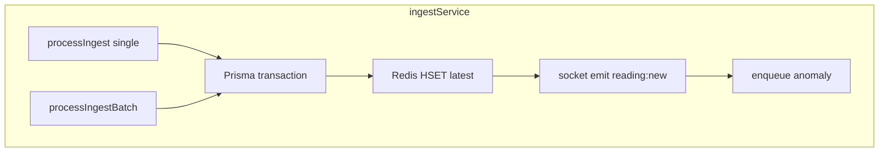
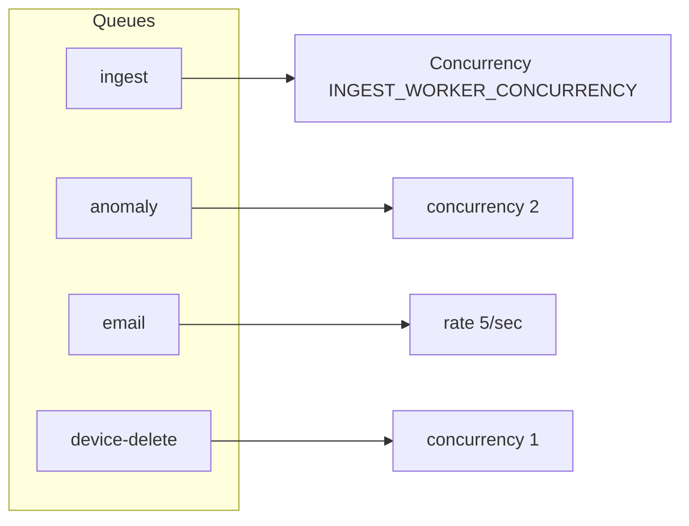

# Backend reference

Node.js API for Smart AgriTech EMS: `ems/ems-backend/`.

## Request pipeline

```mermaid
sequenceDiagram
    participant C as Client
    participant H as helmet/cors/compression
    participant RL as rateLimiter
    participant R as routes
    participant P as protect/authorize
    participant CTRL as controller
    participant DB as Prisma/Redis

    C->>H->>RL->>R
    alt /api/ingest
        R->>CTRL: ingestAuth x-api-key
    else /api/*
        R->>P->>CTRL
    end
    CTRL->>DB
    CTRL-->>C: JSON response
```

**Mount order** (`server.js`):

1. `GET /health`, `GET /metrics`
2. `POST /api/ingest/*` (no JWT)
3. `app.use('/api', apiLimiter, routes)`

---

## Authentication & authorization

### JWT auth (`middleware/auth.js`)

| Header | Format |
|--------|--------|
| `Authorization` | `Bearer <accessToken>` |

| Role | Enum | Typical guards |
|------|------|----------------|
| Super Admin | `SUPER_ADMIN` | `authorize('SUPER_ADMIN')` |
| Org Admin | `ORG_ADMIN` | `authorize('SUPER_ADMIN', 'ORG_ADMIN')` |
| User | `USER` | Device-scoped in controllers |

### Ingest auth (`utils/ingestAuth.js`)

| Header | Value |
|--------|-------|
| `x-api-key` | Global `INGEST_API_KEY` **or** per-device key (SHA-256 hash in DB) |

Per-device keys returned **once** on `POST /api/devices` and `POST /devices/:id/regenerate-ingest-key`.

---

## API route map

### Auth — `/api/auth`

| Method | Path | Auth |
|--------|------|------|
| POST | `/login` | Public (rate limited) |
| POST | `/refresh` | Public |
| POST | `/logout` | Public |
| GET | `/me` | JWT |
| POST | `/change-password` | JWT |
| POST | `/forgot-password` | Public |
| POST | `/reset-password` | Public |

### Ingest — `/api/ingest`

| Method | Path | Body |
|--------|------|------|
| POST | `/` | `{ deviceId, slaveId?, readings[] }` |
| POST | `/command-ack` | `{ deviceId, commandId, status?, reason? }` |

### Devices — `/api/devices`

| Method | Path | Roles (mutations) |
|--------|------|-------------------|
| GET/POST | `/` | POST: SUPER_ADMIN, ORG_ADMIN |
| GET/PUT/DELETE | `/:id` | PUT/DELETE: SUPER_ADMIN, ORG_ADMIN |
| PATCH | `/:id/switch` | SUPER_ADMIN, ORG_ADMIN |
| POST | `/:id/regenerate-ingest-key` | SUPER_ADMIN, ORG_ADMIN |
| GET | `/:id/commands/:commandId` | Authenticated |

**Device config** — `/api/devices/:deviceId/config`:

- `GET /slaves`, `GET /slaves/:id/variables`
- `PATCH /variables/:id`, `GET /variables/:id/log`

**Device users** — `/api/devices/:deviceId/users`:

- `GET`, `POST`, `DELETE /:userId`

### Gateways — `/api/gateways`

Full CRUD; mutations: SUPER_ADMIN, ORG_ADMIN.

### Device templates — `/api/device-templates`

- CRUD + `POST /:id/clone`
- Nested: `/slaves`, `/slaves/:slaveId/variables` CRUD

### Sensor data — `/api/sensor-data`

| Method | Path | Purpose |
|--------|------|---------|
| GET | `/latest` | Current values per variable (`?deviceId&slaveId`) |
| GET | `/history` | Single variable time series (`variableName` required) |
| GET | `/readings` | Paginated raw ingest rows |
| GET | `/aggregate` | Bucketed averages (`variableName`, `timeRange`) |
| GET | `/dashboard-summary` | KPIs + chart data for dashboards |
| GET | `/download` | CSV export |
| DELETE | `/` | SUPER_ADMIN bulk delete |

**Time ranges:** `24h`, `7d`, `30d` (see `utils/helpers.js` `TIME_RANGE_MS`).

### AI analytics — `/api/ai`

| Path | Purpose |
|------|---------|
| `/energy-consumption` | Consumption charts |
| `/power-factor` | PF trend + alarms |
| `/voltage-imbalance` | Phase voltage analytics |
| `/current-imbalance` | Current analytics |
| `/predictions` | Forecast-style readings |

### Alarms — `/api/alarm-*`, `/api/alarm-history`

- Templates, settings, contacts: CRUD
- History: variable alarms, linkage records, notifications
- `PATCH /alarm-history/variable-alarms/:id/process`

### Other groups

| Prefix | Features |
|--------|----------|
| `/api/organizations` | CRUD; `/me` for org admin |
| `/api/users` | CRUD, status, reset password |
| `/api/notifications` | List, read, delete |
| `/api/scheduled-tasks` | CRUD, toggle, logs |
| `/api/anomalies` | List, timeline, acknowledge |
| `/api/interval-history` | Billing intervals |
| `/api/slab-rates` | Tariff slabs |
| `/api/widget-templates` | Dashboard widgets |
| `/api/icons`, `/products`, `/themes`, `/settings` | Platform assets |
| `/api/subscriptions` | Plan requests |
| `/api/device-timestamps` | Connectivity log |

---

## Ingest service (deep dive)



**Writes per ingest:**

1. `SensorReading` — JSON blob of all variables in batch
2. `SensorReadingValue` — normalized float rows (analytics indexes)
3. `Device.lastDataReceivedAt`, `DeviceTimestamp`
4. `DeviceConfigVariable.currentValue` (unless `SKIP_PG_CURRENT_VALUE=true`)
5. Redis `device:{id}:latest` hash

---

## Workers (`workers/jobQueues.js`)



| Queue | Trigger | Handler |
|-------|---------|---------|
| `ingest` | HTTP ingest when Redis up | `processIngestBatch` |
| `anomaly` | After ingest | `runAnomalyCheck` |
| `email` | Alarm notification | Nodemailer send |
| `device-delete` | Device removal | Cascade purge |

---

## Socket.IO (`socket/index.js`)

### Server → client events

| Event | Room | Payload |
|-------|------|---------|
| `reading:new` | `device_{deviceId}` | `{ deviceId, ... }` |
| `device:command` | `device_{deviceId}` | Command status |
| `device:switch` | `org_{organizationId}` | Scheduler switch |
| `alarm:new` | `org_{organizationId}` | Alarm summary |

### Client → server

| Event | Action |
|-------|--------|
| `join:device` | Subscribe to device room |

**Auth:** `handshake.auth.token` must be valid JWT.

---

## Database model summary

| Domain | Models |
|--------|--------|
| Tenancy | `Organization`, `User`, `RefreshToken`, `Subscription` |
| IoT | `Gateway`, `Device`, `DeviceTemplate*`, `DeviceConfig*`, `DeviceUser`, `MqttConfig` |
| Telemetry | `SensorReading`, `SensorReadingValue`, `AIForecastReading` |
| Commands | `DeviceCommand` |
| Alarms | `TemplateTrigger`, `AlarmSetting`, `AlarmContact`, `DeviceVariableAlarmHistory`, `DeviceVariableLinkageHistory` |
| Ops | `ScheduledTask`, `ScheduleExecutionLog`, `Notification` |
| Billing | `SlabRate`, `IntervalHistory` |
| UI | `WidgetTemplate`, `Icon`, `Theme`, `Product`, `SystemSetting` |

Schema: `prisma/schema.prisma`  
Migrations: `prisma/migrations/`

---

## Environment variables

| Variable | Required | Description |
|----------|----------|-------------|
| `DATABASE_URL` | Yes | PostgreSQL connection |
| `JWT_SECRET` | Yes | Token signing |
| `CLIENT_URL` | Yes prod | CORS origins (comma-separated) |
| `REDIS_URL` | Prod recommended | Queued ingest + cache |
| `INGEST_API_KEY` | Yes | Global ingest fallback |
| `PORT` | No | Default 5000 (CapRover: 9001) |
| `SKIP_PG_CURRENT_VALUE` | No | Default `true` with Redis |
| `INGEST_BATCH_MAX` / `INGEST_BATCH_MS` | No | Batch tuning |
| `INGEST_DEVICE_MAX_PER_MIN` | No | Per-device rate limit |
| `VALUE_FLUSH_MS` | No | Redis→PG flush interval |
| `DATABASE_READ_URL` | No | Read replica |
| `CLOUDINARY_*` | No | Image uploads |
| `SMTP_*` / `NODEMAILER_*` | No | Email |
| `PRISMA_LOG_QUERIES` | No | Debug only |

Full list: `ems/ems-backend/.env.example`

---

## Scripts & tooling

| npm script | Purpose |
|------------|---------|
| `npm run dev` | Nodemon server |
| `npm run seed` | Demo users & sample data |
| `npm run seed:fleet` | 100 devices / 10 gateways |
| `npm run simulate:production` | 1s interval fleet simulator |
| `npx prisma migrate deploy` | Apply migrations |

---

## Docker

```dockerfile
# ems/ems-backend/Dockerfile
# - node:20-alpine
# - prisma generate + migrate on entrypoint
# - EXPOSE 5000 (or CapRover PORT)
```

`docker-entrypoint.sh` runs `npx prisma migrate deploy` before `node server.js`.

---

## Health & metrics

**`GET /health`**

```json
{
  "status": "ok",
  "redis": true,
  "ingestMode": "queued"
}
```

**`GET /metrics`** — Prometheus text format (`utils/metrics.js`).

---

## Related documents

- [Architecture](./02-architecture.md)
- [System flows](./01-system-overview-and-flows.md)
- [Web frontend](./06-web-frontend.md)
- [Deployment](./07-deployment-guide.md)
