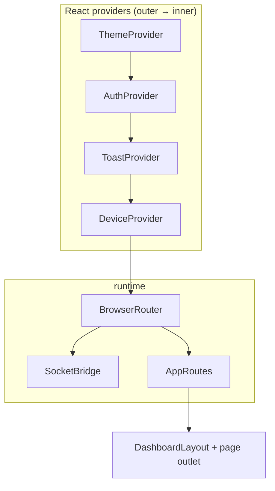
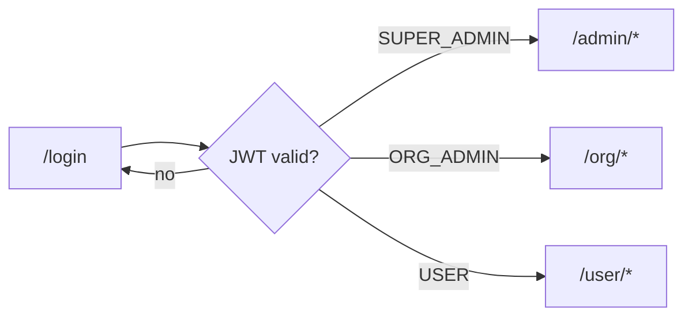
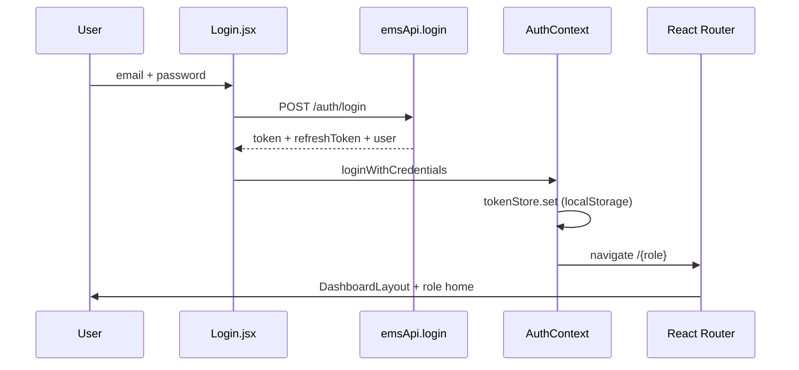
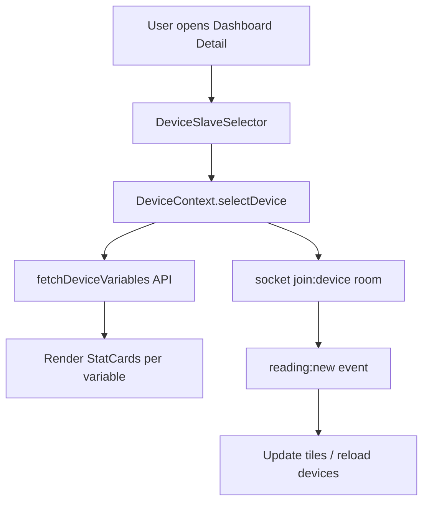
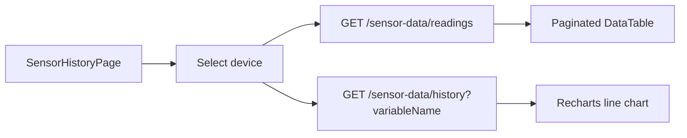
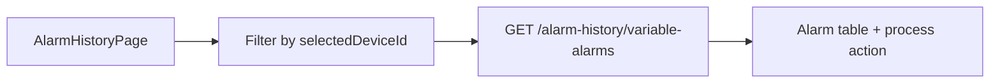
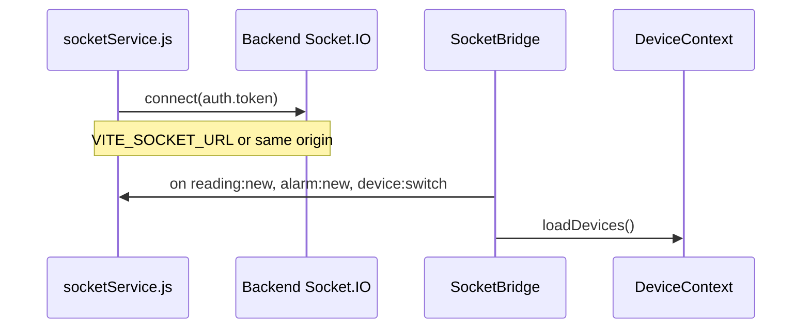
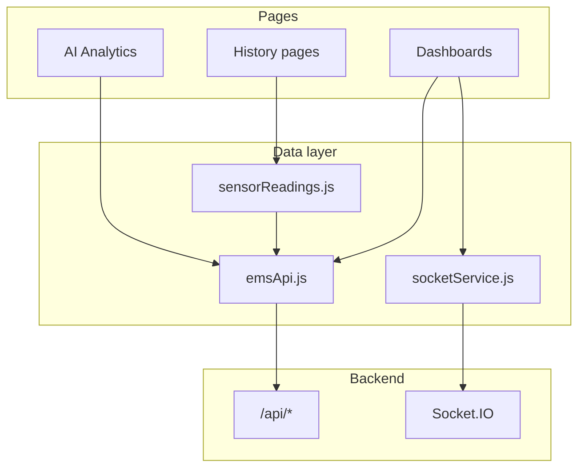

# Web frontend reference

React dashboard for Smart AgriTech EMS: `web_frontend/`.

Built with **Vite**, **React 18**, **React Router**, **Tailwind CSS**, and **Recharts**. Served in production as static files behind **nginx** (Docker image).

---

## Application shell



| Provider | Responsibility |
|----------|----------------|
| `ThemeContext` | Light/dark mode, org theme colors from API |
| `AuthContext` | JWT session, login/logout, role mapping |
| `ToastContext` | Global success/error toasts |
| `DeviceContext` | Selected device/slave, device list cache |
| `SocketBridge` | Connects Socket.IO when logged in; refreshes devices on `reading:new` |

---

## Role-based routing

Backend roles map to URL prefixes via `utils/roles.js`:

| Backend enum | Frontend path | Nav config |
|--------------|---------------|------------|
| `SUPER_ADMIN` | `/admin` | `adminNav` |
| `ORG_ADMIN` | `/org` | `orgNav` |
| `USER` | `/user` | `userNav` |



`ProtectedRoute` redirects unauthenticated users to `/login` and wrong-role users to their home prefix.

---

## Complete route map

### Public

| Path | Page | Purpose |
|------|------|---------|
| `/login` | `Login.jsx` | Email/password login |
| `/` | redirect | → role home or `/login` |

### Super Admin — `/admin`

| Path | Component | Functionality |
|------|-----------|---------------|
| `/admin` | `AdminDashboard` | Fleet KPIs, charts, device summary |
| `/admin/dashboard-detail` | `DashboardDetailPage` | Live variable tiles for selected device |
| `/admin/organizations` | `AdminOrganizations` | CRUD organizations |
| `/admin/users` | `AdminUsers` | CRUD all users |
| `/admin/gateways` | `AdminGateways` | Gateway CRUD |
| `/admin/devices` | `AdminDevices` | Device list, create, assign template |
| `/admin/devices/:deviceId` | `DeviceDetailPage` | Slaves, variables, users, MQTT modal |
| `/admin/device-templates` | `AdminDeviceTemplates` | Template library |
| `/admin/device-templates/:templateId` | `TemplateDetailPage` | Slaves + variables editor |
| `/admin/icons` | `AdminManageIcons` | Icon asset management |
| `/admin/products` | `AdminProducts` | Product catalog |
| `/admin/data-center` | `AdminDataCenter` | Bulk data operations |
| `/admin/sensor-history` | `SensorHistoryPage` | Raw ingest log, pagination |
| `/admin/historical-data` | `AdminHistoricalData` | Multi-variable charts + CSV |
| `/admin/variable-alarms` | `AdminVariableAlarms` | Active variable alarm states |
| `/admin/alarm-history` | `AlarmHistoryPage` | Historical alarms (device filter) |
| `/admin/linkage-records` | `AdminLinkageRecords` | Alarm linkage audit |
| `/admin/template-triggers` | `AdminTemplateTriggers` | Alarm trigger templates |
| `/admin/alarm-settings` | `AdminAlarmSettings` | Per-device alarm thresholds |
| `/admin/alarm-contacts` | `AdminAlarmContacts` | Notification contacts |
| `/admin/device-timestamps` | `AdminDeviceTimestamps` | Connectivity events |
| `/admin/schedule-tasks` | `AdminScheduleTasks` | Cron-style device switches |
| `/admin/theme-settings` | `AdminThemeSettings` | Global UI themes |
| `/admin/settings` | `AdminSettings` | System settings |

### Organization Admin — `/org`

| Path | Component | Functionality |
|------|-----------|---------------|
| `/org` | `OrgDashboard` | Org-scoped dashboard |
| `/org/dashboard-detail` | `DashboardDetailPage` | Live device detail |
| `/org/users` | `OrgUsers` | Team users in org |
| `/org/widget-templates` | `OrgWidgetTemplates` | Dashboard widget layouts |
| `/org/devices` | `OrgDevices` | Org device management |
| `/org/devices/:deviceId` | `DeviceDetailPage` | Device config (org scope) |
| `/org/gateways` | `OrgGateways` | Org gateways |
| `/org/device-templates` | `OrgDeviceTemplates` | Org templates |
| `/org/device-templates/:templateId` | `TemplateDetailPage` | Template editor |
| `/org/sensor-history` | `SensorHistoryPage` | Sensor logs |
| `/org/historical-data` | `OrgHistoricalData` | Historical charts |
| `/org/device-timestamps` | `OrgDeviceTimestamps` | Connectivity log |
| `/org/template-triggers` | `OrgTemplateTriggers` | Alarm triggers |
| `/org/alarm-settings` | `OrgAlarmSettings` | Alarm config |
| `/org/alarm-contacts` | `OrgAlarmContacts` | Contacts |
| `/org/alarm-history` | `AlarmHistoryPage` | Alarm log |
| `/org/schedule-tasks` | `OrgScheduleTasks` | Schedules |
| `/org/settings` | `OrgSettings` | Org preferences |

### End User — `/user`

| Path | Component | Functionality |
|------|-----------|---------------|
| `/user` | `UserDashboard` | Assigned devices overview |
| `/user/dashboard-detail` | `DashboardDetailPage` | Live readings |
| `/user/account` | `UserAccountSettings` | Profile, password |
| `/user/notifications` | `UserNotifications` | In-app notifications |
| `/user/subscription` | `UserSubscription` | Plan request |
| `/user/products` | `UserProducts` | Browse products |
| `/user/schedule` | `UserSchedule` | View schedules |
| `/user/slab-rates` | `UserSlabRates` | Electricity tariff slabs |
| `/user/interval-history` | `UserIntervalHistory` | Billing intervals |
| `/user/sensor-history` | `SensorHistoryPage` | Sensor history |
| `/user/alarm-template` | `UserAlarmTemplate` | User alarm templates |
| `/user/alarm-settings` | `UserAlarmSettings` | User alarm config |
| `/user/alarm-history` | `AlarmHistoryPage` | Alarm history |
| `/user/ai-analytics` | `UserAIAnalytics` | AI analytics hub |
| `/user/voltage-imbalance` | `UserVoltageImbalance` | Phase voltage analytics |
| `/user/current-imbalance` | `UserCurrentImbalance` | Current imbalance |
| `/user/power-factor` | `UserPowerFactor` | Power factor trends |
| `/user/energy-consumption` | `UserEnergyConsumption` | Consumption charts |
| `/user/anomalies` | `UserAnomalies` | Anomaly timeline |

---

## User journey diagrams

### Login → dashboard



### Device selection → live readings



Shared pages (`DashboardDetailPage`, `SensorHistoryPage`, `AlarmHistoryPage`) use:

- `DeviceSlaveSelector` — pick device (and optional Modbus slave)
- `utils/sensorReadings.js` — `fetchDeviceVariables`, `fetchDeviceDashboardCharts`, `latestToReadings`
- `utils/dashboardHelpers.js` — chart aggregation helpers

### Sensor history flow



**Note:** History queries omit `slaveId` when raw ingest rows have null `deviceConfigSlaveId` (common for single-slave devices).

### Alarm history flow



---

## API client layer

### `api/client.js`

| Feature | Behavior |
|---------|----------|
| Base URL | `VITE_API_URL` (build-time) or `/api` (dev proxy) |
| Auth header | `Authorization: Bearer <token>` |
| 401 handling | Auto refresh via `/auth/refresh`; logout on failure |
| Errors | `ApiError` with HTTP status |

### `api/emsApi.js`

Central facade for all REST calls grouped by domain (auth, devices, sensor-data, alarms, AI, etc.). Pages import `emsApi` rather than raw `fetch`.

---

## Real-time (Socket.IO)



| Env var | Production value |
|---------|------------------|
| `VITE_API_URL` | `https://iotbackend.domain.com/api` |
| `VITE_SOCKET_URL` | `https://iotbackend.domain.com` |

CapRover: enable **WebSocket Support** on the backend app.

---

## Layout & UI components

```
web_frontend/src/
├── components/
│   ├── layout/       DashboardLayout, Sidebar, Topbar
│   ├── shared/       DeviceSlaveSelector, TimeRangeChips
│   ├── ui/           Modal, DataTable, StatCard, FormFields, PageState
│   └── SocketBridge.jsx
├── pages/
│   ├── admin/        Super-admin screens
│   ├── org/          Org-admin screens
│   ├── user/         End-user screens
│   └── shared/       Cross-role pages
├── context/          Auth, Theme, Device, Toast
├── config/navConfig.jsx
└── utils/            roles, mappers, sensorReadings, dashboardHelpers
```

`DashboardLayout` renders sidebar from `navConfig`, top bar (user menu, theme toggle), and `<Outlet />` for nested routes.

---

## Build & environment

### Local development

```bash
cd web_frontend
npm install
npm run dev    # http://localhost:5173
```

Vite dev server proxies `/api` to `http://localhost:5000` (see `vite.config.js`).

### Production build

```bash
VITE_API_URL=https://iotbackend.yourdomain.com/api \
VITE_SOCKET_URL=https://iotbackend.yourdomain.com \
npm run build
```

Output: `dist/` → copied into nginx Docker image.

### Docker (`web_frontend/Dockerfile`)

1. Node stage: `npm ci` + `npm run build` with build args
2. nginx stage: serve `dist/` on port 80
3. `nginx.conf`: SPA fallback (`try_files`), gzip, cache static assets

---

## Data flow summary



---

## Role capability matrix (web)

| Feature area | Admin | Org | User |
|--------------|:-----:|:---:|:----:|
| Organizations | ✓ | — | — |
| All users | ✓ | org only | self |
| Gateways / devices CRUD | ✓ | ✓ | view assigned |
| Device templates | ✓ | ✓ | — |
| Icons / products / themes | ✓ | — | products view |
| Data center / linkage | ✓ | — | — |
| Sensor & historical data | ✓ | ✓ | ✓ |
| Alarms (full config) | ✓ | ✓ | limited |
| Schedule tasks | ✓ | ✓ | view |
| AI analytics | — | — | ✓ |
| Billing (slabs / intervals) | — | — | ✓ |
| Notifications | — | — | ✓ |

---

## Related documents

- [Application functionality](./04-application-functionality.md)
- [Backend API](./05-backend.md)
- [Deployment](./07-deployment-guide.md)
- [Architecture](./02-architecture.md)
