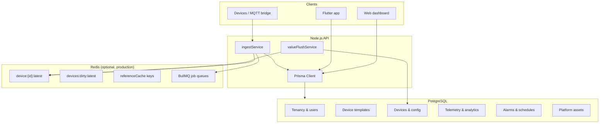
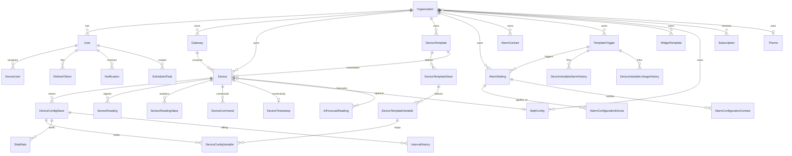
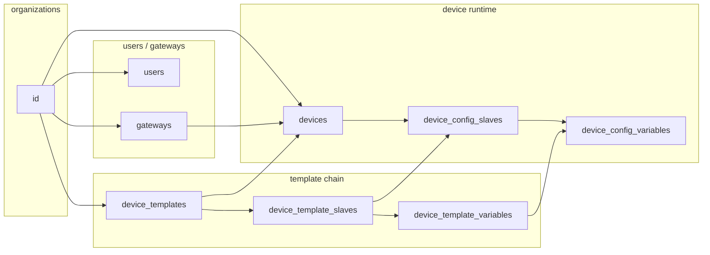
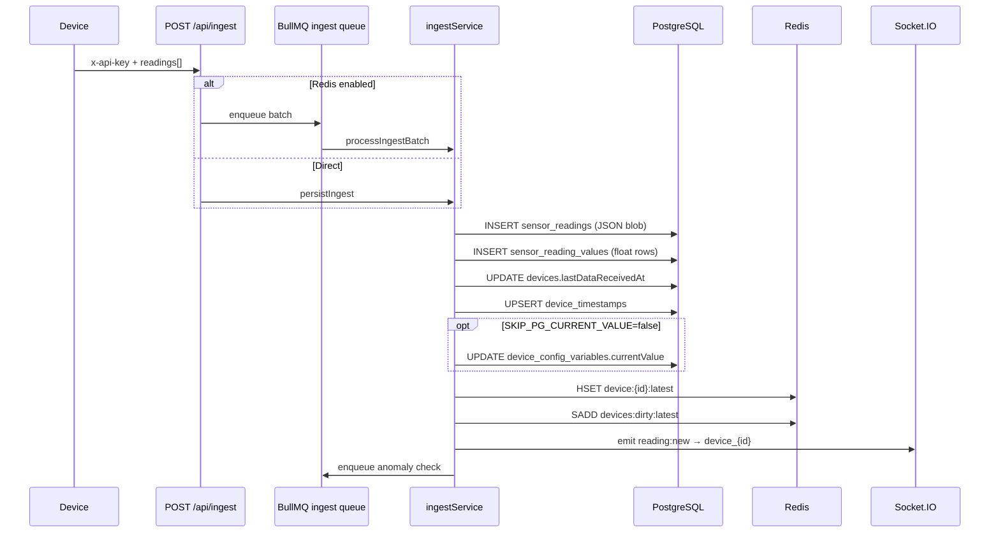
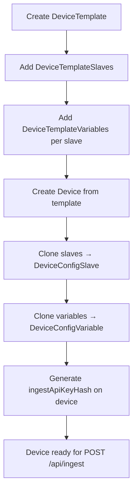
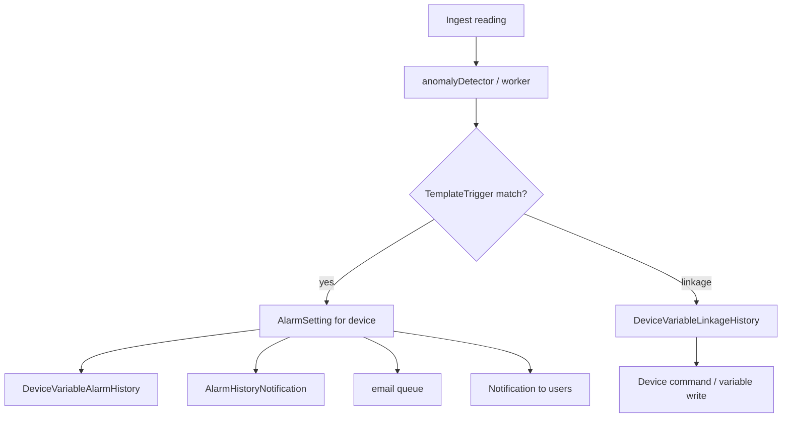
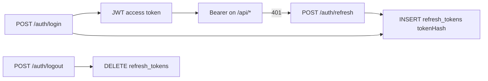
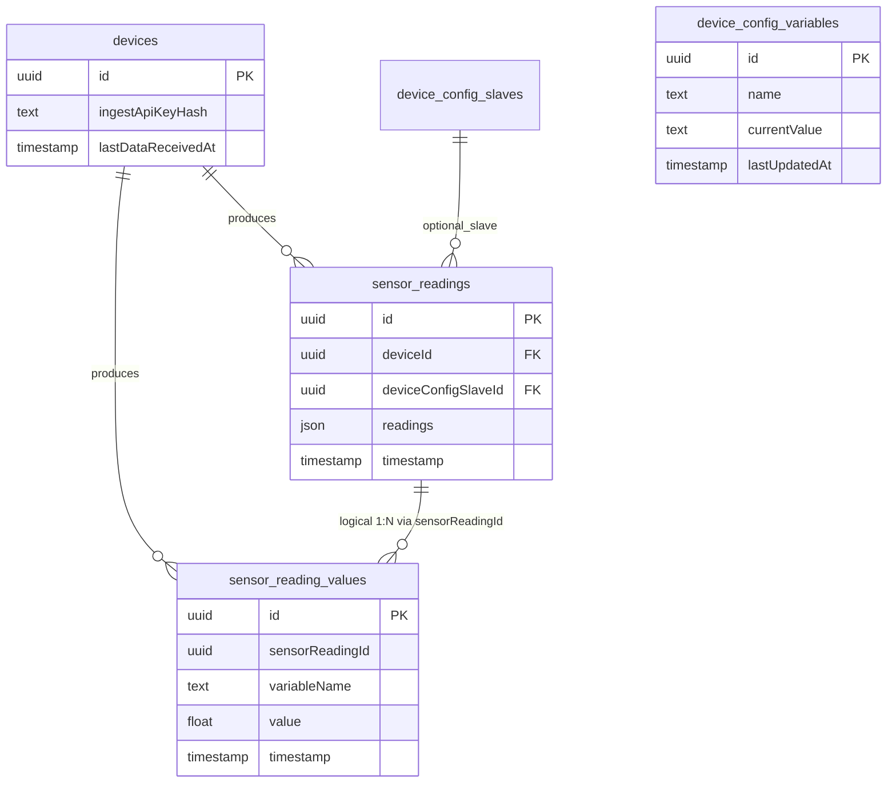

# Database architecture

Complete reference for the Smart AgriTech EMS data layer: **PostgreSQL** (Prisma ORM) plus **Redis** for hot telemetry cache.

**Source of truth:** `ems/ems-backend/prisma/schema.prisma`  
**Migrations:** `ems/ems-backend/prisma/migrations/`

---

## Storage overview

| Store | Engine | Purpose |
|-------|--------|---------|
| Primary DB | PostgreSQL 14+ | All persistent relational data |
| Hot cache | Redis 6+ | Latest variable values, job queues, reference cache |
| ORM | Prisma 5+ | Schema, migrations, type-safe queries |

**Multi-tenancy:** Almost every operational table carries `organizationId` for row-level scoping. `SUPER_ADMIN` bypasses org filters in controllers; `ORG_ADMIN` and `USER` are restricted to their organization (and device assignments for users).

---

## Domain model (high level)

---

## Table inventory (40 Prisma models)

| # | Prisma model | SQL table | Domain |
|---|--------------|-----------|--------|
| 1 | Organization | `organizations` | Tenancy |
| 2 | User | `users` | Auth |
| 3 | RefreshToken | `refresh_tokens` | Auth |
| 4 | PasswordResetCode | `password_reset_codes` | Auth |
| 5 | Gateway | `gateways` | IoT |
| 6 | DeviceTemplate | `device_templates` | IoT template |
| 7 | DeviceTemplateSlave | `device_template_slaves` | IoT template |
| 8 | DeviceTemplateVariable | `device_template_variables` | IoT template |
| 9 | Device | `devices` | IoT runtime |
| 10 | DeviceConfigSlave | `device_config_slaves` | IoT runtime |
| 11 | DeviceConfigVariable | `device_config_variables` | IoT runtime |
| 12 | DeviceConfigVariableLog | `device_config_variable_logs` | IoT audit |
| 13 | DeviceUser | `device_users` | Access control |
| 14 | DeviceCommand | `device_commands` | IoT commands |
| 15 | MqttConfig | `mqtt_configs` | IoT connectivity |
| 16 | SensorReading | `sensor_readings` | Telemetry |
| 17 | SensorReadingValue | `sensor_reading_values` | Telemetry analytics |
| 18 | DeviceTimestamp | `device_timestamps` | Connectivity |
| 19 | TemplateTrigger | `template_triggers` | Alarms |
| 20 | AlarmSetting | `alarm_settings` | Alarms |
| 21 | AlarmConfigurationDevice | `alarm_configuration_devices` | Alarms M:N |
| 22 | AlarmConfigurationContact | `alarm_configuration_contacts` | Alarms M:N |
| 23 | AlarmContact | `alarm_contacts` | Alarms |
| 24 | AlarmHistoryNotification | `alarm_history_notifications` | Alarms |
| 25 | DeviceVariableAlarmHistory | `device_variable_alarm_histories` | Alarms |
| 26 | DeviceVariableLinkageHistory | `device_variable_linkage_histories` | Alarms |
| 27 | ScheduledTask | `scheduled_tasks` | Automation |
| 28 | ScheduleExecutionLog | `schedule_execution_logs` | Automation |
| 29 | SlabRate | `slab_rates` | Billing |
| 30 | IntervalHistory | `interval_histories` | Billing |
| 31 | AIForecastReading | `ai_forecast_readings` | Analytics |
| 32 | Notification | `notifications` | User inbox |
| 33 | Icon | `icons` | UI assets |
| 34 | Product | `products` | Catalog |
| 35 | Theme | `themes` | UI theming |
| 36 | WidgetTemplate | `widget_templates` | Dashboard widgets |
| 37 | SystemSetting | `system_settings` | Platform config |
| 38 | ListType | `list_types` | Lookup lists |
| 39 | ListTypeItem | `list_type_items` | Lookup lists |
| 40 | Subscription | `subscriptions` | Lead capture |

> **Legacy note:** Initial migration also created a `predictions` table. The application uses `ai_forecast_readings` (Prisma `AIForecastReading`). The old `predictions` table may exist on databases created from the init migration only — it is not in the current Prisma schema.

---

## Enumerations (PostgreSQL ENUM types)

| Enum | Values | Used by |
|------|--------|---------|
| `OrgStatus` | `ACTIVE`, `INACTIVE` | organizations |
| `Role` | `SUPER_ADMIN`, `ORG_ADMIN`, `USER` | users |
| `UserStatus` | `ACTIVE`, `INACTIVE`, `DELETED` | users |
| `DeviceStatus` | `ONLINE`, `OFFLINE` | gateways, devices |
| `DataType` | `FLOAT`, `INTEGER`, `BOOLEAN`, `STRING` | device_template_variables |
| `SwitchState` | `ON`, `OFF` | devices |
| `CommandStatus` | `PENDING`, `ACKNOWLEDGED`, `FAILED`, `TIMEOUT` | device_commands |
| `LogSource` | `INGEST`, `MANUAL`, `SCHEDULE`, `AUTOMATION` | device_config_variable_logs |
| `Operator` | `GT`, `LT`, `EQ`, `GTE`, `LTE` | template_triggers |
| `Priority` | `LOW`, `MEDIUM`, `HIGH` | template_triggers |
| `AlarmStatus` | `ACTIVE`, `INACTIVE` | alarm_settings |
| `NotificationStatus` | `SENT`, `FAILED` | alarm_history_notifications |
| `AlarmState` | `ACTIVE`, `RESOLVED` | device_variable_alarm_histories |
| `ProcessState` | `UNPROCESSED`, `PROCESSED` | device_variable_alarm_histories |
| `TaskAction` | `ON`, `OFF` | scheduled_tasks |
| `RepeatType` | `DAILY`, `WEEKLY`, `ONCE` | scheduled_tasks |
| `TaskStatus` | `ACTIVE`, `INACTIVE` | scheduled_tasks |
| `ExecutionResult` | `SUCCESS`, `FAILED` | schedule_execution_logs |
| `Horizon` | `TEN_MIN`, `FIVE_HR`, `SEVEN_DAY`, `CUSTOM` | ai_forecast_readings |
| `IconStatus` | `ACTIVE`, `INACTIVE` | icons |
| `ProductStatus` | `ACTIVE`, `INACTIVE` | products |
| `ThemeStatus` | `ACTIVE`, `INACTIVE` | themes |
| `WidgetType` | `BAR`, `LINE`, `AREA`, `GAUGE`, `VALUE_CARD`, `PIE` | widget_templates |
| `SubscriptionStatus` | `NEW`, `CONTACTED`, `CLOSED` | subscriptions |

---

## Keys & indexes summary

### Primary keys

All tables use `id TEXT PRIMARY KEY` with UUID generated in application (`@default(uuid())`).

### Unique constraints

| Table | Constraint | Columns |
|-------|------------|---------|
| users | `users_email_key` | `email` |
| gateways | `gateways_serialNumber_key` | `serialNumber` |
| device_template_variables | `device_template_variables_templateSlaveId_name_key` | `(templateSlaveId, name)` |
| devices | `devices_mqttConfigId_key` | `mqttConfigId` |
| device_config_variables | `device_config_variables_deviceId_deviceConfigSlaveId_name_key` | `(deviceId, deviceConfigSlaveId, name)` |
| device_users | `device_users_deviceId_userId_key` | `(deviceId, userId)` |
| device_timestamps | `device_timestamps_deviceId_key` | `deviceId` |
| refresh_tokens | `refresh_tokens_tokenHash_key` | `tokenHash` |
| alarm_configuration_devices | `alarm_configuration_devices_alarmSettingId_deviceId_key` | `(alarmSettingId, deviceId)` |
| alarm_configuration_contacts | `alarm_configuration_contacts_alarmSettingId_alarmContactId_key` | `(alarmSettingId, alarmContactId)` |
| system_settings | `system_settings_key_key` | `key` |
| list_types | `list_types_name_key` | `name` |

### Performance indexes

| Table | Index | Columns | Query pattern |
|-------|-------|---------|---------------|
| refresh_tokens | `refresh_tokens_userId_idx` | `userId` | Logout all sessions |
| device_config_variable_logs | composite | `(deviceConfigVariableId, changedAt)` | Variable change history |
| device_config_variable_logs | composite | `(deviceId, changedAt)` | Device audit trail |
| device_users | composite | `(userId, deviceId)` | User device list |
| sensor_readings | composite | `(deviceId, deviceConfigSlaveId, timestamp)` | Raw history by slave |
| sensor_readings | composite | `(deviceId, timestamp)` | Device time series |
| sensor_readings | composite | `(organizationId, timestamp)` | Org-wide queries |
| sensor_reading_values | composite | `(deviceId, variableName, timestamp)` | Analytics charts |
| sensor_reading_values | composite | `(deviceId, timestamp)` | Dashboard aggregates |
| sensor_reading_values | composite | `(organizationId, timestamp)` | Org analytics |
| sensor_reading_values | single | `sensorReadingId` | Join raw → normalized |
| device_commands | composite | `(deviceId, status)` | Pending commands |
| device_commands | composite | `(organizationId, requestedAt)` | Admin command log |
| device_variable_alarm_histories | composite | `(deviceId, alarmTime)` | Alarm history |
| device_variable_linkage_histories | composite | `(deviceId, firedAt)` | Linkage audit |
| schedule_execution_logs | composite | `(scheduleTaskId, executedAt)` | Task run history |
| notifications | composite | `(userId, createdAt)` | User inbox |

---

## Foreign key linkage map

### FK delete behavior

| Parent → Child | ON DELETE |
|----------------|-----------|
| Organization → Gateway, DeviceTemplate, Device, … | `RESTRICT` (cannot delete org with children) |
| Organization → User, WidgetTemplate, Subscription | `SET NULL` |
| Device → SensorReading, DeviceConfigSlave, DeviceUser, … | `CASCADE` |
| DeviceTemplate → DeviceTemplateSlave | `CASCADE` |
| DeviceTemplateSlave → DeviceTemplateVariable | `CASCADE` |
| DeviceConfigSlave → SensorReading | `SET NULL` on slave delete |
| AlarmSetting → AlarmConfigurationDevice | `CASCADE` |
| TemplateTrigger → AlarmSetting | `SET NULL` |

---

## Data flow diagrams

### Ingest → PostgreSQL + Redis

### Template → device instantiation

### Alarm evaluation chain

### Auth token flow

---

## Redis key catalog

Redis is **not** defined in Prisma — these keys are used at runtime.

| Key pattern | Type | TTL | Written by | Read by |
|-------------|------|-----|------------|---------|
| `device:{deviceId}:latest` | Hash (field = variableName, value = string) | 3600s | ingestService | sensorDataController `/latest`, valueFlushService |
| `devices:dirty:latest` | Set of deviceIds | — | valueFlushService.markDirty | valueFlushService flush loop |
| BullMQ `ingest` | Queue | — | ingest route | ingest worker |
| BullMQ `anomaly` | Queue | — | ingestService | anomaly worker |
| BullMQ `email` | Queue | — | alarm notifier | email worker |
| BullMQ `device-delete` | Queue | — | device delete | purge worker |
| `ref:*` (referenceCache) | String/Hash | configurable | referenceCache utils | controllers on cache miss |

**Flush cycle:** When `SKIP_PG_CURRENT_VALUE=true` (default with Redis), `currentValue` in Postgres is updated periodically from Redis hash via `valueFlushService` (`VALUE_FLUSH_MS`, default 60s).

---

## Table reference (all columns)

### 1. organizations

| Column | Type | Null | Default | Description |
|--------|------|------|---------|-------------|
| id | TEXT | NO | uuid | Primary key |
| name | TEXT | NO | — | Organization display name |
| description | TEXT | YES | — | Optional description |
| status | OrgStatus | NO | ACTIVE | ACTIVE / INACTIVE |
| themeId | TEXT | YES | — | FK → themes.id |
| logoUrl | TEXT | YES | — | Logo image URL |
| createdAt | TIMESTAMP | NO | now() | Created |
| updatedAt | TIMESTAMP | NO | — | Auto-updated |

**Relations:** users, devices, gateways, deviceTemplates, alarmConfigurations, alarmContacts, templateTriggers, widgetTemplates, mqttConfigs, subscriptions

---

### 2. users

| Column | Type | Null | Default | Description |
|--------|------|------|---------|-------------|
| id | TEXT | NO | uuid | PK |
| fullName | TEXT | NO | — | Display name |
| email | TEXT | NO | — | **Unique** login |
| passwordHash | TEXT | NO | — | bcrypt hash |
| phone | TEXT | YES | — | Optional phone |
| role | Role | NO | USER | SUPER_ADMIN / ORG_ADMIN / USER |
| organizationId | TEXT | YES | — | FK → organizations (null for super admin) |
| status | UserStatus | NO | ACTIVE | ACTIVE / INACTIVE / DELETED |
| createdAt | TIMESTAMP | NO | now() | — |
| updatedAt | TIMESTAMP | NO | — | — |

---

### 3. refresh_tokens

| Column | Type | Null | Default | Description |
|--------|------|------|---------|-------------|
| id | TEXT | NO | uuid | PK |
| userId | TEXT | NO | — | FK → users (CASCADE) |
| tokenHash | TEXT | NO | — | **Unique** SHA-256 of refresh token |
| expiresAt | TIMESTAMP | NO | — | Expiry |
| createdAt | TIMESTAMP | NO | now() | — |

---

### 4. password_reset_codes

| Column | Type | Null | Default | Description |
|--------|------|------|---------|-------------|
| id | TEXT | NO | uuid | PK |
| userId | TEXT | NO | — | FK → users (CASCADE) |
| code | TEXT | NO | — | Reset code |
| expiresAt | TIMESTAMP | NO | — | Expiry |
| used | BOOLEAN | NO | false | One-time use flag |
| createdAt | TIMESTAMP | NO | now() | — |

---

### 5. gateways

| Column | Type | Null | Default | Description |
|--------|------|------|---------|-------------|
| id | TEXT | NO | uuid | PK |
| name | TEXT | NO | — | Gateway name |
| serialNumber | TEXT | NO | — | **Unique** hardware ID |
| model | TEXT | YES | — | Model string |
| status | DeviceStatus | NO | OFFLINE | ONLINE / OFFLINE |
| organizationId | TEXT | NO | — | FK → organizations |
| lastSeenAt | TIMESTAMP | YES | — | Last heartbeat |
| createdAt | TIMESTAMP | NO | now() | — |
| updatedAt | TIMESTAMP | NO | — | — |

---

### 6. device_templates

| Column | Type | Null | Default | Description |
|--------|------|------|---------|-------------|
| id | TEXT | NO | uuid | PK |
| name | TEXT | NO | — | Template name |
| organizationId | TEXT | NO | — | FK → organizations |
| acquisitionMethod | TEXT | YES | — | e.g. Modbus, MQTT |
| totalSlaves | INT | NO | 0 | Denormalized count |
| totalVariables | INT | NO | 0 | Denormalized count |
| createdAt | TIMESTAMP | NO | now() | — |
| updatedAt | TIMESTAMP | NO | — | — |

---

### 7. device_template_slaves

| Column | Type | Null | Default | Description |
|--------|------|------|---------|-------------|
| id | TEXT | NO | uuid | PK |
| templateId | TEXT | NO | — | FK → device_templates (CASCADE) |
| organizationId | TEXT | NO | — | Org scope |
| name | TEXT | NO | — | Slave name (e.g. Meter 1) |
| description | TEXT | YES | — | — |
| isDefault | BOOLEAN | NO | false | Default slave for UI |
| createdAt | TIMESTAMP | NO | now() | — |
| updatedAt | TIMESTAMP | NO | — | — |

---

### 8. device_template_variables

| Column | Type | Null | Default | Description |
|--------|------|------|---------|-------------|
| id | TEXT | NO | uuid | PK |
| templateSlaveId | TEXT | NO | — | FK → device_template_slaves |
| templateId | TEXT | NO | — | Denormalized template ref |
| organizationId | TEXT | NO | — | Org scope |
| name | TEXT | NO | — | Variable key in ingest JSON |
| displayName | TEXT | YES | — | UI label |
| unit | TEXT | YES | — | e.g. kW, V, °C |
| registerAddress | TEXT | YES | — | Modbus register |
| iconId | TEXT | YES | — | FK → icons |
| dataType | DataType | NO | FLOAT | FLOAT / INTEGER / BOOLEAN / STRING |
| isActive | BOOLEAN | NO | true | Soft disable |
| createdAt | TIMESTAMP | NO | now() | — |
| updatedAt | TIMESTAMP | NO | — | — |

**Unique:** `(templateSlaveId, name)`

---

### 9. devices

| Column | Type | Null | Default | Description |
|--------|------|------|---------|-------------|
| id | TEXT | NO | uuid | PK; also used in ingest payload |
| name | TEXT | NO | — | Device display name |
| gatewayId | TEXT | YES | — | FK → gateways |
| organizationId | TEXT | NO | — | FK → organizations |
| templateId | TEXT | NO | — | FK → device_templates |
| switchState | SwitchState | NO | OFF | ON / OFF (scheduler) |
| status | DeviceStatus | NO | OFFLINE | Connectivity |
| mqttConfigId | TEXT | YES | — | **Unique** FK → mqtt_configs (1:1) |
| lastDataReceivedAt | TIMESTAMP | YES | — | Last ingest time |
| ingestApiKeyHash | TEXT | YES | — | SHA-256 of per-device ingest key |
| createdAt | TIMESTAMP | NO | now() | — |
| updatedAt | TIMESTAMP | NO | — | — |

**Ingest auth:** `ingestApiKeyHash` compared against `x-api-key` header (or global `INGEST_API_KEY` env).

---

### 10. device_config_slaves

| Column | Type | Null | Default | Description |
|--------|------|------|---------|-------------|
| id | TEXT | NO | uuid | PK; used as `slaveId` in ingest |
| deviceId | TEXT | NO | — | FK → devices (CASCADE) |
| templateSlaveId | TEXT | NO | — | FK → device_template_slaves |
| organizationId | TEXT | NO | — | Org scope |
| name | TEXT | NO | — | Runtime slave name |
| description | TEXT | YES | — | — |
| isDefault | BOOLEAN | NO | false | — |
| isActive | BOOLEAN | NO | true | — |
| createdAt | TIMESTAMP | NO | now() | — |
| updatedAt | TIMESTAMP | NO | — | — |

---

### 11. device_config_variables

| Column | Type | Null | Default | Description |
|--------|------|------|---------|-------------|
| id | TEXT | NO | uuid | PK |
| deviceId | TEXT | NO | — | FK → devices (CASCADE) |
| deviceConfigSlaveId | TEXT | NO | — | FK → device_config_slaves |
| templateVariableId | TEXT | NO | — | FK → device_template_variables |
| organizationId | TEXT | NO | — | Org scope |
| name | TEXT | NO | — | Must match ingest `variableName` |
| displayName | TEXT | YES | — | UI label |
| unit | TEXT | YES | — | — |
| currentValue | TEXT | YES | — | Latest value (PG or flushed from Redis) |
| lastUpdatedAt | TIMESTAMP | YES | — | Last value change |
| isActive | BOOLEAN | NO | true | — |
| createdAt | TIMESTAMP | NO | now() | — |
| updatedAt | TIMESTAMP | NO | — | — |

**Unique:** `(deviceId, deviceConfigSlaveId, name)`

---

### 12. device_config_variable_logs

| Column | Type | Null | Default | Description |
|--------|------|------|---------|-------------|
| id | TEXT | NO | uuid | PK |
| deviceConfigVariableId | TEXT | NO | — | FK → device_config_variables |
| deviceId | TEXT | NO | — | FK → devices |
| organizationId | TEXT | NO | — | Org scope |
| previousValue | TEXT | YES | — | Before change |
| newValue | TEXT | YES | — | After change |
| source | LogSource | NO | INGEST | INGEST / MANUAL / SCHEDULE / AUTOMATION |
| changedAt | TIMESTAMP | NO | now() | — |

---

### 13. device_users

| Column | Type | Null | Default | Description |
|--------|------|------|---------|-------------|
| id | TEXT | NO | uuid | PK |
| deviceId | TEXT | NO | — | FK → devices (CASCADE) |
| userId | TEXT | NO | — | FK → users (CASCADE) |
| organizationId | TEXT | NO | — | Org scope |
| assignedAt | TIMESTAMP | NO | now() | — |
| assignedBy | TEXT | YES | — | Admin user id |

**Unique:** `(deviceId, userId)` — controls USER role device access.

---

### 14. device_commands

| Column | Type | Null | Default | Description |
|--------|------|------|---------|-------------|
| id | TEXT | NO | uuid | PK |
| deviceId | TEXT | NO | — | FK → devices (CASCADE) |
| organizationId | TEXT | NO | — | Org scope |
| action | TEXT | NO | — | Command payload |
| status | CommandStatus | NO | PENDING | PENDING / ACKNOWLEDGED / FAILED / TIMEOUT |
| requestedBy | TEXT | YES | — | User id |
| requestedAt | TIMESTAMP | NO | now() | — |
| acknowledgedAt | TIMESTAMP | YES | — | Device ACK time |
| failedReason | TEXT | YES | — | Error detail |

---

### 15. mqtt_configs

| Column | Type | Null | Default | Description |
|--------|------|------|---------|-------------|
| id | TEXT | NO | uuid | PK |
| organizationId | TEXT | NO | — | FK → organizations |
| brokerUrl | TEXT | YES | — | MQTT broker host |
| port | INT | NO | 1883 | Broker port |
| username | TEXT | YES | — | — |
| passwordEncrypted | TEXT | YES | — | Encrypted password |
| topic | TEXT | YES | — | Subscribe topic |
| isActive | BOOLEAN | NO | true | — |
| createdBy | TEXT | YES | — | FK → users |
| createdAt | TIMESTAMP | NO | now() | — |
| updatedAt | TIMESTAMP | NO | — | — |

**Relation:** One optional `Device` per config via `devices.mqttConfigId`.

---

### 16. sensor_readings (raw ingest log)

| Column | Type | Null | Default | Description |
|--------|------|------|---------|-------------|
| id | TEXT | NO | uuid | PK |
| deviceId | TEXT | NO | — | FK → devices (CASCADE) |
| deviceConfigSlaveId | TEXT | YES | — | FK → device_config_slaves (SET NULL) |
| organizationId | TEXT | NO | — | Org scope |
| timestamp | TIMESTAMP | NO | now() | Ingest time |
| readings | JSON | NO | — | Full batch `{ variableName, value }[]` |

**Usage:** Sensor History page (`GET /sensor-data/readings`), audit, replay.

---

### 17. sensor_reading_values (normalized analytics)

| Column | Type | Null | Default | Description |
|--------|------|------|---------|-------------|
| id | TEXT | NO | uuid | PK |
| sensorReadingId | TEXT | NO | — | Parent reading id (no FK in schema) |
| deviceId | TEXT | NO | — | Denormalized device |
| deviceConfigSlaveId | TEXT | YES | — | Optional slave |
| organizationId | TEXT | NO | — | Org scope |
| variableName | TEXT | NO | — | Variable key |
| value | FLOAT | NO | — | Numeric value |
| timestamp | TIMESTAMP | NO | — | Reading time |

**Usage:** Charts, aggregates (`GET /sensor-data/history`, `/aggregate`, `/dashboard-summary`), AI analytics.

> Denormalized by design for fast time-series queries without JSON parsing.

---

### 18. device_timestamps

| Column | Type | Null | Default | Description |
|--------|------|------|---------|-------------|
| id | TEXT | NO | uuid | PK |
| deviceId | TEXT | NO | — | **Unique** FK → devices |
| organizationId | TEXT | NO | — | Org scope |
| lastActiveAt | TIMESTAMP | NO | now() | Last ingest / activity |

---

### 19. template_triggers

| Column | Type | Null | Default | Description |
|--------|------|------|---------|-------------|
| id | TEXT | NO | uuid | PK |
| deviceTemplateId | TEXT | NO | — | FK → device_templates (CASCADE) |
| organizationId | TEXT | NO | — | FK → organizations |
| name | TEXT | NO | — | Trigger name |
| templateVariableId | TEXT | NO | — | FK → device_template_variables (watched) |
| operator | Operator | NO | — | GT / LT / EQ / GTE / LTE |
| threshold | FLOAT | NO | — | Compare value |
| anomalyType | TEXT | NO | — | Classification label |
| priority | Priority | NO | MEDIUM | LOW / MEDIUM / HIGH |
| linkageVariableId | TEXT | YES | — | FK → device_template_variables (action target) |
| linkageAction | TEXT | YES | — | e.g. SET, TOGGLE |
| linkageValue | TEXT | YES | — | Value to write |
| isActive | BOOLEAN | NO | true | — |
| createdBy | TEXT | YES | — | FK → users |
| createdAt | TIMESTAMP | NO | now() | — |
| updatedAt | TIMESTAMP | NO | — | — |

---

### 20. alarm_settings

| Column | Type | Null | Default | Description |
|--------|------|------|---------|-------------|
| id | TEXT | NO | uuid | PK |
| name | TEXT | NO | — | Alarm config name |
| organizationId | TEXT | NO | — | FK → organizations |
| templateTriggerId | TEXT | YES | — | FK → template_triggers |
| pushType | TEXT | YES | — | Notification type |
| pushBody | TEXT | YES | — | Message template |
| pushMethod | TEXT | YES | — | email / sms / push |
| pushingMechanism | TEXT | YES | — | Delivery mechanism |
| status | AlarmStatus | NO | ACTIVE | ACTIVE / INACTIVE |
| createdBy | TEXT | YES | — | FK → users |
| createdAt | TIMESTAMP | NO | now() | — |
| updatedAt | TIMESTAMP | NO | — | — |

**M:N:** devices via `alarm_configuration_devices`, contacts via `alarm_configuration_contacts`.

---

### 21. alarm_configuration_devices

| Column | Type | Null | Default | Description |
|--------|------|------|---------|-------------|
| id | TEXT | NO | uuid | PK |
| alarmSettingId | TEXT | NO | — | FK → alarm_settings (CASCADE) |
| deviceId | TEXT | NO | — | FK → devices (CASCADE) |

**Unique:** `(alarmSettingId, deviceId)`

---

### 22. alarm_configuration_contacts

| Column | Type | Null | Default | Description |
|--------|------|------|---------|-------------|
| id | TEXT | NO | uuid | PK |
| alarmSettingId | TEXT | NO | — | FK → alarm_settings (CASCADE) |
| alarmContactId | TEXT | NO | — | FK → alarm_contacts (CASCADE) |

**Unique:** `(alarmSettingId, alarmContactId)`

---

### 23. alarm_contacts

| Column | Type | Null | Default | Description |
|--------|------|------|---------|-------------|
| id | TEXT | NO | uuid | PK |
| name | TEXT | NO | — | Contact name |
| organizationId | TEXT | NO | — | FK → organizations |
| mobile | TEXT | YES | — | Phone |
| email | TEXT | YES | — | Email |
| whatsapp | TEXT | YES | — | WhatsApp |
| remark | TEXT | YES | — | Notes |
| createdBy | TEXT | YES | — | FK → users |
| createdAt | TIMESTAMP | NO | now() | — |
| updatedAt | TIMESTAMP | NO | — | — |

---

### 24. alarm_history_notifications

| Column | Type | Null | Default | Description |
|--------|------|------|---------|-------------|
| id | TEXT | NO | uuid | PK |
| alarmSettingId | TEXT | YES | — | FK → alarm_settings |
| organizationId | TEXT | NO | — | Org scope |
| deviceId | TEXT | YES | — | FK → devices (SET NULL) |
| message | TEXT | YES | — | Sent message |
| pushType | TEXT | YES | — | Channel |
| sentTo | TEXT | YES | — | Recipient |
| sentAt | TIMESTAMP | NO | now() | — |
| status | NotificationStatus | NO | SENT | SENT / FAILED |

---

### 25. device_variable_alarm_histories

| Column | Type | Null | Default | Description |
|--------|------|------|---------|-------------|
| id | TEXT | NO | uuid | PK |
| alarmSettingId | TEXT | YES | — | FK → alarm_settings |
| templateTriggerId | TEXT | YES | — | FK → template_triggers |
| deviceId | TEXT | NO | — | FK → devices (CASCADE) |
| organizationId | TEXT | NO | — | Org scope |
| variableName | TEXT | NO | — | Variable that triggered |
| triggerName | TEXT | YES | — | Snapshot of trigger name |
| triggerType | TEXT | YES | — | Anomaly type |
| slaveName | TEXT | YES | — | Slave label |
| currentValue | FLOAT | YES | — | Value at alarm time |
| triggeringCondition | TEXT | YES | — | Human-readable condition |
| alarmTime | TIMESTAMP | NO | now() | — |
| alarmState | AlarmState | NO | ACTIVE | ACTIVE / RESOLVED |
| processState | ProcessState | NO | UNPROCESSED | UNPROCESSED / PROCESSED |

---

### 26. device_variable_linkage_histories

| Column | Type | Null | Default | Description |
|--------|------|------|---------|-------------|
| id | TEXT | NO | uuid | PK |
| deviceId | TEXT | NO | — | FK → devices (CASCADE) |
| organizationId | TEXT | NO | — | Org scope |
| templateTriggerId | TEXT | YES | — | FK → template_triggers |
| triggerName | TEXT | YES | — | — |
| watchedVariableName | TEXT | YES | — | Input variable |
| watchedVariableValue | FLOAT | YES | — | Input value |
| linkedVariableName | TEXT | YES | — | Output variable |
| actionTaken | TEXT | YES | — | Action performed |
| firedAt | TIMESTAMP | NO | now() | — |

---

### 27. scheduled_tasks

| Column | Type | Null | Default | Description |
|--------|------|------|---------|-------------|
| id | TEXT | NO | uuid | PK |
| organizationId | TEXT | NO | — | Org scope |
| createdBy | TEXT | YES | — | FK → users |
| deviceId | TEXT | NO | — | FK → devices (CASCADE) |
| deviceConfigSlaveId | TEXT | YES | — | FK → device_config_slaves (SET NULL) |
| deviceConfigVariableId | TEXT | YES | — | FK → device_config_variables |
| variableName | TEXT | NO | — | Target variable |
| action | TaskAction | NO | — | ON / OFF |
| scheduledTime | TEXT | NO | — | Time expression (cron-like) |
| repeatType | RepeatType | NO | DAILY | DAILY / WEEKLY / ONCE |
| daysOfWeek | INT[] | NO | — | PostgreSQL integer array |
| status | TaskStatus | NO | ACTIVE | ACTIVE / INACTIVE |
| nextRunAt | TIMESTAMP | YES | — | Next execution |
| createdAt | TIMESTAMP | NO | now() | — |
| updatedAt | TIMESTAMP | NO | — | — |

---

### 28. schedule_execution_logs

| Column | Type | Null | Default | Description |
|--------|------|------|---------|-------------|
| id | TEXT | NO | uuid | PK |
| scheduleTaskId | TEXT | NO | — | FK → scheduled_tasks (CASCADE) |
| deviceId | TEXT | NO | — | FK → devices (CASCADE) |
| organizationId | TEXT | NO | — | Org scope |
| executedAt | TIMESTAMP | NO | now() | — |
| action | TEXT | YES | — | Action executed |
| variableName | TEXT | YES | — | — |
| result | ExecutionResult | NO | SUCCESS | SUCCESS / FAILED |
| errorMessage | TEXT | YES | — | Failure reason |

---

### 29. slab_rates

| Column | Type | Null | Default | Description |
|--------|------|------|---------|-------------|
| id | TEXT | NO | uuid | PK |
| organizationId | TEXT | NO | — | Org scope |
| deviceConfigSlaveId | TEXT | NO | — | FK → device_config_slaves (CASCADE) |
| unitFrom | FLOAT | NO | — | Tier start (kWh) |
| unitTo | FLOAT | NO | — | Tier end |
| rate | FLOAT | NO | — | Price per unit |
| onPeakRate | FLOAT | YES | — | Peak tariff |
| offPeakRate | FLOAT | YES | — | Off-peak tariff |
| createdBy | TEXT | YES | — | FK → users |
| createdAt | TIMESTAMP | NO | now() | — |
| updatedAt | TIMESTAMP | NO | — | — |

---

### 30. interval_histories

| Column | Type | Null | Default | Description |
|--------|------|------|---------|-------------|
| id | TEXT | NO | uuid | PK |
| organizationId | TEXT | NO | — | Org scope |
| deviceId | TEXT | YES | — | FK → devices (SET NULL) |
| deviceConfigSlaveId | TEXT | NO | — | FK → device_config_slaves (CASCADE) |
| templateVariableId | TEXT | YES | — | FK → device_template_variables |
| templateSlaveId | TEXT | YES | — | FK → device_template_slaves |
| variableName | TEXT | NO | — | Metered variable |
| slaveName | TEXT | YES | — | Display |
| totalUnit | FLOAT | NO | 0 | Consumption in period |
| tariff | FLOAT | NO | 0 | Applied rate |
| startDate | TIMESTAMP | NO | — | Billing period start |
| endDate | TIMESTAMP | NO | — | Billing period end |
| computedAt | TIMESTAMP | NO | now() | Calculation time |

---

### 31. ai_forecast_readings

| Column | Type | Null | Default | Description |
|--------|------|------|---------|-------------|
| id | TEXT | NO | uuid | PK |
| deviceId | TEXT | NO | — | FK → devices (CASCADE) |
| organizationId | TEXT | NO | — | Org scope |
| templateVariableId | TEXT | YES | — | FK → device_template_variables |
| templateSlaveId | TEXT | YES | — | FK → device_template_slaves |
| variableName | TEXT | NO | — | Forecast target |
| horizon | Horizon | NO | — | TEN_MIN / FIVE_HR / SEVEN_DAY / CUSTOM |
| predictions | JSON | NO | — | `[{ timestamp, value }]` array |
| generatedAt | TIMESTAMP | NO | now() | — |

---

### 32. notifications

| Column | Type | Null | Default | Description |
|--------|------|------|---------|-------------|
| id | TEXT | NO | uuid | PK |
| userId | TEXT | NO | — | FK → users (CASCADE) |
| organizationId | TEXT | NO | — | Org scope |
| triggerName | TEXT | YES | — | Alarm trigger label |
| deviceName | TEXT | YES | — | Device label |
| description | TEXT | YES | — | Message body |
| read | BOOLEAN | NO | false | Read flag |
| createdAt | TIMESTAMP | NO | now() | — |

---

### 33. icons

| Column | Type | Null | Default | Description |
|--------|------|------|---------|-------------|
| id | TEXT | NO | uuid | PK |
| name | TEXT | NO | — | Icon name |
| imageUrl | TEXT | NO | — | Image URL (Cloudinary) |
| status | IconStatus | NO | ACTIVE | ACTIVE / INACTIVE |
| createdAt | TIMESTAMP | NO | now() | — |
| updatedAt | TIMESTAMP | NO | — | — |

---

### 34. products

| Column | Type | Null | Default | Description |
|--------|------|------|---------|-------------|
| id | TEXT | NO | uuid | PK |
| name | TEXT | NO | — | Product name |
| price | FLOAT | YES | — | Price |
| imageUrl | TEXT | YES | — | Image |
| description | TEXT | YES | — | — |
| status | ProductStatus | NO | ACTIVE | ACTIVE / INACTIVE |
| createdAt | TIMESTAMP | NO | now() | — |
| updatedAt | TIMESTAMP | NO | — | — |

---

### 35. themes

| Column | Type | Null | Default | Description |
|--------|------|------|---------|-------------|
| id | TEXT | NO | uuid | PK |
| name | TEXT | NO | — | Theme name |
| headerFontColor | TEXT | YES | — | CSS color |
| headerBgColor | TEXT | YES | — | CSS color |
| bodyFontColor | TEXT | YES | — | CSS color |
| bodyBgColor | TEXT | YES | — | CSS color |
| fontSize | TEXT | YES | — | Base font size |
| status | ThemeStatus | NO | ACTIVE | — |
| createdBy | TEXT | YES | — | FK → users |
| createdAt | TIMESTAMP | NO | now() | — |
| updatedAt | TIMESTAMP | NO | — | — |

---

### 36. widget_templates

| Column | Type | Null | Default | Description |
|--------|------|------|---------|-------------|
| id | TEXT | NO | uuid | PK |
| organizationId | TEXT | YES | — | FK → organizations |
| name | TEXT | NO | — | Widget name |
| iconId | TEXT | YES | — | FK → icons |
| themeId | TEXT | YES | — | FK → themes |
| widgetType | WidgetType | NO | VALUE_CARD | BAR / LINE / AREA / GAUGE / VALUE_CARD / PIE |
| variableName | TEXT | YES | — | Bound variable |
| displayName | TEXT | YES | — | Label |
| unit | TEXT | YES | — | — |
| position | INT | NO | 0 | Dashboard sort order |
| isActive | BOOLEAN | NO | true | — |
| createdBy | TEXT | YES | — | FK → users |
| createdAt | TIMESTAMP | NO | now() | — |
| updatedAt | TIMESTAMP | NO | — | — |

---

### 37. system_settings

| Column | Type | Null | Default | Description |
|--------|------|------|---------|-------------|
| id | TEXT | NO | uuid | PK |
| key | TEXT | NO | — | **Unique** setting key |
| type | TEXT | NO | — | string / number / boolean |
| value | TEXT | YES | — | Serialized value |
| description | TEXT | YES | — | Admin description |
| updatedAt | TIMESTAMP | NO | — | — |

---

### 38. list_types / 39. list_type_items

**list_types**

| Column | Type | Description |
|--------|------|-------------|
| id | TEXT PK | — |
| name | TEXT **unique** | List category name |
| description | TEXT | — |
| isActive | BOOLEAN | — |

**list_type_items**

| Column | Type | Description |
|--------|------|-------------|
| id | TEXT PK | — |
| listTypeId | TEXT FK | → list_types (CASCADE) |
| name | TEXT | Item label |
| description | TEXT | — |
| isActive | BOOLEAN | — |

---

### 40. subscriptions

| Column | Type | Null | Default | Description |
|--------|------|------|---------|-------------|
| id | TEXT | NO | uuid | PK |
| organizationId | TEXT | YES | — | FK → organizations |
| name | TEXT | NO | — | Requester name |
| email | TEXT | NO | — | Contact email |
| phone | TEXT | YES | — | — |
| description | TEXT | YES | — | Message |
| status | SubscriptionStatus | NO | NEW | NEW / CONTACTED / CLOSED |
| submittedAt | TIMESTAMP | NO | now() | — |

---

## Feature → table mapping

| Feature | Primary tables |
|---------|----------------|
| Login / JWT | users, refresh_tokens |
| Password reset | password_reset_codes |
| Org management | organizations, themes |
| User management | users, device_users |
| Gateway registry | gateways |
| Device onboarding | devices, device_templates, device_config_* |
| Ingest telemetry | sensor_readings, sensor_reading_values, device_config_variables, device_timestamps |
| Live dashboard | device_config_variables + Redis `device:*:latest` |
| Sensor history | sensor_readings, sensor_reading_values |
| Charts / aggregates | sensor_reading_values |
| Device commands | device_commands |
| Alarms | template_triggers, alarm_settings, alarm_configuration_*, device_variable_alarm_histories |
| Linkage automation | template_triggers, device_variable_linkage_histories |
| Notifications | notifications, alarm_history_notifications |
| Schedules | scheduled_tasks, schedule_execution_logs |
| Billing | slab_rates, interval_histories |
| AI analytics | sensor_reading_values, ai_forecast_readings |
| Dashboard widgets | widget_templates, icons, themes |
| MQTT | mqtt_configs, devices |
| Platform catalog | products, icons, system_settings, list_types |
| Subscription leads | subscriptions |

---

## Entity relationship (telemetry focus)

---

## Security-sensitive columns

| Table | Column | Storage | Notes |
|-------|--------|---------|-------|
| users | passwordHash | bcrypt | Never returned in API |
| devices | ingestApiKeyHash | SHA-256 | Plain key shown once on create |
| refresh_tokens | tokenHash | SHA-256 | Raw token only in HTTP response |
| mqtt_configs | passwordEncrypted | Encrypted | Broker credentials |
| password_reset_codes | code | Plain | Short-lived, single use |

---

## Maintenance & operations

| Task | Command / approach |
|------|-------------------|
| Apply migrations | `npx prisma migrate deploy` |
| Regenerate client | `npx prisma generate` |
| Seed demo data | `npm run seed` |
| Bulk delete sensor data | `DELETE /api/sensor-data` (SUPER_ADMIN) |
| Device purge | BullMQ `device-delete` queue cascades related rows |
| Backup | `pg_dump` of CapRover `iotpostgres` volume |
| Read replica | Set `DATABASE_READ_URL` for read-heavy queries |

---

## Related documents

- [Architecture](./02-architecture.md)
- [Backend API](./05-backend.md)
- [System flows](./01-system-overview-and-flows.md)
- [Deployment](./07-deployment-guide.md)
- Prisma schema: `ems/ems-backend/prisma/schema.prisma`
