# EMS Backend — Complete Technical Documentation

> **Project:** Smart AgriTech / Energy Management System (EMS)  
> **Location:** `ems/ems-backend/`  
> **Stack:** Node.js · Express 5 · Prisma 7 · PostgreSQL · Socket.IO · node-cron  
> **Default Port:** `5000`  
> **API Base:** `/api`  
> **Generated:** June 2026 · **Version:** 2.0 (Extended Deep Dive)  
> **Lines:** ~2,400+ · Covers all 79 source files, 121 endpoints, 40 models

---

## Table of Contents

1. [Overview](#1-overview)
2. [Folder Structure](#2-folder-structure)
3. [System Architecture](#3-system-architecture)
4. [Startup & Request Lifecycle](#4-startup--request-lifecycle)
5. [Authentication & Authorization](#5-authentication--authorization)
6. [Error Handling & HTTP Status Codes](#6-error-handling--http-status-codes)
7. [Rate Limiting](#7-rate-limiting)
8. [Real-Time (Socket.IO)](#8-real-time-socketio)
9. [Core Business Flows](#9-core-business-flows)
10. [Database Models & Relationships](#10-database-models--relationships)
11. [Services Layer](#11-services-layer)
12. [Complete API Reference](#12-complete-api-reference)
13. [Environment Variables](#13-environment-variables)
14. [Known Gaps & Dead Code](#14-known-gaps--dead-code)
15. [Per-File Source Code Reference](#15-per-file-source-code-reference)
16. [Express Middleware Pipeline (Exact Order)](#16-express-middleware-pipeline-exact-order)
17. [Database Integrity: Indexes, Uniques, Foreign Keys](#17-database-integrity-indexes-uniques-foreign-keys)
18. [IoT Data Contract & Standard Variables](#18-iot-data-contract--standard-variables)
19. [Controller Function Reference](#19-controller-function-reference)
20. [Algorithm Deep Dives](#20-algorithm-deep-dives)
21. [Full Response Schemas (Analytics & Dashboard)](#21-full-response-schemas-analytics--dashboard)
22. [Multi-Tenant Access Control Matrix](#22-multi-tenant-access-control-matrix)
23. [Transactions & Side Effects Catalog](#23-transactions--side-effects-catalog)
24. [Security Analysis](#24-security-analysis)
25. [Seeder & Local Development Guide](#25-seeder--local-development-guide)
26. [Route Mounting Tree](#26-route-mounting-tree)

---

## 1. Overview

The EMS backend is a **multi-tenant IoT energy management platform**. It provides:

- **REST API** for organizations, users, devices, templates, sensor data, alarms, scheduling, billing, and admin features
- **IoT data ingest** endpoint for gateways/devices pushing sensor readings
- **Real-time updates** via Socket.IO (readings, alarms, device switches)
- **Anomaly detection** on ingest against configurable template triggers
- **Scheduled device control** via cron jobs
- **Electricity tariff calculation** using slab rates
- **AI analytics** dashboards (aggregations + forecast data)

### Tech Stack Summary

| Layer | Technology |
|-------|------------|
| Runtime | Node.js |
| HTTP Framework | Express 5 |
| ORM | Prisma 7 with `@prisma/adapter-pg` |
| Database | PostgreSQL |
| Auth | JWT in httpOnly cookie + API key for ingest |
| Real-time | Socket.IO 4 |
| Scheduling | node-cron |
| File Upload | Multer + Cloudinary |
| Email | Nodemailer (Gmail SMTP) |
| Password Hashing | bcryptjs (12 rounds) |

### Entry Points

| Command | Description |
|---------|-------------|
| `npm start` | Production server (`node server.js`) |
| `npm run dev` | Development with nodemon |
| `npm run seed` | Seed database via `utils/dummyDataSeeder.js` |

---

## 2. Folder Structure

```
ems-backend/
├── server.js                    # Main HTTP server entry point
├── package.json
├── prisma.config.ts               # Prisma CLI configuration
├── .env.example
│
├── config/
│   ├── database.js              # Prisma singleton (pg Pool + PrismaPg adapter)
│   ├── cloudinary.js            # Cloudinary SDK config
│   └── nodemailer.js            # Gmail SMTP transporter
│
├── middleware/
│   ├── auth.js                  # JWT protect + role authorize
│   ├── errorHandler.js          # AppError class + global handler
│   ├── rateLimiter.js           # API + ingest rate limits
│   └── upload.js                # Multer + Cloudinary storage
│
├── routes/                        # 28 Express router files
│   └── index.js                 # Central router mounting all /api/* routes
│
├── controllers/                   # 27 request handler files
│
├── services/
│   ├── anomalyDetector.js       # Trigger evaluation on ingest
│   ├── notificationService.js   # In-app + email alarm notifications
│   ├── schedulerService.js      # node-cron task registry
│   └── costCalculator.js        # Slab-rate billing computation
│
├── socket/
│   └── index.js                 # Socket.IO init + JWT handshake
│
├── utils/
│   ├── pagination.js            # Page/limit helpers
│   ├── dummyDataSeeder.js       # Full dev database seeder
│   └── dateHelpers.js           # STUB — not implemented
│
└── prisma/
    ├── schema.prisma            # 40 models, 25+ enums
    └── migrations/
        └── 20260611155744_init/
            └── migration.sql
```

**Total backend source files:** ~79

---

## 3. System Architecture

### High-Level Architecture Diagram

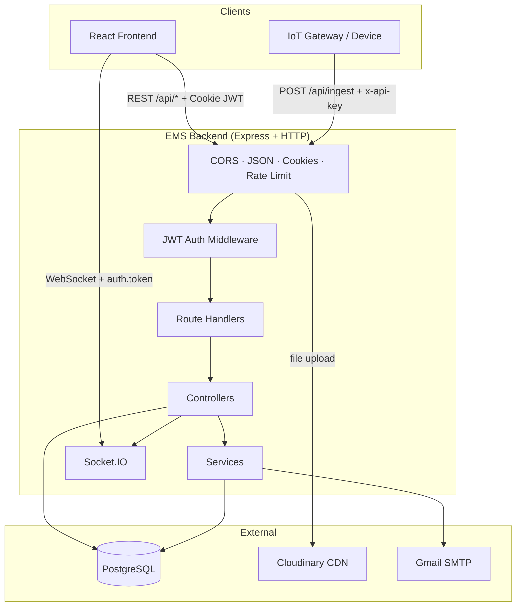

### Layered Architecture

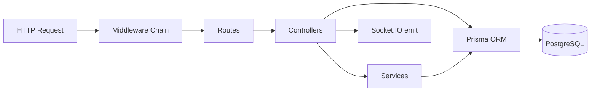

### Multi-Tenant Data Model (Conceptual)

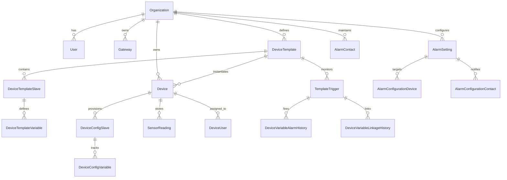

---

## 4. Startup & Request Lifecycle

### Server Startup Sequence

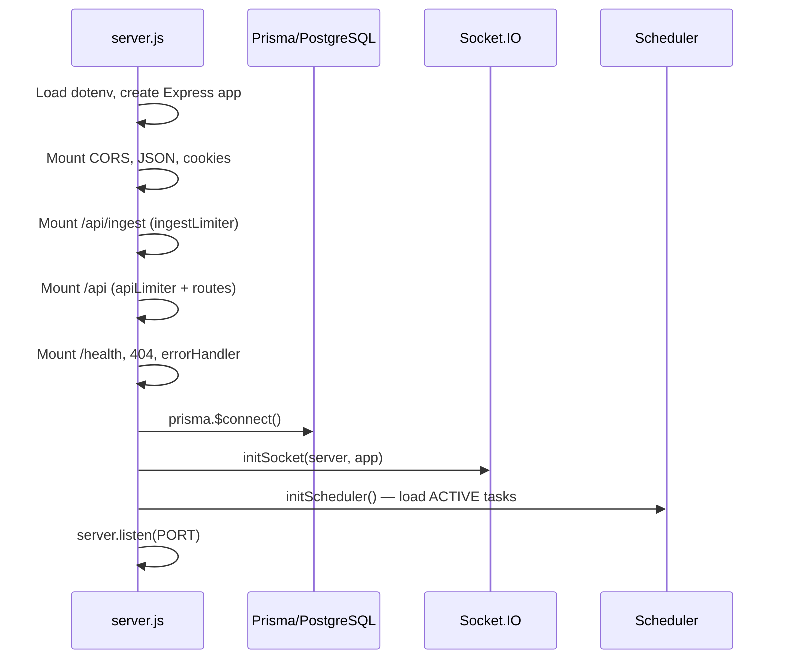

### Standard API Request Flow

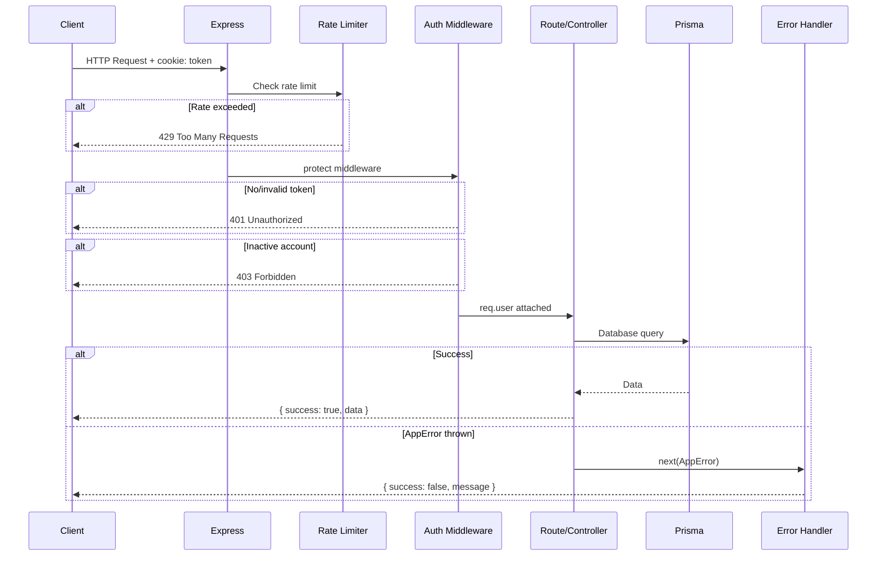

### Standard Response Envelope

**Success (JSON endpoints):**
```json
{
  "success": true,
  "data": { }
}
```

**Success with pagination:**
```json
{
  "success": true,
  "data": [],
  "total": 100,
  "page": 1,
  "pages": 10
}
```

**Error:**
```json
{
  "success": false,
  "message": "Human-readable error message"
}
```

---

## 5. Authentication & Authorization

### Authentication Mechanisms

| Mechanism | Used For | Details |
|-----------|----------|---------|
| JWT Cookie | All `/api/*` routes (except public) | Cookie name: `token`, httpOnly, secure in production, sameSite: `lax`, 7-day maxAge |
| API Key Header | `POST /api/ingest` | Header: `x-api-key` must match `INGEST_API_KEY` env var |
| Socket JWT | WebSocket connections | Passed in `handshake.auth.token` |

### Roles

| Role | Scope | Capabilities |
|------|-------|--------------|
| `SUPER_ADMIN` | Global | All organizations, system settings, themes, icons, list types, products admin |
| `ORG_ADMIN` | Own organization | Users, devices, templates, gateways, widgets (within org) |
| `USER` | Assigned devices | Read devices assigned via `DeviceUser`, slab rates, interval history |

### Org Scoping Pattern

Most controllers use inline `orgScope(user)`:
- `SUPER_ADMIN` → no filter (sees all orgs)
- `ORG_ADMIN` / `USER` → filtered by `user.organizationId`
- `USER` on devices → additionally filtered by `deviceUsers` assignment

### Authorization Matrix (Route-Level)

| Route Prefix | Min Auth | Write Roles |
|--------------|----------|-------------|
| `/api/auth/login`, `/logout`, `/forgot-password`, `/reset-password` | Public | — |
| `/api/auth/me` | JWT | Any authenticated |
| `/api/ingest` | API Key | — |
| `/api/organizations` | JWT | SUPER_ADMIN only |
| `/api/users` | JWT | SUPER_ADMIN, ORG_ADMIN |
| `/api/devices` (POST/PUT/DELETE) | JWT | SUPER_ADMIN, ORG_ADMIN |
| `/api/device-templates` (write) | JWT | SUPER_ADMIN, ORG_ADMIN |
| `/api/gateways` (write) | JWT | SUPER_ADMIN, ORG_ADMIN |
| `/api/slab-rates` | JWT | ORG_ADMIN, USER (**SUPER_ADMIN blocked**) |
| `/api/interval-history` | JWT | ORG_ADMIN, USER (**SUPER_ADMIN blocked**) |
| `/api/sensor-data` (DELETE) | JWT | SUPER_ADMIN only |
| `/api/settings`, `/api/themes`, `/api/list-types` | JWT | SUPER_ADMIN only |
| `/api/icons` (write) | JWT | SUPER_ADMIN only |
| `/api/products` GET | Public | — |
| `/api/products` (write) | JWT | SUPER_ADMIN only |
| `/api/subscriptions` POST | Public | — |
| `/api/subscriptions` (read/update) | JWT | SUPER_ADMIN only |
| Most other routes | JWT | Any authenticated role |

---

## 6. Error Handling & HTTP Status Codes

### Global Error Handler

All errors flow to `middleware/errorHandler.js`:

```javascript
// Response format
{ "success": false, "message": "<error message>" }
```

- Uses `err.statusCode` if set (via `AppError`), otherwise **500**
- Stack traces logged only when `NODE_ENV !== 'production'`

### HTTP Status Code Reference

| Code | When Used |
|------|-----------|
| **200** | Successful GET, PUT, PATCH, DELETE |
| **201** | Successful POST (resource created) |
| **400** | Validation errors, business rule violations, duplicate records |
| **401** | Not authenticated, invalid credentials, invalid/expired JWT, invalid API key |
| **403** | Insufficient role permissions, inactive account, cross-org access denied |
| **404** | Resource not found, unknown route |
| **429** | Rate limit exceeded |
| **500** | Unhandled server errors |

### Complete Error Message Catalog

| Message | Status | Endpoint / Context |
|---------|--------|-------------------|
| `Route not found` | 404 | Unknown URL |
| `Too many requests, please try again later.` | 429 | General API rate limit |
| `Ingest rate limit exceeded.` | 429 | Ingest rate limit |
| `Not authenticated` | 401 | Missing JWT cookie |
| `Invalid or expired token` | 401 | JWT verification failed |
| `User no longer exists` | 401 | User deleted after token issued |
| `Account inactive` | 403 | User status INACTIVE |
| `You do not have permission to perform this action` | 403 | Role not in authorize() list |
| `Email and password are required` | 400 | Login |
| `Invalid credentials` | 401 | Login — wrong email/password |
| `User not found` | 404 | GET /auth/me |
| `Email is required` | 400 | Forgot password |
| `userId, code, and newPassword are required` | 400 | Reset password |
| `Invalid or expired reset code` | 400 | Reset password |
| `Invalid or missing API key` | 401 | Ingest route middleware |
| `Invalid API key` | 401 | Ingest controller |
| `deviceId and readings[] are required` | 400 | Ingest |
| `Device not found` | 404 | Ingest, devices, sensor data |
| `Access denied` | 403 | Sensor data — wrong org |
| `deviceId is required` | 400 | Sensor data endpoints |
| `deviceId and variableName are required` | 400 | Sensor history/download |
| `deviceId, variableName, and timeRange are required` | 400 | Sensor aggregate |
| `Invalid timeRange. Use: 1h\|24h\|7d\|30d` | 400 | Sensor aggregate/dashboard |
| `Config variable not found` | 404 | Device config PATCH |
| `User is already assigned to this device` | 400 | Device user assign (P2002) |
| `Assignment not found` | 404 | Device user remove (P2025) |
| `User and device must belong to the same organisation` | 400 | Device user assign |
| `Device template not found` | 404 | Templates |
| `Cannot delete: template is used by devices.` | 400 | Template delete |
| `Slave not found` | 404 | Template slaves |
| `Cannot delete: slave is in use by provisioned devices.` | 400 | Slave delete |
| `Variable not found` | 404 | Template variables |
| `Cannot delete: variable has provisioned config variables.` | 400 | Variable delete |
| `Alarm record not found` | 404 | Anomaly acknowledge |
| `Config slave not found` | 404 | Interval history create |
| `Interval history record not found` | 404 | Interval history delete |
| `Template trigger not found` | 404 | Alarm templates |
| `Trigger is in use by an alarm setting.` | 400 | Alarm template delete |
| `Alarm setting not found` | 404 | Alarm settings |
| `Alarm contact not found` | 404 | Alarm contacts |
| `Contact is linked to an alarm setting.` | 400 | Alarm contact delete |
| `Notification not found` | 404 | Notifications |
| `Scheduled task not found` | 404 | Scheduled tasks |
| `Widget template not found` | 404 | Widget templates |
| `Organization not found` | 404 | Organizations |
| `Cannot delete: organisation has active devices, users, or gateways.` | 400 | Org delete |
| `password is required` | 400 | User create |
| `ORG_ADMIN can only create USER role` | 403 | User create |
| `Email already in use` | 400 | User create |
| `status must be ACTIVE, INACTIVE, or DELETED` | 400 | User status |
| `newPassword is required` | 400 | Admin password reset |
| `Gateway not found` | 404 | Gateways |
| `Cannot delete: gateway has devices attached.` | 400 | Gateway delete |
| `Slab rate not found` | 404 | Slab rates |
| `Image file is required` | 400 | Icon create |
| `Icon not found` | 404 | Icons |
| `Icon is in use by template variables.` | 400 | Icon delete |
| `Product not found` | 404 | Products |
| `Theme not found` | 404 | Themes |
| `orgId is required` | 400 | Theme assign |
| `Setting not found` | 404 | Settings delete |
| `name and email are required` | 400 | Subscription create |
| `status must be NEW, CONTACTED, or CLOSED` | 400 | Subscription status |
| `Subscription not found` | 404 | Subscription update |
| `List type not found` | 404 | List types |
| `Cannot delete: list type has items. Remove items first.` | 400 | List type delete |
| `List item not found` | 404 | List items |
| `listTypeId is required` | 400 | List item direct create |
| `Internal server error` | 500 | Unhandled exceptions |

### Prisma Error Codes Handled

| Prisma Code | Mapped To |
|-------------|-----------|
| `P2002` | 400 — Unique constraint (duplicate) |
| `P2025` | 404 — Record not found |

---

## 7. Rate Limiting

| Limiter | Path | Window | Max Requests | Response |
|---------|------|--------|--------------|----------|
| `ingestLimiter` | `/api/ingest` | 1 minute | 1000 | `{ success: false, message: "Ingest rate limit exceeded." }` |
| `apiLimiter` | `/api/*` | 15 minutes | 100 | `{ success: false, message: "Too many requests, please try again later." }` |
| None | `/health` | — | Unlimited | — |

> Ingest is mounted **before** the general API limiter so high-throughput IoT traffic is not capped at 100 req/15 min.

---

## 8. Real-Time (Socket.IO)

### Connection

```javascript
// Client connects with JWT
const socket = io(SERVER_URL, {
  auth: { token: '<jwt_token>' },
  withCredentials: true
});
```

### Room Assignment

On successful JWT verification:
- Joins `org_<organizationId>` — org-wide broadcasts
- Joins `user_<userId>` — personal notifications (reserved)

> **Note:** JWT payload only contains `{ id }`. `decoded.organizationId` in socket handler will be `undefined` unless JWT is extended. Org room join may not work unless token payload is updated or user is looked up from DB.

### Events Emitted by Server

| Event | Trigger | Payload |
|-------|---------|---------|
| `reading:new` | Sensor ingest | `{ deviceId, readings, timestamp }` |
| `alarm:new` | Anomaly breach | `{ deviceId, triggerName, value }` |
| `device:switch` | Scheduled task / manual switch | `{ deviceId, action }` |

---

## 9. Core Business Flows

### 9.1 IoT Data Ingest Flow

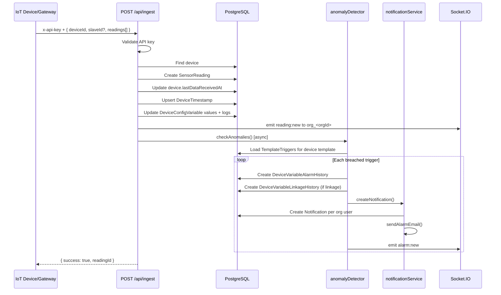

**Ingest Request Body:**
```json
{
  "deviceId": "uuid",
  "slaveId": "uuid (optional — deviceConfigSlaveId)",
  "readings": [
    { "variableName": "VoltageA", "value": 230.5, "unit": "V" },
    { "variableName": "PowerConsumption", "value": 1.25, "unit": "kWh" }
  ]
}
```

**Ingest Response:**
```json
{ "success": true, "readingId": "uuid" }
```

### 9.2 Device Provisioning Flow

When a device is created (`POST /api/devices`):

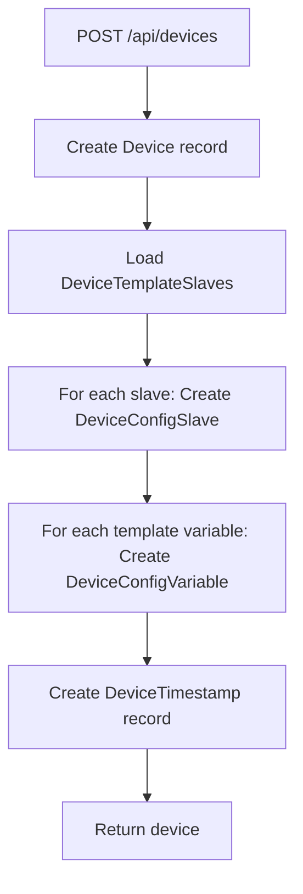

### 9.3 Anomaly Detection Logic

For each active `TemplateTrigger` on the device's template:

1. Find matching reading by `triggerVar.name === reading.variableName`
2. Parse value as float
3. Evaluate operator: `GT | LT | EQ | GTE | LTE`
4. If breached:
   - Create `DeviceVariableAlarmHistory` (ACTIVE, UNPROCESSED)
   - If `linkageVariableId` set → create `DeviceVariableLinkageHistory`
   - Notify all ACTIVE org users (in-app `Notification`)
   - Send email if `AlarmSetting` with `pushType: 'email'` exists
   - Emit `alarm:new` socket event

### 9.4 Scheduled Task Flow

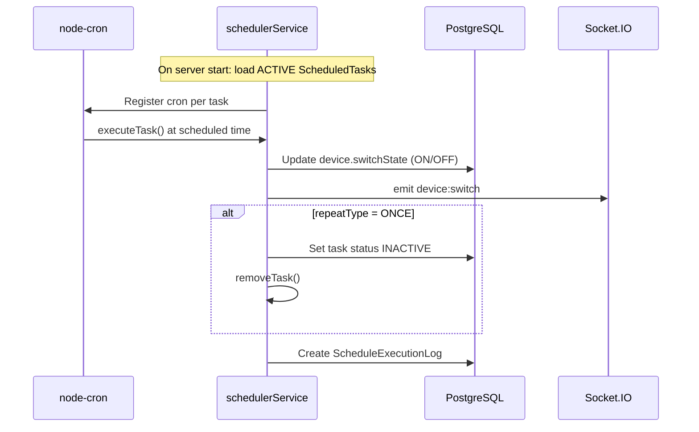

**Cron Expression Builder:**
- `DAILY`: `{minute} {hour} * * *`
- `WEEKLY`: `{minute} {hour} * * {daysOfWeek}`
- `ONCE`: Same as daily, then deactivated after run
- Timezone: **UTC**

### 9.5 Billing / Interval Cost Flow

`POST /api/interval-history` triggers `costCalculator.computeIntervalCost()`:

1. Sum all `SensorReading` values for `variableName` in date range
2. Load `SlabRate` tiers for `deviceConfigSlaveId` (ordered by `unitFrom`)
3. Apply tiered pricing: units in each slab × rate
4. Overflow beyond last slab uses last slab's rate
5. Store result in `IntervalHistory` with `totalUnit` and `tariff`

### 9.6 Authentication Flow

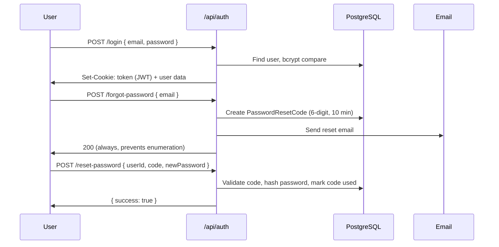

---

## 10. Database Models & Relationships

### Enums Reference

| Enum | Values |
|------|--------|
| `OrgStatus` | ACTIVE, INACTIVE |
| `Role` | SUPER_ADMIN, ORG_ADMIN, USER |
| `UserStatus` | ACTIVE, INACTIVE, DELETED |
| `DeviceStatus` | ONLINE, OFFLINE |
| `DataType` | FLOAT, INTEGER, BOOLEAN, STRING |
| `SwitchState` | ON, OFF |
| `LogSource` | INGEST, MANUAL, SCHEDULE, AUTOMATION |
| `Operator` | GT, LT, EQ, GTE, LTE |
| `Priority` | LOW, MEDIUM, HIGH |
| `AlarmStatus` | ACTIVE, INACTIVE |
| `NotificationStatus` | SENT, FAILED |
| `AlarmState` | ACTIVE, RESOLVED |
| `ProcessState` | UNPROCESSED, PROCESSED |
| `TaskAction` | ON, OFF |
| `RepeatType` | DAILY, WEEKLY, ONCE |
| `TaskStatus` | ACTIVE, INACTIVE |
| `ExecutionResult` | SUCCESS, FAILED |
| `Horizon` | TEN_MIN, FIVE_HR, SEVEN_DAY, CUSTOM |
| `IconStatus` | ACTIVE, INACTIVE |
| `ProductStatus` | ACTIVE, INACTIVE |
| `ThemeStatus` | ACTIVE, INACTIVE |
| `WidgetType` | BAR, LINE, AREA, GAUGE, VALUE_CARD, PIE |
| `SubscriptionStatus` | NEW, CONTACTED, CLOSED |

### Model Reference

#### Organization
| Field | Type | Notes |
|-------|------|-------|
| id | UUID | PK |
| name | String | Required |
| description | String? | |
| status | OrgStatus | Default: ACTIVE |
| themeId | String? | FK → Theme |
| logoUrl | String? | |
| createdAt / updatedAt | DateTime | Auto |

**Relations:** users, devices, gateways, deviceTemplates, alarmConfigurations, alarmContacts, templateTriggers, widgetTemplates, mqttConfigs, subscriptions

---

#### User
| Field | Type | Notes |
|-------|------|-------|
| id | UUID | PK |
| fullName | String | |
| email | String | Unique |
| passwordHash | String | bcrypt hashed |
| phone | String? | |
| role | Role | Default: USER |
| organizationId | String? | FK → Organization |
| status | UserStatus | Default: ACTIVE |

---

#### Gateway
| Field | Type | Notes |
|-------|------|-------|
| id | UUID | PK |
| name | String | |
| serialNumber | String | Unique |
| model | String? | |
| status | DeviceStatus | Default: OFFLINE |
| organizationId | String | FK |
| lastSeenAt | DateTime? | |

---

#### DeviceTemplate
| Field | Type | Notes |
|-------|------|-------|
| id | UUID | PK |
| name | String | |
| organizationId | String | FK |
| acquisitionMethod | String? | |
| totalSlaves | Int | Default: 0 |
| totalVariables | Int | Default: 0 |

---

#### DeviceTemplateSlave
| Field | Type | Notes |
|-------|------|-------|
| id | UUID | PK |
| templateId | String | FK, cascade delete |
| organizationId | String | |
| name | String | |
| description | String? | |
| isDefault | Boolean | Default: false |

---

#### DeviceTemplateVariable
| Field | Type | Notes |
|-------|------|-------|
| id | UUID | PK |
| templateSlaveId | String | FK, cascade delete |
| templateId | String | |
| organizationId | String | |
| name | String | Unique per slave |
| displayName | String? | |
| unit | String? | |
| registerAddress | String? | Modbus register |
| iconId | String? | FK → Icon |
| dataType | DataType | Default: FLOAT |
| isActive | Boolean | Default: true |

---

#### Device
| Field | Type | Notes |
|-------|------|-------|
| id | UUID | PK |
| name | String | |
| gatewayId | String? | FK → Gateway |
| organizationId | String | FK |
| templateId | String | FK → DeviceTemplate |
| switchState | SwitchState | Default: OFF |
| status | DeviceStatus | Default: OFFLINE |
| mqttConfigId | String? | Unique FK → MqttConfig |
| lastDataReceivedAt | DateTime? | Updated on ingest |

---

#### DeviceConfigSlave / DeviceConfigVariable
Provisioned copies of template slaves/variables with live `currentValue` on each variable.

**DeviceConfigVariableLog** tracks value changes with `source`: INGEST | MANUAL | SCHEDULE | AUTOMATION.

---

#### SensorReading
| Field | Type | Notes |
|-------|------|-------|
| id | UUID | PK |
| deviceId | String | FK |
| deviceConfigSlaveId | String? | |
| organizationId | String | |
| timestamp | DateTime | Default: now |
| readings | Json | Array of `{ variableName, value, unit? }` |

**Index:** `[deviceId, deviceConfigSlaveId, timestamp]`

---

#### TemplateTrigger (Alarm Template)
| Field | Type | Notes |
|-------|------|-------|
| deviceTemplateId | String | FK |
| templateVariableId | String | Watched variable |
| operator | Operator | GT/LT/EQ/GTE/LTE |
| threshold | Float | |
| anomalyType | String | e.g. "voltage", "custom" |
| priority | Priority | Default: MEDIUM |
| linkageVariableId | String? | Auto-action target |
| linkageAction | String? | |
| linkageValue | String? | |
| isActive | Boolean | Default: true |

---

#### AlarmSetting
Links triggers to devices and contacts for notification delivery.

| Field | Type | Notes |
|-------|------|-------|
| templateTriggerId | String? | FK |
| pushType | String? | e.g. "email" |
| pushBody | String? | |
| pushMethod | String? | |
| pushingMechanism | String? | |
| status | AlarmStatus | Default: ACTIVE |

**Junction tables:** `AlarmConfigurationDevice`, `AlarmConfigurationContact`

---

#### ScheduledTask
| Field | Type | Notes |
|-------|------|-------|
| deviceId | String | FK |
| variableName | String | |
| action | TaskAction | ON / OFF |
| scheduledTime | String | Format: `"HH:MM"` |
| repeatType | RepeatType | DAILY / WEEKLY / ONCE |
| daysOfWeek | Int[] | For WEEKLY (0=Sun) |
| status | TaskStatus | ACTIVE / INACTIVE |

---

#### SlabRate
| Field | Type | Notes |
|-------|------|-------|
| deviceConfigSlaveId | String | FK |
| unitFrom | Float | Tier start |
| unitTo | Float | Tier end |
| rate | Float | Price per unit |
| onPeakRate | Float? | |
| offPeakRate | Float? | |

---

#### IntervalHistory
| Field | Type | Notes |
|-------|------|-------|
| deviceConfigSlaveId | String | FK |
| variableName | String | |
| totalUnit | Float | Computed consumption |
| tariff | Float | Computed cost |
| startDate / endDate | DateTime | Billing period |
| computedAt | DateTime | |

---

#### AIForecastReading / Prediction
| Field | Type | Notes |
|-------|------|-------|
| deviceId | String | |
| variableName | String | |
| horizon | Horizon / String | |
| predictions | Json | Array of `{ timestamp, value }` |
| generatedAt | DateTime | |

---

#### Notification (In-App)
| Field | Type | Notes |
|-------|------|-------|
| userId | String | FK |
| triggerName | String? | |
| deviceName | String? | |
| description | String? | |
| anomalyId | String? | |
| read | Boolean | Default: false |

---

#### DeviceUser
| Field | Type | Constraints |
|-------|------|-------------|
| id | UUID | PK |
| deviceId | UUID | FK → Device, CASCADE |
| userId | UUID | FK → User, CASCADE |
| organizationId | String | Denormalized org id |
| assignedAt | DateTime | Default: now |
| assignedBy | String? | User id who assigned |
| **Unique** | | deviceId + userId |

#### DeviceTimestamp
| Field | Type | Constraints |
|-------|------|-------------|
| id | UUID | PK |
| deviceId | UUID | FK → Device, UNIQUE, CASCADE |
| organizationId | String | |
| lastActiveAt | DateTime | Default: now |

#### TemplateTrigger — Full Field Reference
| Field | Type | Required | Description |
|-------|------|----------|-------------|
| id | UUID | auto | Primary key |
| deviceTemplateId | UUID | yes | Which template this rule applies to |
| organizationId | UUID | yes | Owning org |
| name | String | yes | Human-readable trigger name |
| templateVariableId | UUID | yes | Variable to watch |
| operator | Operator | yes | GT, LT, EQ, GTE, LTE |
| threshold | Float | yes | Comparison value |
| anomalyType | String | yes | Category label (e.g. overvoltage) |
| priority | Priority | default MEDIUM | LOW, MEDIUM, HIGH |
| linkageVariableId | UUID? | no | Target variable for linkage log |
| linkageAction | String? | no | Described action (not executed) |
| linkageValue | String? | no | Value for linkage |
| isActive | Boolean | default true | Enable/disable trigger |
| createdBy | UUID? | no | FK → User |

#### AlarmSetting — Full Field Reference
| Field | Type | Description |
|-------|------|-------------|
| name | String | Setting display name |
| organizationId | UUID | Owning org |
| templateTriggerId | UUID? | Optional link to trigger |
| pushType | String? | e.g. `"email"` — only email implemented |
| pushBody | String? | Custom message template (unused in email) |
| pushMethod | String? | Reserved |
| pushingMechanism | String? | Reserved |
| status | AlarmStatus | ACTIVE / INACTIVE |
| createdBy | UUID? | Creator user |

#### AlarmContact
| Field | Type | Description |
|-------|------|-------------|
| name | String | Contact name |
| organizationId | UUID | Owning org |
| mobile | String? | Phone number |
| email | String? | Used for email alerts |
| whatsapp | String? | Reserved — not implemented |
| remark | String? | Notes |
| createdBy | UUID? | Creator |

#### DeviceVariableAlarmHistory
| Field | Type | Description |
|-------|------|-------------|
| alarmSettingId | UUID? | Optional — not always set on ingest alarms |
| templateTriggerId | UUID? | FK to trigger |
| deviceId | UUID | Device that breached |
| organizationId | String | Org scope |
| variableName | String | e.g. VoltageA |
| triggerName | String? | From TemplateTrigger.name |
| triggerType | String? | anomalyType |
| slaveName | String? | Optional |
| currentValue | Float? | Value at breach |
| triggeringCondition | String? | e.g. "VoltageA GT 250" |
| alarmTime | DateTime | Default: now |
| alarmState | AlarmState | ACTIVE / RESOLVED |
| processState | ProcessState | UNPROCESSED / PROCESSED |

#### DeviceVariableLinkageHistory
| Field | Type | Description |
|-------|------|-------------|
| watchedVariableName | String? | Variable that breached |
| watchedVariableValue | Float? | Value at breach |
| linkedVariableName | String? | Linkage target name |
| actionTaken | String? | From trigger.linkageAction |
| firedAt | DateTime | When linkage logged |

#### ScheduledTask
| Field | Type | Description |
|-------|------|-------------|
| organizationId | UUID | Org scope |
| createdBy | UUID? | Creator |
| deviceId | UUID | Target device |
| deviceConfigSlaveId | UUID? | Optional reference |
| deviceConfigVariableId | UUID? | Optional FK |
| variableName | String | Label (not used in execution) |
| action | TaskAction | ON / OFF — updates device.switchState |
| scheduledTime | String | `"HH:MM"` format |
| repeatType | RepeatType | DAILY / WEEKLY / ONCE |
| daysOfWeek | Int[] | Cron days for WEEKLY (0=Sunday) |
| status | TaskStatus | ACTIVE / INACTIVE |
| nextRunAt | DateTime? | Reserved — not populated |

#### ScheduleExecutionLog
| Field | Type | Description |
|-------|------|-------------|
| scheduleTaskId | UUID | FK → ScheduledTask |
| deviceId | UUID | Device acted upon |
| organizationId | String | Org |
| executedAt | DateTime | Default: now |
| action | String? | ON/OFF executed |
| variableName | String? | From task |
| result | ExecutionResult | SUCCESS / FAILED |
| errorMessage | String? | If FAILED |

#### SlabRate
| Field | Type | Description |
|-------|------|-------------|
| organizationId | String | Org scope |
| deviceConfigSlaveId | UUID | FK — billing per slave |
| unitFrom | Float | Tier start (inclusive) |
| unitTo | Float | Tier end |
| rate | Float | Price per unit in tier |
| onPeakRate | Float? | **Not used in calculator** |
| offPeakRate | Float? | **Not used in calculator** |
| createdBy | String? | Creator user id |

#### IntervalHistory
| Field | Type | Description |
|-------|------|-------------|
| deviceConfigSlaveId | UUID | FK |
| templateVariableId | UUID? | Optional reference |
| templateSlaveId | UUID? | Optional reference |
| variableName | String | Metered variable |
| slaveName | String? | Denormalized |
| totalUnit | Float | Computed consumption |
| tariff | Float | Computed cost |
| startDate / endDate | DateTime | Billing period |
| computedAt | DateTime | When calculated |

#### AIForecastReading
| Field | Type | Description |
|-------|------|-------------|
| deviceId | UUID | FK |
| organizationId | String | Org |
| templateVariableId | UUID? | Optional FK |
| templateSlaveId | UUID? | Optional FK |
| variableName | String | Forecast target |
| horizon | Horizon | TEN_MIN, FIVE_HR, SEVEN_DAY, CUSTOM |
| predictions | Json | `[{ timestamp, predictedValue }]` |
| generatedAt | DateTime | When forecast created |

#### Prediction (Generic Store)
Similar to AIForecastReading but `horizon` is free-form String (not enum). **Not used by any controller endpoint** — only AIForecastReading is queried.

#### Notification
| Field | Type | Description |
|-------|------|-------------|
| userId | UUID | Recipient |
| organizationId | String | Org |
| triggerName | String? | Alarm trigger name |
| deviceName | String? | Device name |
| description | String? | Human-readable detail |
| anomalyId | String? | Reserved — not populated on create |
| read | Boolean | Default: false |

#### Icon
| Field | Type | Description |
|-------|------|-------------|
| name | String | Icon label |
| imageUrl | String | Cloudinary URL |
| status | IconStatus | ACTIVE / INACTIVE |

#### Product
| Field | Type | Description |
|-------|------|-------------|
| name | String | Product name |
| price | Float? | Optional price |
| imageUrl | String? | Cloudinary URL |
| description | String? | |
| status | ProductStatus | ACTIVE / INACTIVE |

#### Theme
| Field | Type | Description |
|-------|------|-------------|
| name | String | Theme name |
| headerFontColor | String? | CSS color |
| headerBgColor | String? | CSS color |
| bodyFontColor | String? | CSS color |
| bodyBgColor | String? | CSS color |
| fontSize | String? | e.g. "14px" |
| status | ThemeStatus | ACTIVE / INACTIVE |
| createdBy | String? | Creator |

#### WidgetTemplate
| Field | Type | Description |
|-------|------|-------------|
| organizationId | UUID? | Null = global? |
| name | String | Widget label |
| iconId | UUID? | FK → Icon |
| themeId | UUID? | FK → Theme |
| widgetType | WidgetType | BAR, LINE, AREA, GAUGE, VALUE_CARD, PIE |
| variableName | String? | Data source variable |
| displayName | String? | UI label |
| unit | String? | Display unit |
| position | Int | Sort order (default 0) |
| isActive | Boolean | Default: true |
| createdBy | UUID? | Creator |

#### SystemSetting
| Field | Type | Description |
|-------|------|-------------|
| key | String | UNIQUE setting key |
| type | String | e.g. "string", "image" |
| value | String? | Setting value or URL |
| description | String? | Admin description |

#### ListType / ListTypeItem
| ListType | | |
| name | String | UNIQUE |
| description | String? | |
| isActive | Boolean | |

| ListTypeItem | | |
| listTypeId | UUID | FK, CASCADE |
| name | String | |
| description | String? | |
| isActive | Boolean | |

#### MqttConfig
| Field | Type | Description |
|-------|------|-------------|
| organizationId | UUID | FK |
| deviceId | UUID? | UNIQUE — 1:1 with Device |
| brokerUrl | String? | MQTT broker host |
| port | Int | Default: 1883 |
| username | String? | |
| passwordEncrypted | String? | Stored encrypted (no encrypt logic in backend) |
| topic | String? | MQTT topic |
| isActive | Boolean | Default: true |

> **Note:** MqttConfig model exists but **no CRUD routes** — only linkable via `Device.mqttConfigId` on create/update.

#### PasswordResetCode
| Field | Type | Description |
|-------|------|-------------|
| userId | UUID | FK, CASCADE |
| code | String | 6-digit plaintext |
| expiresAt | DateTime | 10 minutes from creation |
| used | Boolean | Single-use flag |

#### Subscription
| Field | Type | Description |
|-------|------|-------------|
| organizationId | UUID? | Optional org link |
| name | String | Submitter name |
| email | String | Contact email |
| phone | String? | |
| description | String? | Message |
| status | SubscriptionStatus | NEW / CONTACTED / CLOSED |
| submittedAt | DateTime | Default: now |

#### AlarmHistoryNotification
| Field | Type | Description |
|-------|------|-------------|
| alarmSettingId | UUID? | FK |
| organizationId | String | |
| deviceId | String? | |
| message | String? | Full email body |
| pushType | String? | "email" |
| sentTo | String? | Comma-separated emails |
| sentAt | DateTime | Default: now |
| status | NotificationStatus | SENT / FAILED |

---

## 11. Services Layer

### anomalyDetector.js
- `checkAnomalies(deviceId, organizationId, readings, io)`
- Evaluates template triggers against incoming readings
- Fire-and-forget (errors logged, don't block ingest response)

### notificationService.js
- `createNotification({ deviceId, organizationId, trigger, triggerVar, val })`
- Creates in-app notifications for all ACTIVE org users
- `sendAlarmEmail()` — sends to contacts linked via AlarmSetting where `pushType === 'email'`
- Logs to `AlarmHistoryNotification`

### schedulerService.js
- `initScheduler()` — loads ACTIVE tasks on startup
- `addTask(task)` / `removeTask(taskId)` — cron job registry (in-memory Map)
- `executeTask(task)` — updates device switchState, logs execution

### costCalculator.js
- `computeIntervalCost(deviceConfigSlaveId, variableName, startDate, endDate)`
- Returns `{ totalUnit, tariff }`

---

## 12. Complete API Reference

> **Legend:** 🔓 Public · 🔑 JWT · 👑 Role required · 📎 Multipart

### Health

| Method | Path | Auth | Description |
|--------|------|------|-------------|
| GET | `/health` | 🔓 | `{ status: "ok" }` |

---

### Auth — `/api/auth`

#### POST `/login` 🔓
**Request:**
```json
{ "email": "user@example.com", "password": "secret" }
```
**Response 200:**
```json
{
  "success": true,
  "data": {
    "id": "uuid", "fullName": "...", "email": "...",
    "role": "ORG_ADMIN", "organizationId": "uuid", "status": "ACTIVE"
  }
}
```
**Sets cookie:** `token` (JWT, 7 days)

#### POST `/logout` 🔓
**Response:** `{ "success": true, "message": "Logged out" }`

#### GET `/me` 🔑
**Response:** `{ "success": true, "data": { user fields } }`

#### POST `/forgot-password` 🔓
**Request:** `{ "email": "user@example.com" }`  
**Response:** `{ "success": true, "message": "If that email exists, a reset code was sent." }`

#### POST `/reset-password` 🔓
**Request:**
```json
{ "userId": "uuid", "code": "123456", "newPassword": "newSecret" }
```
**Response:** `{ "success": true, "message": "Password reset successfully" }`

---

### Ingest — `/api/ingest`

#### POST `/` 🔑 API Key (`x-api-key`)
**Request:**
```json
{
  "deviceId": "uuid",
  "slaveId": "uuid (optional)",
  "readings": [
    { "variableName": "VoltageA", "value": 230.5, "unit": "V" }
  ]
}
```
**Response:** `{ "success": true, "readingId": "uuid" }`

---

### Devices — `/api/devices` 🔑

| Method | Path | Roles | Query / Body |
|--------|------|-------|--------------|
| GET | `/` | All | `?page&limit&search&status&gatewayId` |
| POST | `/` | 👑 SA, OA | `{ name, templateId, gatewayId?, organizationId?, mqttConfigId? }` |
| GET | `/:id` | All | USER: assigned only |
| PUT | `/:id` | 👑 SA, OA | `{ name?, gatewayId?, switchState?, status?, mqttConfigId? }` |
| DELETE | `/:id` | 👑 SA, OA | Cascade deletes children |

**List Response:**
```json
{ "success": true, "data": [Device], "total": 50, "page": 1, "pages": 5 }
```

---

### Device Config — `/api/devices/:deviceId/config` 🔑

| Method | Path | Description |
|--------|------|-------------|
| GET | `/` | Full config tree (slaves + variables) |
| GET | `/slaves` | Paginated config slaves |
| GET | `/slaves/:configSlaveId/variables` | Variables for slave |
| PATCH | `/variables/:configVariableId` | `{ currentValue }` — manual update |
| GET | `/variables/:configVariableId/log` | Change history (`?from&to&page&limit`) |

---

### Device Users — `/api/devices/:deviceId/users` 🔑

| Method | Path | Roles | Body |
|--------|------|-------|------|
| GET | `/` | All | Paginated assignments |
| POST | `/` | 👑 SA, OA | `{ userId }` |
| DELETE | `/:userId` | 👑 SA, OA | — |

---

### Device Templates — `/api/device-templates` 🔑

| Method | Path | Roles | Body |
|--------|------|-------|------|
| GET | `/` | All | `?page&limit&search` |
| POST | `/` | 👑 SA, OA | `{ name, organizationId?, acquisitionMethod? }` |
| GET | `/:id` | All | Includes slaves + variables |
| PUT | `/:id` | 👑 SA, OA | `{ name?, acquisitionMethod? }` |
| DELETE | `/:id` | 👑 SA, OA | Blocked if devices exist |
| POST | `/:id/clone` | 👑 SA, OA | Deep copy template |

### Template Slaves — `/api/device-templates/:templateId/slaves` 🔑

| Method | Path | Roles | Body |
|--------|------|-------|------|
| GET | `/` | All | Paginated |
| POST | `/` | 👑 SA, OA | `{ name, description?, isDefault? }` |
| PUT | `/:slaveId` | 👑 SA, OA | `{ name?, description?, isDefault? }` |
| DELETE | `/:slaveId` | 👑 SA, OA | Blocked if provisioned |

### Template Variables — `.../slaves/:slaveId/variables` 🔑

| Method | Path | Roles | Body |
|--------|------|-------|------|
| GET | `/` | All | Paginated, includes icon |
| POST | `/` | 👑 SA, OA | `{ name, displayName?, unit?, registerAddress?, iconId?, dataType? }` |
| PUT | `/:variableId` | 👑 SA, OA | `{ name?, displayName?, unit?, registerAddress?, iconId?, dataType?, isActive? }` |
| DELETE | `/:variableId` | 👑 SA, OA | Blocked if provisioned |

---

### Sensor Data — `/api/sensor-data` 🔑

#### GET `/latest`
**Query:** `deviceId` (required), `slaveId?`  
**Response:**
```json
{
  "success": true,
  "data": {
    "VoltageA": { "value": "230.5", "unit": "V", "lastUpdatedAt": "..." }
  },
  "timestamp": "..."
}
```

#### GET `/history`
**Query:** `deviceId`, `variableName` (required), `slaveId?`, `startDate?`, `endDate?`, `limit?` (default 50)  
**Response:**
```json
{
  "success": true,
  "count": 50,
  "data": [{ "variableName": "...", "value": 230.5, "unit": "V", "receivedTime": "..." }]
}
```

#### GET `/aggregate`
**Query:** `deviceId`, `variableName`, `timeRange` (required: `1h|24h|7d|30d`), `slaveId?`  
**Response:**
```json
{
  "success": true,
  "timeRange": "24h",
  "data": [{ "timestamp": "...", "value": 230.5 }]
}
```

**Bucket sizes:** 1h→1min, 24h→1hr, 7d→1day, 30d→1day

#### GET `/dashboard-summary`
**Query:** `deviceId` (required), `slaveId?`, `timeRange?` (default `24h`)  
**Response:** Complex KPI object with power consumption, export power, imbalances, THD, frequency, anomalies, energy savings comparison.

#### GET `/download`
**Query:** Same as history. Returns **CSV stream** (`text/csv`).

#### DELETE `/` 👑 SUPER_ADMIN
**Query:** `deviceId` (required), `slaveId?`, `startDate?`, `endDate?`  
**Response:** `{ "success": true, "deleted": 150 }`

---

### Anomalies — `/api/anomalies` 🔑

| Method | Path | Query / Body |
|--------|------|--------------|
| GET | `/` | `?page&limit&deviceId&alarmState&processState&from&to` |
| GET | `/timeline` | `deviceId` (required), `from?`, `to?` — 30-min buckets |
| PATCH | `/:id/acknowledge` | Sets alarmState=RESOLVED, processState=PROCESSED |

---

### Interval History — `/api/interval-history` 🔑 👑 OA, USER

| Method | Path | Body |
|--------|------|------|
| GET | `/` | `?page&limit&deviceConfigSlaveId` |
| POST | `/` | `{ deviceConfigSlaveId, variableName, startDate, endDate }` |
| DELETE | `/:id` | — |

**Create Response:** Includes computed `totalUnit` and `tariff`.

---

### AI Analytics — `/api/ai` 🔑

| Method | Path | Query |
|--------|------|-------|
| GET | `/predictions` | `deviceId`, `variableName` (required), `horizon?`, `from?`, `to?` |
| GET | `/voltage-imbalance` | `deviceId` (required), `slaveId?`, `timeRange?` |
| GET | `/current-imbalance` | `deviceId` (required), `slaveId?`, `timeRange?` |
| GET | `/power-factor` | `deviceId` (required), `slaveId?`, `timeRange?` |
| GET | `/energy-consumption` | `deviceId` (required), `slaveId?`, `timeRange?` |

**Voltage/Current Response Structure:**
```json
{
  "success": true,
  "data": {
    "current": { "VoltageA": "230", "VoltageB": "229" },
    "chartData": {
      "voltageA": [{ "timestamp": "...", "value": 230 }],
      "voltageB": [], "voltageC": [], "voltageImbalance": [], "thdV": []
    },
    "alarms": []
  }
}
```

---

### Alarm Templates — `/api/alarm-templates` 🔑

| Method | Path | Body |
|--------|------|------|
| GET | `/` | `?page&limit&organizationId&deviceTemplateId&search` |
| POST | `/` | `{ name, organizationId?, deviceTemplateId, templateVariableId, operator, threshold, anomalyType, priority?, linkageVariableId?, linkageAction?, linkageValue? }` |
| PUT | `/:id` | `{ name?, operator?, threshold?, anomalyType?, priority?, linkageVariableId?, linkageAction?, linkageValue?, isActive? }` |
| DELETE | `/:id` | Blocked if used by alarm setting |

---

### Alarm Settings — `/api/alarm-settings` 🔑

| Method | Path | Body |
|--------|------|------|
| GET | `/` | `?page&limit&organizationId&templateTriggerId` |
| POST | `/` | `{ name, organizationId?, templateTriggerId?, pushType?, pushBody?, pushMethod?, pushingMechanism?, deviceIds?, contactIds? }` |
| PUT | `/:id` | `{ name?, pushType?, pushBody?, pushMethod?, pushingMechanism?, status?, deviceIds?, contactIds? }` |
| DELETE | `/:id` | — |

---

### Alarm Contacts — `/api/alarm-contacts` 🔑

| Method | Path | Body |
|--------|------|------|
| GET | `/` | `?page&limit&organizationId&search` |
| POST | `/` | `{ name, organizationId?, mobile?, email?, whatsapp?, remark? }` |
| PUT | `/:id` | `{ name?, mobile?, email?, whatsapp?, remark? }` |
| DELETE | `/:id` | Blocked if linked to alarm setting |

---

### Alarm History — `/api/alarm-history` 🔑

| Method | Path | Description |
|--------|------|-------------|
| GET | `/notifications` | Email push history |
| GET | `/variable-alarms` | Paginated alarm records |
| GET | `/variable-alarms/csv` | CSV export |
| PATCH | `/variable-alarms/:id/process` | Mark PROCESSED |
| DELETE | `/variable-alarms` | Batch delete (`{ ids?, deviceId?, from?, to? }`) |
| GET | `/linkage-records` | Linkage action history |
| GET | `/linkage-records/csv` | CSV export |
| DELETE | `/linkage-records` | Batch delete |

---

### Notifications — `/api/notifications` 🔑

| Method | Path | Description |
|--------|------|-------------|
| GET | `/` | User's notifications (`?page&limit&read`) + `unreadCount` |
| DELETE | `/` | Delete all for user |
| DELETE | `/:id` | Delete one |

> **Note:** `markRead` and `markAllRead` exist in controller but are **not routed**.

---

### Scheduled Tasks — `/api/scheduled-tasks` 🔑

| Method | Path | Body |
|--------|------|------|
| GET | `/` | `?page&limit&deviceId&status` |
| POST | `/` | `{ organizationId?, deviceId, deviceConfigSlaveId?, deviceConfigVariableId?, variableName, action, scheduledTime, repeatType?, daysOfWeek? }` |
| PUT | `/:id` | `{ variableName?, action?, scheduledTime?, repeatType?, daysOfWeek?, status? }` |
| DELETE | `/:id` | — |
| PATCH | `/:id/toggle` | Toggle ACTIVE ↔ INACTIVE |
| GET | `/:id/logs` | Execution logs (paginated) |

---

### Widget Templates — `/api/widget-templates` 🔑

| Method | Path | Roles | Body |
|--------|------|-------|------|
| GET | `/` | All | `?page&limit&widgetType` |
| POST | `/` | 👑 SA, OA | `{ organizationId?, name, iconId?, themeId?, widgetType?, variableName?, displayName?, unit?, position? }` |
| PUT | `/:id` | 👑 SA, OA | Update fields |
| DELETE | `/:id` | 👑 SA, OA | — |

---

### List Types — `/api/list-types` 🔑 👑 SUPER_ADMIN

| Method | Path | Body |
|--------|------|------|
| GET | `/` | Paginated |
| POST | `/` | `{ name, description? }` |
| PUT | `/:id` | `{ name?, description?, isActive? }` |
| DELETE | `/:id` | Blocked if has items |
| GET | `/:listTypeId/items` | `?page&limit&isActive` |
| POST | `/:listTypeId/items` | `{ name, description? }` |
| PUT | `/:listTypeId/items/:itemId` | `{ name?, description?, isActive? }` |
| DELETE | `/:listTypeId/items/:itemId` | — |

### List Items (Legacy) — `/api/list-items` 🔑 👑 SUPER_ADMIN

| Method | Path | Body |
|--------|------|------|
| GET | `/` | `?listTypeId&isActive` |
| POST | `/` | `{ listTypeId, name, description? }` |
| PUT | `/:id` | `{ name?, description?, isActive? }` |
| DELETE | `/:id` | — |

---

### Organizations — `/api/organizations` 🔑 👑 SUPER_ADMIN

| Method | Path | Body |
|--------|------|------|
| GET | `/` | `?page&limit&search&status` |
| POST | `/` | `{ name, description?, status?, themeId?, logoUrl? }` |
| GET | `/:id` | — |
| PUT | `/:id` | Update fields |
| DELETE | `/:id` | Soft-delete (status=INACTIVE), blocked if has devices/users/gateways |

---

### Users — `/api/users` 🔑 👑 SUPER_ADMIN, ORG_ADMIN

| Method | Path | Body |
|--------|------|------|
| GET | `/` | `?page&limit&role&status&search&organizationId` |
| POST | `/` | `{ fullName, email, password, role?, organizationId?, phone? }` |
| GET | `/:id` | — |
| PUT | `/:id` | `{ fullName?, phone?, role?, status?, organizationId? }` |
| PATCH | `/:id/status` | `{ status: "ACTIVE"|"INACTIVE"|"DELETED" }` |
| POST | `/:id/reset-password` | `{ newPassword }` |

---

### Gateways — `/api/gateways` 🔑

| Method | Path | Roles | Body |
|--------|------|-------|------|
| GET | `/` | All | `?page&limit&search&status&organizationId` + headers `X-Total-Online`, `X-Total-Offline` |
| POST | `/` | 👑 SA, OA | `{ name, serialNumber, model?, status?, organizationId? }` |
| GET | `/:id` | All | — |
| PUT | `/:id` | 👑 SA, OA | `{ name?, serialNumber?, model?, status? }` |
| DELETE | `/:id` | 👑 SA, OA | Blocked if devices attached |

> **Note:** `linkDevice` controller exists but is **not routed**.

---

### Slab Rates — `/api/slab-rates` 🔑 👑 ORG_ADMIN, USER

| Method | Path | Body |
|--------|------|------|
| GET | `/` | `?page&limit&deviceConfigSlaveId` |
| POST | `/` | `{ organizationId?, deviceConfigSlaveId, unitFrom, unitTo, rate, onPeakRate?, offPeakRate? }` |
| PUT | `/:id` | Update tier fields |
| DELETE | `/:id` | — |

---

### Device Timestamps — `/api/device-timestamps` 🔑 👑 SUPER_ADMIN, ORG_ADMIN

| Method | Path | Response Fields |
|--------|------|-----------------|
| GET | `/` | Paginated + `lastActiveMinsAgo`, `onlineStatus` (ONLINE if < 5 min) |

---

### Icons — `/api/icons` 🔑

| Method | Path | Roles | Body |
|--------|------|-------|------|
| GET | `/` | All | `?page&limit&status` |
| POST | `/` 📎 | 👑 SA | `multipart: imageFile` + `name` |
| PUT | `/:id` 📎 | 👑 SA | `imageFile?` + `name?` |
| DELETE | `/:id` | 👑 SA | Blocked if in use |

---

### Products — `/api/products`

| Method | Path | Auth | Body |
|--------|------|------|------|
| GET | `/` | 🔓 | `?page&limit&status` |
| POST | `/` 📎 | 👑 SA | `{ name, price?, description?, status? }` + `imageFile?` |
| PUT | `/:id` 📎 | 👑 SA | Update fields |
| DELETE | `/:id` | 👑 SA | — |

---

### Themes — `/api/themes` 🔑 👑 SUPER_ADMIN

| Method | Path | Body |
|--------|------|------|
| GET | `/` | `?page&limit&status` |
| POST | `/` | `{ name, headerFontColor?, headerBgColor?, bodyFontColor?, bodyBgColor?, fontSize?, status? }` |
| PUT | `/:id` | Update theme fields |
| DELETE | `/:id` | — |
| POST | `/:id/assign` | `{ orgId }` — assign theme to organization |

---

### Settings — `/api/settings` 🔑 👑 SUPER_ADMIN

| Method | Path | Body |
|--------|------|------|
| GET | `/` | All system settings |
| PUT | `/:key` 📎 | `{ type?, value?, description? }` + optional `imageFile` |
| DELETE | `/:key` | — |

---

### Subscriptions — `/api/subscriptions`

| Method | Path | Auth | Body |
|--------|------|------|------|
| POST | `/` | 🔓 | `{ name, email, phone?, description?, organizationId? }` |
| GET | `/` | 👑 SA | `?page&limit&status` |
| PATCH | `/:id/status` | 👑 SA | `{ status: "NEW"|"CONTACTED"|"CLOSED" }` |

---

## 13. Environment Variables

| Variable | Required | Description |
|----------|----------|-------------|
| `PORT` | No | Server port (default: 5000) |
| `DATABASE_URL` | Yes | PostgreSQL connection string |
| `JWT_SECRET` | Yes | JWT signing secret |
| `JWT_EXPIRES_IN` | No | Token expiry (default: 7d) |
| `CLIENT_URL` | Yes | Frontend origin for CORS + Socket.IO |
| `INGEST_API_KEY` | Yes | API key for IoT ingest |
| `CLOUDINARY_CLOUD_NAME` | For uploads | Cloudinary config |
| `CLOUDINARY_API_KEY` | For uploads | Cloudinary config |
| `CLOUDINARY_API_SECRET` | For uploads | Cloudinary config |
| `NODEMAILER_USER` | For email | Gmail address |
| `NODEMAILER_PASS` | For email | Gmail app password |
| `NODE_ENV` | No | `production` enables secure cookies, hides stack traces |

---

## 14. Known Gaps & Dead Code

| Item | Location | Status |
|------|----------|--------|
| `switchToggle` | `deviceController.js` | Controller exists, **not routed** in `routes/devices.js` |
| `linkDevice` | `gatewayController.js` | Controller exists, **not routed** in `routes/gateways.js` |
| `markRead` / `markAllRead` | `notificationController.js` | Exported, **not routed** |
| `dateHelpers.js` | `utils/` | Empty stub |
| `mongoose` | `package.json` | Listed as dependency but **unused** |
| Socket org room | `socket/index.js` | JWT only has `{ id }`, `organizationId` not in token — org room join may fail |
| SUPER_ADMIN on slab-rates / interval-history | Route authorize | SUPER_ADMIN **explicitly excluded** |
| Parent `ems/prisma/` | Outside ems-backend | Separate stub schema, not the active backend |

---

## Appendix: Pagination Convention

All paginated endpoints accept:
- `page` (default: 1)
- `limit` (default: 10)

Response includes: `total`, `page`, `pages` (= `Math.ceil(total / limit)`)

---

## Appendix: File Upload Convention

Multipart field name: **`imageFile`**

Allowed formats: `jpg`, `jpeg`, `png`, `webp`, `svg`

Cloudinary folders:
- General: `ems/`
- Icons: `ems/icons/`

---

## 15. Per-File Source Code Reference

Every file under `ems-backend/` with purpose, exports, and dependencies.

### Root Files

| File | Lines | Purpose | Key Exports / Entry |
|------|-------|---------|---------------------|
| `server.js` | 58 | HTTP server bootstrap | Starts Express, mounts routes, connects DB, init Socket.IO + scheduler |
| `package.json` | 35 | NPM manifest | Scripts: `start`, `dev`, `seed` |
| `package-lock.json` | — | Locked dependency tree | — |
| `.env.example` | 12 | Environment template | All required env vars documented |
| `prisma.config.ts` | 18 | Prisma 7 CLI config | Schema path, `DATABASE_URL`, migrate adapter via `PrismaPg` |

### config/

| File | Purpose | Env Vars Used |
|------|---------|---------------|
| `database.js` | Singleton `PrismaClient` with `pg` Pool + `PrismaPg` adapter. Dev mode logs queries. | `DATABASE_URL`, `NODE_ENV` |
| `cloudinary.js` | Configures Cloudinary v2 SDK | `CLOUDINARY_CLOUD_NAME`, `CLOUDINARY_API_KEY`, `CLOUDINARY_API_SECRET` |
| `nodemailer.js` | Gmail SMTP transporter (service: `gmail`) | `NODEMAILER_USER`, `NODEMAILER_PASS` |

### middleware/

| File | Exports | Behavior |
|------|---------|----------|
| `auth.js` | `protect`, `authorize(...roles)` | Reads `req.cookies.token`, verifies JWT, loads user from DB (excludes passwordHash), attaches `req.user` |
| `errorHandler.js` | `AppError`, `errorHandler` | Custom error class with `statusCode`; global handler returns `{ success: false, message }` |
| `rateLimiter.js` | `apiLimiter`, `ingestLimiter` | express-rate-limit wrappers |
| `upload.js` | `uploadSingle`, `uploadIcon` | Multer + CloudinaryStorage; field name `imageFile`; folders `ems/` and `ems/icons/` |

### routes/ (28 files)

| File | Mount Path | `protect` | Role Guards | Controller |
|------|------------|-----------|-------------|------------|
| `index.js` | `/api` | — | — | Aggregates all sub-routers |
| `auth.js` | `/api/auth` | Partial | — | `authController` |
| `ingest.js` | `/api/ingest` | API key | — | `ingestController` |
| `devices.js` | `/api/devices` | All | POST/PUT/DELETE: SA, OA | `deviceController` |
| `deviceConfig.js` | `/api/devices/:deviceId/config` | All | — | `deviceConfigController` |
| `deviceUsers.js` | `/api/devices/:deviceId/users` | All | POST/DELETE: SA, OA | `deviceUserController` |
| `deviceTemplates.js` | `/api/device-templates` | All | Write: SA, OA | `deviceTemplateController` |
| `templateSlaves.js` | `.../slaves` | All | Write: SA, OA | `templateSlaveController` |
| `templateVariables.js` | `.../variables` | All | Write: SA, OA | `templateVariableController` |
| `sensorData.js` | `/api/sensor-data` | All | DELETE: SA | `sensorDataController` |
| `anomalies.js` | `/api/anomalies` | All | — | `anomalyController` |
| `intervalHistory.js` | `/api/interval-history` | All | OA, USER only | `intervalHistoryController` |
| `aiAnalytics.js` | `/api/ai` | All | — | `aiAnalyticsController` |
| `alarmLinkage.js` | 4 routers | All | — | `alarmLinkageController` |
| `notifications.js` | `/api/notifications` | All | — | `notificationController` |
| `scheduledTasks.js` | `/api/scheduled-tasks` | All | — | `scheduledTaskController` |
| `widgetTemplates.js` | `/api/widget-templates` | All | Write: SA, OA | `widgetTemplateController` |
| `listTypes.js` | `/api/list-types` | All | SA only | `listTypeController` |
| `listItems.js` | `/api/list-items` | All | SA only | `listTypeController` (legacy) |
| `organizations.js` | `/api/organizations` | All | SA only | `organizationController` |
| `users.js` | `/api/users` | All | SA, OA | `userController` |
| `gateways.js` | `/api/gateways` | All | Write: SA, OA | `gatewayController` |
| `slabRates.js` | `/api/slab-rates` | All | OA, USER only | `slabRateController` |
| `deviceTimestamps.js` | `/api/device-timestamps` | All | SA, OA | `deviceTimestampController` |
| `icons.js` | `/api/icons` | All | Write: SA | `iconController` |
| `products.js` | `/api/products` | GET public | Write: SA | `productController` |
| `themes.js` | `/api/themes` | All | SA only | `themeController` |
| `settings.js` | `/api/settings` | All | SA only | `settingController` |
| `subscriptions.js` | `/api/subscriptions` | POST public | Read/update: SA | `subscriptionController` |

### controllers/ (27 files)

Each controller follows the pattern: `async (req, res, next) => { try { ... } catch (err) { next(err) } }`.

| Controller | Exported Functions | Uses `orgScope` | Uses Transactions |
|------------|-------------------|-----------------|-------------------|
| `authController.js` | login, logout, getMe, forgotPassword, resetPassword | No | resetPassword |
| `ingestController.js` | ingest | No | No (parallel Promise.all) |
| `deviceController.js` | getDevices, getDevice, createDevice, updateDevice, deleteDevice, **switchToggle** | Yes | create, delete |
| `deviceConfigController.js` | getFullConfig, getConfigSlaves, getConfigSlaveVariables, updateConfigVariable, getConfigVariableLog | No | updateConfigVariable |
| `deviceUserController.js` | getDeviceUsers, assignUser, removeUser | No | No |
| `deviceTemplateController.js` | getDeviceTemplates, getDeviceTemplate, create, update, delete, clone | Yes | clone |
| `templateSlaveController.js` | getSlaves, createSlave, updateSlave, deleteSlave | No | create, update, delete |
| `templateVariableController.js` | getVariables, createVariable, updateVariable, deleteVariable | No | create, delete |
| `sensorDataController.js` | getLatest, getHistory, getAggregate, getDashboardSummary, downloadCSV, deleteReadings | No (authoriseDevice) | No |
| `anomalyController.js` | getAnomalies, getAnomalyTimeline, acknowledgeAnomaly | Yes | No |
| `intervalHistoryController.js` | getIntervalHistory, createIntervalHistory, deleteIntervalHistory | Yes | No |
| `aiAnalyticsController.js` | getPredictions, getVoltageAnalysis, getCurrentAnalysis, getPowerFactorAnalysis, getEnergyAnalysis | Yes (predictions only) | No |
| `alarmLinkageController.js` | 18 functions across templates, settings, contacts, history | Yes | create/update alarm settings |
| `notificationController.js` | getNotifications, markRead, markAllRead, deleteNotification, deleteAllNotifications | No | No |
| `scheduledTaskController.js` | getScheduledTasks, create, update, delete, toggleTask, getTaskLogs | Yes | delete |
| `widgetTemplateController.js` | CRUD | Yes | No |
| `organizationController.js` | CRUD (soft delete) | No | No |
| `userController.js` | CRUD + status + adminResetPassword | Yes | No |
| `gatewayController.js` | CRUD + **linkDevice** | Yes | No |
| `slabRateController.js` | CRUD | Yes | No |
| `deviceTimestampController.js` | getDeviceTimestamps | Yes | No |
| `iconController.js` | CRUD | No | No |
| `productController.js` | CRUD | No | No |
| `themeController.js` | CRUD + assignTheme | No | No |
| `settingController.js` | getSettings, upsertSetting, deleteSetting | No | No |
| `subscriptionController.js` | create, getSubscriptions, updateSubscriptionStatus | No | No |
| `listTypeController.js` | 12 functions (types + items + legacy) | No | No |

### services/

| File | Functions | Called From |
|------|-----------|-------------|
| `anomalyDetector.js` | `checkAnomalies` | `ingestController` (async, non-blocking) |
| `notificationService.js` | `createNotification`, `sendAlarmEmail` | `anomalyDetector` |
| `schedulerService.js` | `initScheduler`, `addTask`, `removeTask`, `executeTask` (internal) | `server.js`, `scheduledTaskController` |
| `costCalculator.js` | `computeIntervalCost` | `intervalHistoryController` |

### socket/

| File | Functions | Notes |
|------|-----------|-------|
| `index.js` | `initSocket`, `getIO` | JWT in `handshake.auth.token`; rooms `org_*`, `user_*` |

### utils/

| File | Status | Purpose |
|------|--------|---------|
| `pagination.js` | **Unused in controllers** | `paginate(req)` default limit 20 max 100; controllers inline their own pagination (default limit 10) |
| `dummyDataSeeder.js` | Active | Full dev seed — see [Section 25](#25-seeder--local-development-guide) |
| `dateHelpers.js` | **Stub** | Empty — `// Date helpers — to be implemented` |

### prisma/

| File | Purpose |
|------|---------|
| `schema.prisma` | 40 models, 25 enums, 849 lines |
| `migrations/20260611155744_init/migration.sql` | 883 lines — creates all tables, enums, indexes, FKs |
| `migrations/migration_lock.toml` | Locks provider to `postgresql` |

---

## 16. Express Middleware Pipeline (Exact Order)

### Global Middleware Chain (`server.js`)

```
Incoming Request
    │
    ▼
1. cors({ origin: CLIENT_URL, credentials: true })
    │
    ▼
2. express.json()
    │
    ▼
3. express.urlencoded({ extended: true })
    │
    ▼
4. cookieParser()
    │
    ├─── POST /api/ingest ───────────────────────────────┐
    │         ingestLimiter (1000/min)                  │
    │         routes/ingest → apiKeyAuth → ingest       │
    │                                                    │
    └─── /api/* ─────────────────────────────────────────┤
              apiLimiter (100/15min)                       │
              routes/index.js → per-route middleware       │
                                                         │
    ▼                                                    │
5. GET /health (no auth, no rate limit)                  │
    │                                                    │
    ▼                                                    │
6. 404 handler → { success: false, message: 'Route not found' }
    │                                                    │
    ▼                                                    │
7. errorHandler (must be last)                           │
    └────────────────────────────────────────────────────┘
```

### Per-Route Middleware Patterns

**Pattern A — JWT only:**
```javascript
router.use(protect);
router.get('/', handler);
```

**Pattern B — JWT + role:**
```javascript
router.use(protect, authorize('SUPER_ADMIN'));
```

**Pattern C — JWT + per-method role:**
```javascript
router.use(protect);
router.post('/', authorize('SUPER_ADMIN', 'ORG_ADMIN'), handler);
```

**Pattern D — File upload:**
```javascript
router.put('/:key', handleUpload(uploadSingle), upsertSetting);
// handleUpload forwards Multer errors to errorHandler
```

### Request Object After Auth

`req.user` shape (from `protect` middleware):
```typescript
{
  id: string;           // UUID
  fullName: string;
  email: string;
  role: 'SUPER_ADMIN' | 'ORG_ADMIN' | 'USER';
  organizationId: string | null;
  status: 'ACTIVE' | 'INACTIVE' | 'DELETED';
}
```

### Cookie Specification

| Property | Value |
|----------|-------|
| Name | `token` |
| httpOnly | `true` |
| secure | `true` when `NODE_ENV === 'production'` |
| sameSite | `lax` |
| maxAge | 7 days (604800000 ms) |
| JWT payload | `{ id: userId }` only |
| JWT expiry | `JWT_EXPIRES_IN` env or `7d` |

---

## 17. Database Integrity: Indexes, Uniques, Foreign Keys

### Unique Constraints

| Table | Constraint | Columns |
|-------|------------|---------|
| users | `users_email_key` | email |
| gateways | `gateways_serialNumber_key` | serialNumber |
| device_template_variables | composite | templateSlaveId + name |
| devices | `devices_mqttConfigId_key` | mqttConfigId |
| device_config_variables | composite | deviceId + deviceConfigSlaveId + name |
| device_users | composite | deviceId + userId |
| device_timestamps | `device_timestamps_deviceId_key` | deviceId |
| alarm_configuration_devices | composite | alarmSettingId + deviceId |
| alarm_configuration_contacts | composite | alarmSettingId + alarmContactId |
| system_settings | `system_settings_key_key` | key |
| list_types | `list_types_name_key` | name |
| mqtt_configs | `mqtt_configs_deviceId_key` | deviceId |

### Performance Indexes

| Table | Index Columns | Query Pattern Optimized |
|-------|---------------|-------------------------|
| sensor_readings | deviceId, deviceConfigSlaveId, timestamp | Time-series queries, aggregates |
| device_config_variable_logs | deviceConfigVariableId, changedAt | Variable change history |
| device_variable_alarm_histories | deviceId, alarmTime | Dashboard anomalies, timeline |
| device_variable_linkage_histories | deviceId, firedAt | Linkage history listing |
| schedule_execution_logs | scheduleTaskId, executedAt | Task log pagination |
| notifications | userId, createdAt | User notification feed |

### Foreign Key Cascade Matrix

| Parent → Child | ON DELETE | Impact |
|----------------|-----------|--------|
| device_templates → device_template_slaves | **CASCADE** | Delete template removes slaves |
| device_template_slaves → device_template_variables | **CASCADE** | Delete slave removes variables |
| devices → device_config_slaves | **CASCADE** | Delete device removes config |
| devices → sensor_readings | **CASCADE** | Delete device removes all readings |
| devices → device_users | **CASCADE** | Delete device removes assignments |
| template_triggers → (via device delete manual) | — | Device delete manually clears alarm/linkage history |
| devices → organizations | **RESTRICT** | Cannot delete org with devices |
| device_config_variables → device_template_variables | **RESTRICT** | Cannot delete template var if provisioned |
| device_config_slaves → device_template_slaves | **RESTRICT** | Cannot delete template slave if provisioned |

### Manual Cascade on Device Delete

`deviceController.deleteDevice` explicitly deletes (in order):
1. `DeviceConfigVariableLog` (for all config vars)
2. `DeviceConfigVariable`
3. `DeviceConfigSlave`
4. `DeviceVariableAlarmHistory`
5. `DeviceVariableLinkageHistory`
6. `ScheduleExecutionLog` → `ScheduledTask`
7. `DeviceTimestamp`
8. `SensorReading`
9. `AIForecastReading`
10. `DeviceUser`
11. `AlarmConfigurationDevice`
12. `Device`

> Prisma CASCADE handles most children; controller adds explicit cleanup for histories and alarm configs.

---

## 18. IoT Data Contract & Standard Variables

### Ingest Payload Schema

```typescript
interface IngestRequest {
  deviceId: string;          // Required — UUID of Device
  slaveId?: string;          // Optional — DeviceConfigSlave.id
  readings: ReadingEntry[];  // Required — non-empty array
}

interface ReadingEntry {
  variableName: string;      // Must match DeviceConfigVariable.name
  value: number | string;    // Stored as string in config; parsed for anomalies
  unit?: string;             // Optional — stored in JSON only
}
```

### Standard 18 Variables (from seeder / energy monitor template)

| variableName | displayName | Unit | Register | Typical Range (seed) |
|--------------|-------------|------|----------|-------------------|
| VoltageA | Voltage Phase A | V | 0x0001 | 218–242 |
| VoltageB | Voltage Phase B | V | 0x0002 | 217–241 |
| VoltageC | Voltage Phase C | V | 0x0003 | 219–243 |
| CurrentA | Current Phase A | A | 0x0004 | 1–45 |
| CurrentB | Current Phase B | A | 0x0005 | 1–45 |
| CurrentC | Current Phase C | A | 0x0006 | 1–45 |
| ActivePower | Active Power | kW | 0x0007 | 0.5–9.5 |
| ReactivePower | Reactive Power | kVar | 0x0008 | 0.1–4.5 |
| ApparentPower | Apparent Power | kVA | 0x0009 | 0.6–11 |
| PowerConsumption | Power Consumption | kWh | 0x000A | 5–80 |
| ExportPower | Export Power | kWh | 0x000B | 0–15 |
| PowerFactor | Power Factor | ratio | 0x000C | 0.72–0.99 |
| Frequency | Frequency | Hz | 0x000D | 49.5–50.5 |
| VoltageImbalance | Voltage Imbalance | % | 0x000E | 0–4.5 |
| CurrentImbalance | Current Imbalance | % | 0x000F | 0–9 |
| THD_V | THD Voltage | % | 0x0010 | 0–4.8 |
| THD_I | THD Current | % | 0x0011 | 0–14 |
| TotalCost | Total Cost | PKR | 0x0012 | 10–500 |

### Variable Name Conventions Used by Analytics

These exact names are **hardcoded** in `sensorDataController` and `aiAnalyticsController`:

| Controller Function | Hardcoded Variable Names |
|--------------------|-------------------------|
| `getDashboardSummary` | PowerConsumption, ExportPower, VoltageImbalance, CurrentImbalance, PowerFactor, THD_V, THD_I, Frequency |
| `getVoltageAnalysis` | VoltageA, VoltageB, VoltageC, VoltageImbalance, THD_V |
| `getCurrentAnalysis` | CurrentA, CurrentB, CurrentC, CurrentImbalance, THD_I |
| `getPowerFactorAnalysis` | PowerFactor |
| `getEnergyAnalysis` | PowerConsumption, ActivePower |

> Custom device templates with different variable names will not appear in dashboard KPIs unless names match exactly.

### SensorReading JSON Storage

Each `SensorReading.readings` field stores:
```json
[
  { "variableName": "VoltageA", "value": 230.12, "unit": "V" },
  { "variableName": "PowerConsumption", "value": 45.3, "unit": "kWh" }
]
```

Ingest updates `DeviceConfigVariable.currentValue` only when `variableName` matches an existing config variable on the device.

---

## 19. Controller Function Reference

### authController.js

| Function | Method | Side Effects |
|----------|--------|--------------|
| `login` | POST | Sets `token` cookie; bcrypt compare; excludes passwordHash from response |
| `logout` | POST | Clears `token` cookie |
| `getMe` | GET | DB lookup by `req.user.id` |
| `forgotPassword` | POST | Creates `PasswordResetCode`; sends email; always 200 (anti-enumeration) |
| `resetPassword` | POST | Transaction: update passwordHash + mark code used |

### ingestController.js

| Step | DB Operation |
|------|--------------|
| 1 | Validate API key |
| 2 | `sensorReading.create` |
| 3 | `device.update` lastDataReceivedAt |
| 4 | `deviceTimestamp.upsert` |
| 5 | For each reading: `deviceConfigVariable.update` + `deviceConfigVariableLog.create` |
| 6 | Socket emit `reading:new` |
| 7 | `checkAnomalies()` fire-and-forget |

### deviceController.js — createDevice Transaction

```
BEGIN TRANSACTION
  CREATE Device
  FOR EACH DeviceTemplateSlave WHERE templateId:
    CREATE DeviceConfigSlave
    FOR EACH DeviceTemplateVariable WHERE templateSlaveId:
      CREATE DeviceConfigVariable
  CREATE DeviceTimestamp
COMMIT
```

### alarmLinkageController.js — Alarm Setting Create

```
BEGIN TRANSACTION
  CREATE AlarmSetting
  IF deviceIds: CREATE MANY AlarmConfigurationDevice
  IF contactIds: CREATE MANY AlarmConfigurationContact
COMMIT
```

### sensorDataController.js — Helper Functions

| Helper | Purpose |
|--------|---------|
| `TIME_RANGE_MS` | Maps `1h\|24h\|7d\|30d` to milliseconds |
| `BUCKET_MS` | Maps timeRange to aggregation bucket size |
| `startOfRange(timeRange)` | Returns Date = now - range |
| `authoriseDevice(deviceId, user)` | Throws 404/403 if device missing or wrong org |
| `bucketReadings(rows, variableName, bucketMs)` | Groups readings into time buckets, computes average |

---

## 20. Algorithm Deep Dives

### 20.1 Time-Series Bucketing

Used in: `getAggregate`, `getDashboardSummary`, `aiAnalyticsController.bucketValues`

```
bucketKey = floor(timestamp_ms / bucketMs) * bucketMs
bucketValue = sum(values in bucket) / count(values in bucket)
```

| timeRange | Window | Bucket Size | Approx Points |
|-----------|--------|-------------|---------------|
| 1h | 3,600,000 ms | 60,000 ms (1 min) | ~60 |
| 24h | 86,400,000 ms | 3,600,000 ms (1 hr) | ~24 |
| 7d | 604,800,000 ms | 86,400,000 ms (1 day) | ~7 |
| 30d | 2,592,000,000 ms | 86,400,000 ms (1 day) | ~30 |

### 20.2 Anomaly Condition Evaluation

```javascript
function evaluateCondition(val, operator, threshold) {
  // operator is enum: GT, LT, EQ, GTE, LTE
  // val = parseFloat(reading.value)
  // Returns boolean — true triggers alarm
}
```

**Important behaviors:**
- No debouncing — every ingest that breaches creates a **new** alarm record
- No linkage action execution — linkage only **logs** to `DeviceVariableLinkageHistory`; does not write to device
- Triggers are template-level — same trigger applies to **all** devices using that template
- `alarmSetting.configDevices` is **not checked** during anomaly detection — all org email settings with `pushType: 'email'` fire

### 20.3 Cost Calculator (Slab Rate Tiering)

**Algorithm** (`costCalculator.computeIntervalCost`):

```
1. Fetch all SensorReading rows for deviceId + slaveId in [startDate, endDate]
2. totalUnit = SUM of reading.values where variableName matches
3. Load SlabRate tiers ordered by unitFrom ASC
4. remaining = totalUnit
5. FOR EACH slab:
     tierCapacity = slab.unitTo - slab.unitFrom
     unitsInTier = min(remaining, tierCapacity)
     tariff += unitsInTier * slab.rate
     remaining -= unitsInTier
6. IF remaining > 0 AND slabs exist:
     tariff += remaining * lastSlab.rate  // overflow at highest tier rate
7. RETURN { totalUnit: round(4dp), tariff: round(2dp) }
```

**Worked Example:**

| Slab | unitFrom | unitTo | rate |
|------|----------|--------|------|
| 1 | 0 | 100 | 15.0 |
| 2 | 100 | 300 | 22.5 |
| 3 | 300 | 500 | 30.0 |

Consumption = 350 units:
- Slab 1: 100 × 15.0 = 1,500
- Slab 2: 200 × 22.5 = 4,500
- Slab 3: 50 × 30.0 = 1,500
- **Total tariff = 7,500**

> `onPeakRate` and `offPeakRate` fields exist in schema but are **not used** in calculation.

### 20.4 Cron Scheduler

**Expression builder** (`schedulerService.buildExpression`):

| repeatType | daysOfWeek | Cron (UTC) |
|------------|------------|------------|
| DAILY | — | `{min} {hour} * * *` |
| WEEKLY | `[1,3,5]` | `{min} {hour} * * 1,3,5` |
| ONCE | — | Same as DAILY, then status→INACTIVE |

`scheduledTime` format: `"HH:MM"` (24-hour, split on `:`)

**Execution:**
- Updates `device.switchState` to `task.action` (ON/OFF)
- Does **not** update `DeviceConfigVariable` or write logs
- Emits `device:switch` socket event
- Creates `ScheduleExecutionLog` with SUCCESS/FAILED

### 20.5 Energy Savings Comparison

`getDashboardSummary` computes period-over-period for `PowerConsumption`:

| Period | Current Window | Previous Window |
|--------|----------------|-----------------|
| daily | last 24h | 24–48h ago |
| weekly | last 7d | 7–14d ago |
| monthly | last 30d | 30–60d ago |

```javascript
percentage = previous === 0
  ? (current > 0 ? 100 : 0)
  : ((current - previous) / previous) * 100
```

Positive percentage = consumption increased vs prior period.

### 20.6 CSV Streaming

`sensorDataController.downloadCSV` and alarm CSV exports:
- Set headers: `Content-Type: text/csv`, `Content-Disposition: attachment`
- Paginate DB reads in chunks of **500** rows
- Write directly to response stream (memory-efficient)
- No `success` JSON wrapper — raw CSV body

---

## 21. Full Response Schemas (Analytics & Dashboard)

### GET `/api/sensor-data/dashboard-summary` — Complete Response

```json
{
  "success": true,
  "timeRange": "24h",
  "data": {
    "totalPowerConsumption": {
      "value": 1234.5678,
      "chartData": [{ "timestamp": "2026-06-11T10:00:00.000Z", "value": 45.2 }]
    },
    "totalExportPower": {
      "value": 89.1234,
      "chartData": [{ "timestamp": "...", "value": 3.1 }]
    },
    "voltageImbalance": {
      "value": 1.85,
      "chartData": [{ "timestamp": "...", "value": 1.9 }]
    },
    "currentImbalance": {
      "value": 4.2,
      "chartData": []
    },
    "powerFactor": {
      "value": 0.92,
      "chartData": []
    },
    "thdV": {
      "value": 2.1,
      "chartData": []
    },
    "thdI": {
      "value": 8.5,
      "chartData": []
    },
    "frequency": {
      "value": 50.02,
      "chartData": []
    },
    "anomalies": {
      "count": 12,
      "breakdown": [
        { "type": "overvoltage", "count": 5 },
        { "type": "low_power_factor", "count": 7 }
      ],
      "chartData": [
        { "timestamp": "2026-06-11T09:00:00.000Z", "count": 3 }
      ]
    },
    "energySavingsComparison": {
      "daily": {
        "current": 120.5,
        "previous": 115.2,
        "percentage": 4.6
      },
      "weekly": {
        "current": 850.0,
        "previous": 920.0,
        "percentage": -7.61
      },
      "monthly": {
        "current": 3500.0,
        "previous": 3200.0,
        "percentage": 9.38
      }
    }
  }
}
```

### GET `/api/ai/predictions` — Response

```json
{
  "success": true,
  "data": {
    "id": "uuid",
    "deviceId": "uuid",
    "organizationId": "uuid",
    "templateVariableId": "uuid",
    "templateSlaveId": "uuid",
    "variableName": "PowerConsumption",
    "horizon": "FIVE_HR",
    "predictions": [
      { "timestamp": "2026-06-11T12:06:00.000Z", "predictedValue": 47.2341 }
    ],
    "generatedAt": "2026-06-11T11:00:00.000Z"
  }
}
```

Returns `{ "success": true, "data": null }` if no forecast exists.

### GET `/api/ai/power-factor` — Response

```json
{
  "success": true,
  "data": {
    "current": "0.92",
    "chartData": [{ "timestamp": "...", "value": 0.91 }],
    "alarms": [
      {
        "id": "uuid",
        "variableName": "PowerFactor",
        "triggerType": "low_power_factor",
        "alarmTime": "2026-06-11T08:00:00.000Z",
        "currentValue": 0.78,
        "alarmState": "ACTIVE",
        "processState": "UNPROCESSED"
      }
    ],
    "predictedChart": [
      { "timestamp": "2026-06-11T12:06:00.000Z", "predictedValue": 0.89 }
    ]
  }
}
```

### GET `/api/anomalies/timeline` — Response

```json
{
  "success": true,
  "data": [
    {
      "timestamp": "2026-06-11T09:00:00.000Z",
      "count": 4,
      "types": {
        "overvoltage": 2,
        "low_power_factor": 2
      }
    }
  ]
}
```

Buckets are **30-minute** fixed intervals (unlike sensor aggregate buckets).

### Device List Item Shape

```json
{
  "id": "uuid",
  "name": "Energy Meter 01",
  "gatewayId": "uuid",
  "organizationId": "uuid",
  "templateId": "uuid",
  "switchState": "OFF",
  "status": "OFFLINE",
  "mqttConfigId": null,
  "lastDataReceivedAt": "2026-06-11T10:30:00.000Z",
  "createdAt": "...",
  "updatedAt": "...",
  "gateway": { "id": "uuid", "name": "Main Gateway" },
  "template": { "id": "uuid", "name": "Agritech Energy Monitor" },
  "organization": { "id": "uuid", "name": "Smart Agritech Lab" }
}
```

### Alarm Template (TemplateTrigger) Full Shape

```json
{
  "id": "uuid",
  "deviceTemplateId": "uuid",
  "organizationId": "uuid",
  "name": "High Voltage Alert",
  "templateVariableId": "uuid",
  "operator": "GT",
  "threshold": 250,
  "anomalyType": "overvoltage",
  "priority": "HIGH",
  "linkageVariableId": null,
  "linkageAction": null,
  "linkageValue": null,
  "isActive": true,
  "createdBy": "uuid",
  "createdAt": "...",
  "updatedAt": "...",
  "deviceTemplate": { "id": "uuid", "name": "..." },
  "watchedVariable": { "id": "uuid", "name": "VoltageA", "unit": "V" },
  "linkageVariable": null,
  "creator": { "id": "uuid", "fullName": "...", "email": "..." }
}
```

---

## 22. Multi-Tenant Access Control Matrix

### orgScope Variants

**Variant 1** (most controllers):
```javascript
const orgScope = (user) =>
  user.role === 'SUPER_ADMIN' ? {} : { organizationId: user.organizationId };
```

**Variant 2** (users, gateways, alarm linkage):
```javascript
const orgScope = (user, extraOrgId) =>
  user.role === 'SUPER_ADMIN'
    ? (extraOrgId ? { organizationId: extraOrgId } : {})
    : { organizationId: user.organizationId };
```
SUPER_ADMIN can pass `?organizationId=` query to filter; ORG_ADMIN/USER always scoped.

### Role × Resource Access Table

| Resource | SUPER_ADMIN | ORG_ADMIN | USER |
|----------|-------------|-----------|------|
| All organizations | Read/Write | — | — |
| Own org devices | All orgs | All in org | Assigned only |
| Create device | Yes (any org) | Yes (own org) | No |
| Sensor data read | Any device | Org devices | Assigned devices |
| Sensor data delete | Yes | No | No |
| Users CRUD | All orgs | Own org (USER role only on create) | No |
| Slab rates | **Blocked** | Yes | Yes |
| Interval history | **Blocked** | Yes | Yes |
| Scheduled tasks | Yes | Yes | Yes |
| Alarm templates | Yes | Yes | Yes |
| Widget templates | Yes | Yes (own org) | Read only |
| System settings | Yes | No | No |
| Device timestamps | Yes | Yes | No |

### USER Device Filtering

```javascript
// Applied in deviceController.getDevices / getDevice
if (req.user.role === 'USER') {
  where.deviceUsers = { some: { userId: req.user.id } };
}
```

USER without `DeviceUser` assignment sees **zero devices**.

### SUPER_ADMIN organizationId on Create

When creating resources, SUPER_ADMIN must pass `organizationId` in body; otherwise `undefined` may cause DB errors:

| Endpoint | orgId resolution |
|----------|------------------|
| POST /devices | `body.organizationId` if SA, else `req.user.organizationId` |
| POST /users | Same pattern |
| POST /gateways | Same pattern |
| POST /device-templates | Same pattern |

SUPER_ADMIN has `organizationId: null` on their user record.

---

## 23. Transactions & Side Effects Catalog

### Database Transactions

| Operation | Transaction Scope | Models Affected |
|-----------|-------------------|-----------------|
| Create device | Single `$transaction` | Device, DeviceConfigSlave, DeviceConfigVariable, DeviceTimestamp |
| Delete device | Single `$transaction` | 12+ models (manual cascade) |
| Clone template | Single `$transaction` | DeviceTemplate, slaves, variables |
| Create alarm setting | Single `$transaction` | AlarmSetting, AlarmConfigurationDevice, AlarmConfigurationContact |
| Update alarm setting | Single `$transaction` | AlarmSetting + replace junction tables |
| Reset password | `$transaction` array | User, PasswordResetCode |
| Update config variable | Single `$transaction` | DeviceConfigVariable, DeviceConfigVariableLog |
| Create template slave | Single `$transaction` | DeviceTemplateSlave, DeviceTemplate.totalSlaves |
| Delete template slave | `$transaction` array | Slave delete + decrement counter |

### Non-Transactional Side Effects

| Trigger | Side Effect | Blocking? |
|---------|-------------|-----------|
| Ingest | Socket `reading:new` | No — try/catch |
| Ingest | `checkAnomalies()` | No — `.catch()` fire-and-forget |
| Anomaly breach | Socket `alarm:new` | No |
| Anomaly breach | Email via Nodemailer | No — errors logged |
| Anomaly breach | In-app Notification createMany | No |
| Scheduled task run | Socket `device:switch` | No |
| Manual switchToggle | Socket `device:switch` | No — **not routed** |
| Login | Set cookie | Sync |
| Forgot password | Send email | Async — errors silently ignored |

### Idempotency

| Endpoint | Idempotent? | Notes |
|----------|-------------|-------|
| POST /ingest | No | Each call creates new SensorReading |
| POST /login | Yes | Same result, new JWT each time |
| DELETE bulk alarms | Yes | deleteMany with same filter |
| PATCH acknowledge | No | Second call on same ID succeeds (already RESOLVED) |
| POST /forgot-password | No | Creates new code each call |

---

## 24. Security Analysis

### Strengths

| Area | Implementation |
|------|----------------|
| Password storage | bcrypt 12 rounds |
| JWT storage | httpOnly cookie (not localStorage) |
| Password reset | 6-digit code, 10-min expiry, single-use, anti-enumeration on forgot |
| Rate limiting | API + ingest separated |
| RBAC | Role middleware on sensitive routes |
| CORS | Restricted to `CLIENT_URL` |
| Ingest isolation | Separate API key auth, higher rate limit |

### Risks & Recommendations

| Risk | Severity | Detail |
|------|----------|--------|
| Socket org room join | **High** | JWT payload is `{ id }` only; `decoded.organizationId` is undefined — org broadcasts may not reach clients |
| No alarm debouncing | Medium | Every ingest breach creates duplicate alarms |
| Anomaly ignores device filter on settings | Medium | Email sent for all org email settings, not per `AlarmConfigurationDevice` |
| SUPER_ADMIN blocked from billing routes | Medium | May be unintentional — SA cannot manage slab rates |
| No input validation library | Medium | No Joi/Zod — relies on Prisma + manual checks |
| `mongoose` in package.json | Low | Unused dependency — attack surface if accidentally imported |
| Password reset codes in DB | Low | Plaintext 6-digit codes stored |
| No HTTPS enforcement in code | Low | Relies on reverse proxy; `secure` cookie only in production |
| Device config routes lack org check | Medium | Any authenticated user with deviceId can read config |
| Anomaly acknowledge lacks org scope | Medium | Any user can acknowledge any alarm by ID |
| INGEST_API_KEY single key | Medium | No per-device keys |
| Email errors swallowed | Low | forgotPassword and ingest anomaly paths silent-fail |

### JWT Security Flow

```mermaid
sequenceDiagram
    participant C as Client
    participant S as Server
    participant DB as Database

    C->>S: POST /login { email, password }
    S->>DB: findUnique email
    S->>S: bcrypt.compare
    S->>S: jwt.sign({ id }, SECRET, { expiresIn })
    S->>C: Set-Cookie: token=JWT; HttpOnly; SameSite=Lax

    C->>S: GET /api/devices (Cookie: token)
    S->>S: jwt.verify(token, SECRET)
    S->>DB: findUnique user by decoded.id
    S->>S: Check status !== DELETED/INACTIVE
    S->>C: 200 + data
```

---

## 25. Seeder & Local Development Guide

### Prerequisites

1. PostgreSQL running
2. Copy `.env.example` → `.env` and fill values
3. Run migrations: `npx prisma migrate deploy` (from `ems-backend/`)
4. Seed: `npm run seed`

### Seeded Credentials

| Role | Email | Password |
|------|-------|----------|
| SUPER_ADMIN | superadmin@ems.com | Admin@123456 |
| ORG_ADMIN | orgadmin@ems.com | Admin@123456 |
| USER | user@ems.com | User@123456 |

### Seeded Data Summary

| Entity | Count / Detail |
|--------|----------------|
| Organization | Smart Agritech Lab |
| Theme | Default (dark header) |
| Gateway | GW-AGRI-001 (N510) |
| Device Template | Agritech Energy Monitor |
| Template Variables | 18 (see Section 18) |
| Template Triggers | 2 (overvoltage GT 250, power factor LT 0.85) |
| Device | Energy Meter 01 |
| Device Users | orgAdmin + regularUser assigned |
| Sensor Readings | 200 (spanning 7 days) |
| Alarm Histories | 20 records |
| AI Forecasts | 4 variables × 50 points (FIVE_HR horizon) |
| Alarm Contact | alerts@ems.com |
| List Type | Protocols and Drivers (3 items) |

### Seeder Idempotency

- Uses `upsert` / `findOrCreate` — safe to run multiple times
- Sensor readings only seeded if count < 200
- Alarm histories only if count < 20
- AI forecasts only if none exist for variable+horizon

### Development Workflow

```bash
cd ems/ems-backend
cp .env.example .env
# Edit DATABASE_URL, JWT_SECRET, etc.
npm install
npx prisma migrate deploy
npm run seed
npm run dev
# Server: http://localhost:5000
# Health: GET http://localhost:5000/health
```

### Testing Ingest Manually

```bash
curl -X POST http://localhost:5000/api/ingest \
  -H "Content-Type: application/json" \
  -H "x-api-key: YOUR_INGEST_API_KEY" \
  -d '{
    "deviceId": "<device-uuid-from-seed>",
    "readings": [
      { "variableName": "VoltageA", "value": 255, "unit": "V" }
    ]
  }'
```

Expected: `{ "success": true, "readingId": "..." }` + alarm if VoltageA > 250.

---

## 26. Route Mounting Tree

Complete URL tree as mounted in `server.js` + `routes/index.js`:

```
GET  /health

POST /api/ingest                          [apiKey + ingestLimiter]

/api                                      [apiLimiter]
├── /auth
│   ├── POST   /login
│   ├── POST   /logout
│   ├── GET    /me                        [protect]
│   ├── POST   /forgot-password
│   └── POST   /reset-password
│
├── /devices                              [protect]
│   ├── GET|POST    /
│   ├── GET|PUT|DELETE /:id
│   ├── /:deviceId/config
│   │   ├── GET  /
│   │   ├── GET  /slaves
│   │   ├── GET  /slaves/:configSlaveId/variables
│   │   ├── PATCH /variables/:configVariableId
│   │   └── GET  /variables/:configVariableId/log
│   └── /:deviceId/users
│       ├── GET|POST /
│       └── DELETE /:userId
│
├── /device-templates                     [protect]
│   ├── GET|POST    /
│   ├── GET|PUT|DELETE /:id
│   ├── POST   /:id/clone
│   └── /:templateId/slaves
│       ├── GET|POST    /
│       ├── PUT|DELETE  /:slaveId
│       └── /:slaveId/variables
│           ├── GET|POST    /
│           └── PUT|DELETE  /:variableId
│
├── /sensor-data                          [protect]
│   ├── GET  /latest
│   ├── GET  /history
│   ├── GET  /aggregate
│   ├── GET  /dashboard-summary
│   ├── GET  /download
│   └── DELETE /                          [SUPER_ADMIN]
│
├── /anomalies                            [protect]
│   ├── GET   /
│   ├── GET   /timeline
│   └── PATCH /:id/acknowledge
│
├── /interval-history                     [protect, ORG_ADMIN|USER]
│   ├── GET|POST /
│   └── DELETE /:id
│
├── /ai                                   [protect]
│   ├── GET /predictions
│   ├── GET /voltage-imbalance
│   ├── GET /current-imbalance
│   ├── GET /power-factor
│   └── GET /energy-consumption
│
├── /alarm-templates                      [protect]
├── /alarm-settings                       [protect]
├── /alarm-contacts                       [protect]
├── /alarm-history                        [protect]
│   ├── GET   /notifications
│   ├── GET   /variable-alarms
│   ├── GET   /variable-alarms/csv
│   ├── PATCH /variable-alarms/:id/process
│   ├── DELETE /variable-alarms
│   ├── GET   /linkage-records
│   ├── GET   /linkage-records/csv
│   └── DELETE /linkage-records
│
├── /notifications                        [protect]
├── /scheduled-tasks                      [protect]
├── /widget-templates                     [protect]
├── /list-types                           [protect, SUPER_ADMIN]
├── /list-items                           [protect, SUPER_ADMIN]
├── /organizations                        [protect, SUPER_ADMIN]
├── /users                                [protect, SUPER_ADMIN|ORG_ADMIN]
├── /gateways                             [protect]
├── /slab-rates                           [protect, ORG_ADMIN|USER]
├── /device-timestamps                    [protect, SUPER_ADMIN|ORG_ADMIN]
├── /icons                                [protect]
├── /products
│   ├── GET  /                            [public]
│   └── POST|PUT|DELETE                   [SUPER_ADMIN]
├── /themes                               [protect, SUPER_ADMIN]
├── /settings                             [protect, SUPER_ADMIN]
└── /subscriptions
    ├── POST /                            [public]
    └── GET|PATCH                           [SUPER_ADMIN]
```

### Endpoint Count Summary

| Category | Count |
|----------|-------|
| Public endpoints | 5 (health, login, logout, forgot/reset password, products GET, subscription POST) |
| Ingest (API key) | 1 |
| Authenticated endpoints | ~115 |
| **Total** | ~121 |

---

## Appendix B: Domain-Specific Flow Diagrams

### Alarm Pipeline (End-to-End)

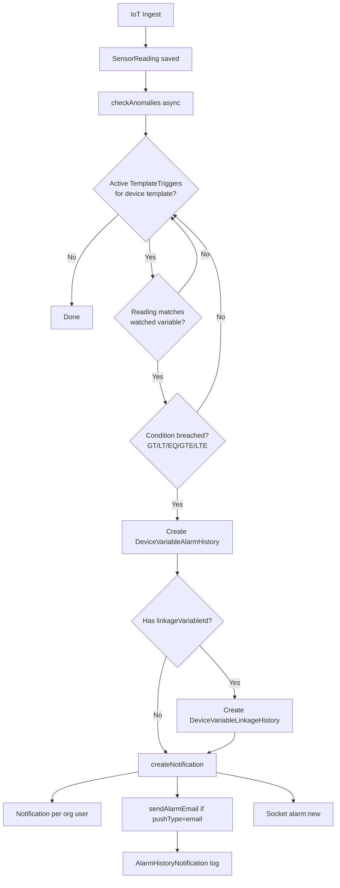

### Template → Device Provisioning

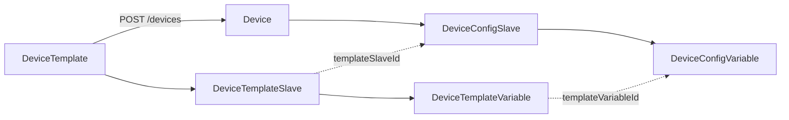

### Billing Flow

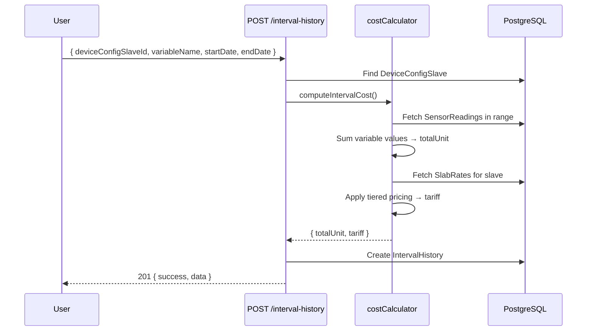

---

## Appendix C: Prisma Client Configuration

```javascript
// config/database.js
const pool = new Pool({ connectionString: process.env.DATABASE_URL });
const adapter = new PrismaPg(pool);
const prisma = new PrismaClient({
  adapter,
  log: NODE_ENV === 'development' ? ['query', 'error', 'warn'] : ['error'],
});
```

**Prisma 7 notes:**
- Uses driver adapter pattern (not direct connection)
- `prisma.config.ts` configures migrate CLI with same adapter
- Schema datasource has no `url` in schema.prisma (Prisma 7 style) — URL in config

---

## Appendix D: Unrouted Controller Functions (Implementation Ready)

These functions are **fully implemented** but not exposed via HTTP:

### deviceController.switchToggle
- **Would be:** `PATCH /api/devices/:id/switch`
- **Body:** `{ "action": "ON" | "OFF" }`
- **Behavior:** Updates switchState, emits `device:switch`

### gatewayController.linkDevice
- **Would be:** `PATCH /api/gateways/:id/link-device`
- **Body:** `{ "deviceId": "uuid" }`
- **Behavior:** Sets `device.gatewayId`

### notificationController.markRead / markAllRead
- **Would be:** `PATCH /api/notifications/:id/read`, `PATCH /api/notifications/read-all`
- **Behavior:** Sets `read: true`

---

*End of documentation — Version 2.0 (Extended Deep Dive)*
